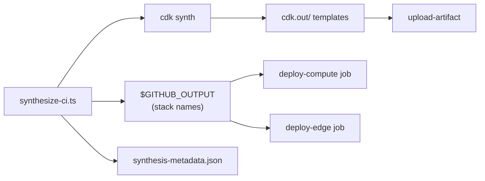

# Synthesize CI Step — Reference

> Pipeline step: `_deploy-monitoring-k8s.yml` → job `synth` → step **"Synthesize & Determine Stack Names"**

```yaml
- name: Synthesize & Determine Stack Names
  id: synth
  run: npx tsx scripts/deployment/synthesize-ci.ts k8s ${{ inputs.cdk-environment }}
```

## What It Does

The step runs [synthesize-ci.ts](file:///Users/nelsonlamounier/Desktop/revamp-portfolio-iac/cdk-monitoring/scripts/deployment/synthesize-ci.ts) and performs three actions:

### 1. CDK Synth

Synthesizes all CDK stacks for the `k8s` project in the given environment, producing CloudFormation templates in `cdk.out/`.

```
cdk synth --all --context project=k8s --context environment=development
```

### 2. Dynamic Stack Name Discovery

Reads the project's registered stacks from [stacks.ts](file:///Users/nelsonlamounier/Desktop/revamp-portfolio-iac/cdk-monitoring/scripts/deployment/stacks.ts) and writes each stack name to `$GITHUB_OUTPUT`:

```
compute=K8s-Compute-development
edge=K8s-Edge-development
```

Downstream jobs reference these via `steps.synth.outputs.<stack-id>` — this avoids hardcoding stack names anywhere in the pipeline.

### 3. Synthesis Metadata

Writes `cdk.out/synthesis-metadata.json` with traceability data:

```json
{
  "commitSha": "abc123...",
  "shortSha": "abc123",
  "timestamp": "2026-02-22T08-30-00",
  "environment": "development",
  "region": "eu-west-1",
  "project": "k8s",
  "stackCount": 2,
  "architecture": "consolidated-2-stack"
}
```

This artifact is uploaded in the next step for audit and debugging.

## Why It Matters

| Concern | How this step addresses it |
|---------|---------------------------|
| **No hardcoded stack names** | Stack names are resolved from the project registry, so adding/removing stacks only requires updating `stacks.ts` |
| **Single source of truth** | Every downstream deploy job reads stack names from `steps.synth.outputs.*` |
| **Traceability** | `synthesis-metadata.json` links each deployment to a specific commit and timestamp |
| **Fail-fast** | If `cdk synth` fails (type errors, missing env vars), the pipeline stops here before any deploy jobs run |

## Data Flow



## Key Files

| File | Role |
|------|------|
| [synthesize-ci.ts](file:///Users/nelsonlamounier/Desktop/revamp-portfolio-iac/cdk-monitoring/scripts/deployment/synthesize-ci.ts) | Entry point — parses args, runs synth, writes outputs |
| [stacks.ts](file:///Users/nelsonlamounier/Desktop/revamp-portfolio-iac/cdk-monitoring/scripts/deployment/stacks.ts) | Project registry — defines which stacks belong to each project |
| [exec.ts](file:///Users/nelsonlamounier/Desktop/revamp-portfolio-iac/cdk-monitoring/scripts/deployment/exec.ts) | Helper — builds CDK CLI args and executes `cdk` subprocess |
