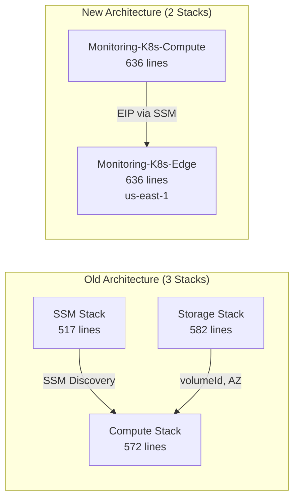
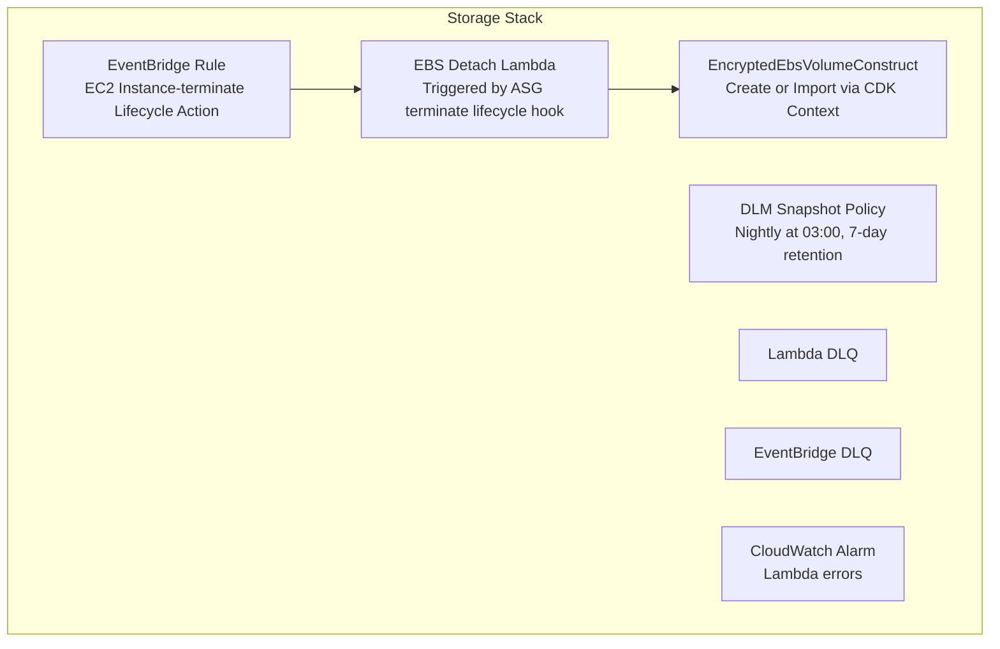

# Old Monitoring Stack vs New K8s Compute Stack — Detailed Comparison

## Architecture Overview

| Aspect | Old (Docker Compose on EC2) | New (k3s Kubernetes) |
|--------|---------------------------|---------------------|
| **CDK Stacks** | 3 stacks (1,671 lines total) | 2 stacks: Compute (636 lines) + Edge (636 lines) |
| **App Runtime** | Docker Compose | k3s (Kubernetes) |
| **Config Model** | SSM Run Command → Docker Compose | User Data → Kustomize manifests |
| **Stack Coupling** | SSM-based discovery (loose) | Compute → Edge (EIP published to SSM) |
| **Public Domain** | None (SSM-only access) | `monitoring.nelsonlamounier.com` via CloudFront |



---

## 1. Stack Decomposition vs Consolidation

### Old: 3 Separate Stacks

| Stack | File | Responsibility |
|-------|------|----------------|
| **SSM** | [ssm-stack.ts](file:///Users/nelsonlamounier/Desktop/revamp-portfolio-iac/cdk-monitoring/lib/stacks/monitoring/ssm/ssm-stack.ts) | S3 bucket, SSM Run Command document, IAM execution policy |
| **Storage** | [storage-stack.ts](file:///Users/nelsonlamounier/Desktop/revamp-portfolio-iac/cdk-monitoring/lib/stacks/monitoring/storage/storage-stack.ts) | EBS volume (create/import), DLM snapshots, lifecycle Lambda |
| **Compute** | [compute-stack.ts](file:///Users/nelsonlamounier/Desktop/revamp-portfolio-iac/cdk-monitoring/lib/stacks/monitoring/compute/compute-stack.ts) | Security group, Launch Template, ASG, IAM grants, SSM association |

**Coupling model:** SSM Stack writes 3 discovery parameters to SSM (`document-name`, `scripts-bucket-name`, `execution-policy-arn`). Compute Stack reads them at synth time — no CloudFormation cross-stack exports.

### New: 2 Stacks (Compute + Edge)

| Stack | File | Region | Responsibility |
|-------|------|--------|----------------|
| **Compute** | [compute-stack.ts](file:///Users/nelsonlamounier/Desktop/revamp-portfolio-iac/cdk-monitoring/lib/stacks/k8s/compute/compute-stack.ts) | eu-west-1 | SG, EBS, S3, SSM docs, Launch Template, ASG, EIP, Golden AMI, State Manager |
| **Edge** | [edge-stack.ts](file:///Users/nelsonlamounier/Desktop/revamp-portfolio-iac/cdk-monitoring/lib/stacks/k8s/edge/edge-stack.ts) | us-east-1 | ACM certificate, WAF Web ACL, CloudFront distribution, DNS alias record |

**Coupling model:** Compute publishes the Elastic IP to SSM at `/k8s/{env}/elastic-ip`. Edge reads it cross-region via `AwsCustomResource` at synth time. Config comes from `K8sConfigs` + `K8sEdgeConfig` resolved from the config layer.

> [!IMPORTANT]
> The old architecture separated storage into its own stack because EBS volume lifecycle management (DLM, lifecycle Lambda for detach-on-terminate) was complex enough to warrant isolation. The new stack eliminates this by relying on k3s' PVC model — the EBS volume is a simple `ec2.Volume` with no lifecycle Lambda.

---

## 2. Application Runtime

### Old: Docker Compose

The SSM document's `StartMonitoringStack` step runs:
```bash
docker compose up -d
```
Services (Grafana, Prometheus, Loki, Tempo, etc.) are defined in a `docker-compose.yml` file uploaded to S3, then downloaded to the instance at `/opt/monitoring/`. Docker + Docker Compose are installed via user-data, and a **systemd service** auto-restarts the stack on reboot.

**Configuration flow:**
```
S3 (docker-compose.yml + configs)
    → SSM Document downloads to /opt/monitoring/
    → Generates .env (Grafana password, metrics token)
    → Configures Steampipe (cross-account SQL queries)
    → docker compose up -d
    → Creates systemd service for auto-start
    → Registers Loki/Tempo endpoints in SSM
```

### New: k3s Kubernetes

k3s is installed via user-data using the official install script. Monitoring services are deployed as **Kubernetes workloads** via Kustomize manifests:

```bash
# In user-data (UserDataBuilder):
installK3s → installCalicoCNI → configureKubeconfig → deployK8sManifests
```

**Configuration flow:**
```
S3 (kustomize manifests + deploy-manifests.sh)
    → User-data syncs to /data/k8s/
    → deploy-manifests.sh resolves SSM secrets
    → kubectl apply -k manifests/ --server-side
```

> [!NOTE]
> **Key difference:** The old model separates OS bootstrap (user-data) from app config (SSM document). The new model does everything in user-data, with SSM documents as a **re-deployment** mechanism for manifest updates without instance replacement.

---

## 3. Storage Strategy

### Old: Managed EBS with Lifecycle Lambda



- Uses `EncryptedEbsVolumeConstruct` with **import/create** logic (checks CDK context for `existingVolumeId`)
- DLM policy for automated nightly snapshots
- Lambda + EventBridge for **automatic EBS detach** on ASG terminate lifecycle hook
- Customer-managed KMS key with explicit grant chain
- **13 IAM policy statements** across Lambda, DLM role
- DLQ for both Lambda and EventBridge (AwsSolutions compliance)

### New: Simple EBS Volume

```typescript
const ebsVolume = new ec2.Volume(this, 'K8sDataVolume', {
    availabilityZone: `${this.region}a`,
    size: cdk.Size.gibibytes(configs.storage.volumeSizeGb),
    volumeType: ec2.EbsDeviceVolumeType.GP3,
    encrypted: true,
    removalPolicy: configs.removalPolicy,
});
```

- Plain `ec2.Volume` — no import/create logic
- **No DLM**, **no lifecycle Lambda**, **no EventBridge** — k3s PVCs handle data persistence
- EBS attach is done in user-data via `UserDataBuilder.attachEbsVolume()`
- AWS-managed encryption (no customer KMS key)

> [!TIP]
> The old stack needed the lifecycle Lambda because Docker Compose stores state on the EBS volume — if the volume isn't cleanly detached before instance termination, data corruption can occur. k3s handles this more gracefully: the data directory is on the EBS volume, and k3s manages its own state persistence.

---

## 4. Security Group

### Old: SecurityGroupConstruct

```typescript
// Uses a reusable construct with DEFAULT_MONITORING_PORTS
const sgConstruct = new SecurityGroupConstruct(this, 'SecurityGroup', {
    vpc,
    trustedCidrs: props.trustedCidrs,
    ssmOnlyAccess,      // Toggleable CIDR-based access
    allowSsh: false,
    ports: DEFAULT_MONITORING_PORTS,
});
```
- Configurable via `trustedCidrs` prop (development: open, production: SSM-only)
- Uses a reusable `SecurityGroupConstruct`
- Adds **cross-stack ingress**: looks up the ECS task SG via SSM and grants Prometheus scrape access on port 3000

### New: Inline Security Group

```typescript
this.securityGroup = new ec2.SecurityGroup(this, 'K8sSecurityGroup', {
    vpc,
    description: `k3s Kubernetes node security group`,
    allowAllOutbound: true,
});
// Individual addIngressRule() calls for each port
```

Ports explicitly opened:
| Port | Purpose |
|------|---------|
| 80 | Traefik HTTP (from anywhere — CloudFront origin) |
| 443 | Traefik HTTPS (from anywhere) |
| 6443 | K8s API (from VPC only — SSM port-forwarding) |
| 9090 | Prometheus (from VPC) |
| 9100 | Node Exporter (from VPC) |
| 31100 | Loki NodePort (from VPC — ECS → k8s log shipping) |
| 31317 | Tempo NodePort (from VPC — ECS → k8s trace shipping) |

> [!NOTE]
> The new stack no longer uses the reusable `SecurityGroupConstruct`. It defines rules inline, which is simpler but less reusable. The k8s approach also opens ports from anywhere for HTTP/HTTPS (CloudFront origin), while the old stack used CIDR-based access control.

### Traefik
The monitoring stack opens HTTP/HTTPS to 0.0.0.0/0 because of Traefik — the Kubernetes Ingress Controller running on the k3s node. Here's the traffic flow:

Internet → CloudFront → Elastic IP (54.77.245.187) → EC2 port 80/443 → Traefik → Grafana pod

Traefik acts as the Kubernetes Ingress Controller (similar to an ALB but running as a k8s pod). It receives all inbound HTTP/HTTPS traffic on ports 80/443 and routes it to the correct k8s Service based on Ingress rules (e.g., grafana.yourdomain.com → grafana:3000).

The ports must be open to anywhere because:

1. CloudFront doesn't have a fixed IP range you can CIDR-restrict — CloudFront edge locations span thousands of IPs globally that change dynamically
2. The Elastic IP is the CloudFront origin — CloudFront forwards traffic directly to the EC2 instance's public IP
3. Without 0.0.0.0/0 on ports 80/443, CloudFront requests would be blocked by the security group

### How it differs from the old stack

In the old stack, the security group allowed:

| Old (Docker Compose) | New (k3s + Traefik) |
|----------------------|---------------------|
| Ingress | No public web access — SSM-only | CloudFront → Traefik → Pods |
| Ports 80/443 | Not opened (Grafana accessed via SSM port-forwarding) | Open to 0.0.0.0/0 |
| Access pattern | SSM Session → localhost:3000 | Browser → CloudFront → Traefik → Grafana |

Security layers (defense in depth)
Even though 80/443 are open to the internet, there are multiple security layers:

1. CloudFront — WAF rules, DDoS protection, geo-restrictions
2. Traefik — Only routes traffic matching defined Ingress rules; everything else gets 404
3. Kubernetes NetworkPolicy — Can restrict pod-to-pod communication
4. Grafana auth — Username/password authentication required
5. Other ports (6443, 9090, 9100, 31100, 31317) — Still restricted to VPC CIDR only, not exposed to the internet

#### In short
The old stack was a private monitoring server accessed only via SSM tunneling. The new k3s stack is a publicly accessible monitoring platform behind CloudFront, which is why Traefik needs ports 80/443 open from anywhere. The actual dashboards are still protected by Grafana authentication — the security group just allows the traffic to reach the Ingress Controller.
---

## 5. SSM Configuration Model

### Old: SSM Run Command Document (7 steps)

The SSM stack defines a **monolithic** SSM document with 7 sequential steps:

1. `DownloadMonitoringStack` — `aws s3 cp` scripts from S3
2. `ConfigureEnvironment` — Generate `.env` (Grafana password, metrics token)
3. `InstallSteampipePlugins` — Pre-create plugin directories
4. `GenerateSteampipeConfig` — Dynamic `aws.spc` with cross-account connections
5. `StartMonitoringStack` — Wait for Docker, `docker compose up -d`, create systemd service
6. `RegisterEndpointsInSsm` — Write Loki/Tempo endpoints to SSM
7. `ConfigureGitHubActionsExporter` — Read GitHub PAT from SSM, start exporter

Triggered by **SSM State Manager Association** targeting `tag:aws:autoscaling:groupName`.

### New: 2 SSM Documents + State Manager

| Document | Purpose |
|----------|---------|
| `ManifestDeployDocument` | Re-deploy manifests via `deploy-manifests.sh` (single step) |
| `SsmStateManagerConstruct` | Post-boot configuration (Calico, kubeconfig, manifests) |

**Key difference:** The old model runs the SSM document **after** user-data completes (via State Manager association). The new model does most configuration **in user-data** via `UserDataBuilder`, and the SSM documents are for **re-deployment** without instance replacement.

---

## 6. User Data Pipeline

### Old: Minimal (OS bootstrap only)

```
updateSystem → installAwsCli → attachEbsVolume → sendCfnSignal → installDocker → done
```
Application configuration is fully delegated to the SSM document.

### New: Full Application Bootstrap

```
installAwsCli → attachEbsVolume → sendCfnSignal → updateSystem
    → installK3s → installCalicoCNI → configureKubeconfig
    → deployK8sManifests → done
```

> [!WARNING]
> **cfn-signal position changed.** In the old stack, cfn-signal fires after `installAwsCli + attachEbs` but before Docker install. In the new stack, it fires after `attachEbs` but before `updateSystem` — because `dnf update` takes 10-15 minutes on cold boot and would exceed the signal timeout.

---

## 7. New Resources (K8s-Only)

These exist in the new stack but have no equivalent in the old stack:

| Resource | Purpose |
|----------|---------|
| **Elastic IP** (`ec2.CfnEIP`) | Stable public IP for CloudFront origin — old stack relied on instance IPs |
| **Golden AMI Pipeline** (`GoldenAmiPipelineConstruct`) | EC2 Image Builder to pre-bake Docker, k3s, Calico into an AMI |
| **SSM State Manager** (`SsmStateManagerConstruct`) | Post-boot configuration associations with drift remediation |
| **ECR Pull IAM** | k3s needs to pull container images from ECR — Docker Compose used Docker Hub |
| **EIP Association IAM** | Instance role needs `ec2:AssociateAddress` for self-assigning the EIP |

---

## 8. Removed Resources (Old-Only)

These existed in the old stack but were eliminated in the migration:

| Resource | Old Stack | Why Removed |
|----------|-----------|-------------|
| **DLM Snapshot Policy** | Storage Stack | k3s PVCs handle persistence; EBS snapshots not needed |
| **EBS Lifecycle Lambda** | Storage Stack (120 lines) | Not needed — single-node k3s with `maxCapacity=1` |
| **EventBridge Rule** | Storage Stack | Triggered the lifecycle Lambda |
| **2 × SQS DLQs** | Storage Stack | Dead Letter Queues for Lambda and EventBridge |
| **EBS Volume Import Logic** | Storage Stack | No context-based volume import; always creates new |
| **Steampipe Config Generation** | SSM Stack | SQL governance not part of k8s monitoring |
| **Cross-stack Prometheus Ingress** | Compute Stack | Replaced by NodePort access from VPC CIDR |
| **SSM Execution Policy** | SSM Stack | No separate IAM policy export — all inline |
| **Loki/Tempo Placeholder Params** | Compute Stack | k8s uses NodePort service discovery, not SSM endpoints |

---

## 9. Summary: Lines of Code Comparison

| Component | Old (3 Stacks) | New (2 Stacks) | Delta |
|-----------|---------------|----------------|-------|
| Security Group | 30 lines (delegated) | 50 lines (inline) | +20 |
| Storage | 460 lines (full stack) | 10 lines (simple Volume) | **-450** |
| SSM/Config | 517 lines (full stack) | 90 lines (inline docs) | **-427** |
| Compute/ASG | 200 lines | 200 lines | 0 |
| User Data | 15 lines | 40 lines | +25 |
| IAM Grants | 170 lines | 80 lines | **-90** |
| Golden AMI | — | 20 lines | +20 |
| State Manager | — | 20 lines | +20 |
| Elastic IP | — | 10 lines | +10 |
| Edge Stack | — | 636 lines | +636 |
| **Total** | **~1,671 lines** | **~1,272 lines** | **-399** |

---

## 10. Grafana Domain — Edge Stack (`monitoring.nelsonlamounier.com`)

Section 4 covers the traffic flow and security model: CloudFront → Elastic IP → Traefik → Grafana. This section documents the **CDK implementation** — the [K8sEdgeStack](file:///Users/nelsonlamounier/Desktop/revamp-portfolio-iac/cdk-monitoring/lib/stacks/k8s/edge/edge-stack.ts) that provisions the edge infrastructure.

### What Changed

The old monitoring stack had no public domain — Grafana was accessed via SSM port-forwarding (`localhost:3000`). The new architecture adds a dedicated edge stack that gives Grafana a proper domain with TLS, WAF, and CDN.

| Aspect | Old (Docker Compose) | New (k3s + Edge) |
|--------|---------------------|------------------|
| **Domain** | None | `monitoring.nelsonlamounier.com` |
| **Access** | SSM port-forwarding only | Public via CloudFront |
| **TLS** | None (localhost) | ACM certificate (auto-renewed) |
| **WAF** | None | 5 AWS managed rules |
| **DDoS** | None | CloudFront Shield Standard |
| **CDN Caching** | N/A | Disabled (real-time dashboards) |

### Edge Stack Resources (us-east-1)

| Resource | Details |
|----------|---------|
| **ACM Certificate** | DNS-validated for `monitoring.nelsonlamounier.com` via cross-account Route 53 |
| **WAF Web ACL** | Common Rule Set, Known Bad Inputs, IP Reputation, Anonymous IP, Rate Limiting |
| **CloudFront Distribution** | Single HTTP origin (EIP), `CacheDisabled` policy, `REDIRECT_TO_HTTPS` viewer protocol |
| **DNS Alias Record** | Route 53 A record → CloudFront via cross-account Lambda custom resource |
| **EIP SSM Read** | Cross-region `AwsCustomResource` reads `/k8s/{env}/elastic-ip` from eu-west-1 |

> [!NOTE]
> CloudFront cannot serve multiple hostnames with different origins on a single distribution. Since the NextJs app (`nelsonlamounier.com`) already has its own distribution, the monitoring domain requires a **separate** distribution with the EIP as its origin.

### Cross-Region Discovery

The Compute stack writes the Elastic IP to SSM in `eu-west-1`:

```typescript
new ssm.StringParameter(this, 'ElasticIpParam', {
    parameterName: `${configs.ssmPrefix}/elastic-ip`,
    stringValue: this.elasticIp.ref,
});
```

The Edge stack reads it from `us-east-1` via `AwsCustomResource`:

```typescript
const eipLookup = new cr.AwsCustomResource(this, 'EipLookup', {
    onUpdate: {
        service: 'SSM',
        action: 'getParameter',
        parameters: { Name: `${ssmPrefix}/elastic-ip` },
        region: props.computeRegion,   // eu-west-1
    },
});
```

### Traefik Host-Based Routing

With the edge stack adding a domain, the Traefik [IngressRoute](file:///Users/nelsonlamounier/Desktop/revamp-portfolio-iac/cdk-monitoring/k8s/apps/monitoring/manifests/traefik/ingress.yaml) was updated from `PathPrefix(/)` to host-based matching so CloudFront's forwarded `Host` header routes correctly:

```yaml
routes:
    - match: Host(`monitoring.nelsonlamounier.com`) || PathPrefix(`/`)
      kind: Rule
      priority: 10
      services:
        - name: grafana
          port: 3000
```

- `Host(monitoring.nelsonlamounier.com)` — matches CloudFront traffic
- `PathPrefix(/)` — fallback for direct-IP access during debugging
- `priority: 10` — higher than the NextJs IngressRoute (priority 1)

### Configuration (Environment Variables)

| Variable | Source | Description |
|----------|--------|-------------|
| `MONITOR_DOMAIN_NAME` | `vars.MONITOR_DOMAIN_NAME` | `monitoring.nelsonlamounier.com` |
| `HOSTED_ZONE_ID` | `vars.HOSTED_ZONE_ID` | Route 53 hosted zone (shared with NextJs) |
| `CROSS_ACCOUNT_ROLE_ARN` | `vars.DNS_VALIDATION_ROLE` | IAM role for cross-account DNS (shared with NextJs) |

### Pipeline Integration

The [_deploy-monitoring-k8s.yml](file:///Users/nelsonlamounier/Desktop/revamp-portfolio-iac/cdk-monitoring/.github/workflows/_deploy-monitoring-k8s.yml) deploys edge as a separate job after compute:

```text
setup → validate → deploy-compute (eu-west-1) → deploy-edge (us-east-1) → deploy-manifests → verify
```

