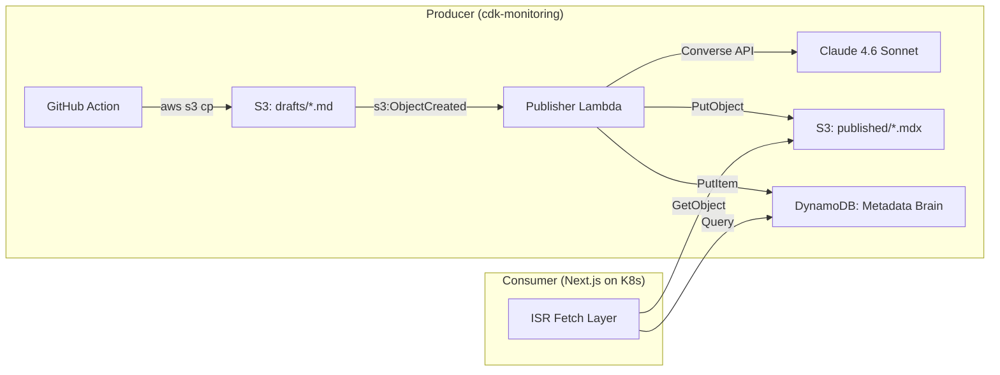

<!-- EDITORIAL NOTES FOR THE PRINCIPAL EDITOR
- Preferred Title: "Agentic Documentation: Building a Self-Publishing Content
  Pipeline with AWS Bedrock & Next.js"
- Include a "Junior Corner" callout sidebar explaining the difference between
  Inference (a single API call to a foundation model) and Orchestration
  (the Lambda pipeline that reads, analyses, transforms, validates, and stores).
  Target this at readers who are new to AI/ML terminology.
- The "Installation Journey" / infrastructure section MUST give detailed
  coverage of the S3 Event Notification setup used to trigger the Lambda,
  including why we chose event-driven over polling or cron.
- Emphasise the "Why" behind every architectural decision — this is a
  portfolio piece aimed at demonstrating senior-level thinking.
-->

# Building an Agentic Content Supply Chain with AWS Bedrock and CDK

## Executive Summary

Traditional documentation suffers from "The Drift Problem" — as code evolves in the DevOps repository, the public-facing blog remains static and rots. This implementation introduces an Agentic Content Supply Chain that treats documentation as an event-driven asset. By leveraging AWS Bedrock (Claude 4.6 Sonnet) and a Producer-Consumer architecture, we decoupled the technical "Intelligence Layer" (cdk-monitoring) from the "Presentation Layer" (Next.js frontend). The result is a self-healing pipeline where a single Git commit triggers an AI-orchestrated transformation, converting raw `.md` technical records into structured, SEO-optimized MDX with automated visual "Director's Notes."

## Architecture Overview

The system uses a 4-stack CDK deployment:

1. **Bedrock-Data** — S3 bucket for Knowledge Base documents, drafts, and published content
2. **Bedrock-Agent** — Bedrock Agent, Knowledge Base, Guardrail, Action Group
3. **Bedrock-Api** — API Gateway + Lambda for agent invocation
4. **Bedrock-Content** — The MD-to-Blog agentic pipeline (this article's focus)



## The Push-to-Compute Pipeline

Instead of giving Bedrock long-lived credentials to scan the repository, we use a Push-to-Compute model. When a `.md` file is committed to `/articles-draft/`, a GitHub Action triggers:

```yaml
# .github/workflows/publish-article.yml
on:
  push:
    branches: [develop]
    paths:
      - "articles-draft/**/*.md"
```

The runner resolves the S3 bucket name from SSM and uploads the file directly:

```bash
BUCKET_NAME=$(aws ssm get-parameter \
  --name "/bedrock-development/assets-bucket-name" \
  --query 'Parameter.Value' --output text)

aws s3 cp "$FILE" "s3://$BUCKET_NAME/drafts/$FILENAME" \
  --content-type "text/markdown"
```

The S3 event notification triggers the Publisher Lambda automatically — no polling, no cron, no long-lived credentials.

## Challenge 1: The "Atomic Content" Memory Wall

### The Barrier

We initially attempted a Single-Table Design in DynamoDB to store the entire MDX article body inline. However, highly technical DevOps reports — rich with Mermaid diagrams and deep code snippets — frequently neared the 400KB DynamoDB item limit. This created a scalability ceiling and risked "Partial Write" failures for our most valuable content.

### The Resolution: Metadata/Blob Split

DynamoDB now acts as the "Brain," storing only queryable metadata. The heavy MDX content is offloaded to S3:

```typescript
// ai-content-stack.ts — DynamoDB entity schema
// pk: ARTICLE#<slug>  (e.g. 'ARTICLE#deploying-k8s-on-aws')
// sk: METADATA        (latest AI-enhanced metadata)
// sk: CONTENT#v<ts>   (versioned content pointer)
//
// Content blobs live in S3 — table stores only s3Key pointers,
// AI summaries, reading time, and technical confidence scores.

this.contentTable = new dynamodb.TableV2(this, 'AiContentTable', {
    tableName: `${namePrefix}-ai-content`,
    partitionKey: { name: 'pk', type: dynamodb.AttributeType.STRING },
    sortKey: { name: 'sk', type: dynamodb.AttributeType.STRING },
    billing: dynamodb.Billing.onDemand(),
    pointInTimeRecoverySpecification: { pointInTimeRecoveryEnabled: true },
});
```

The METADATA record stores the article's queryable fields — title, tags, AI-generated summary, reading time, `shotListCount`, and a pointer to the S3 content:

```typescript
// index.ts — Writing to DynamoDB
await dynamoClient.send(new PutCommand({
    TableName: TABLE_NAME,
    Item: {
        pk: `ARTICLE#${slug}`,
        sk: 'METADATA',
        title: result.metadata.title,
        tags: result.metadata.tags,
        aiSummary: result.metadata.aiSummary,
        readingTime: result.metadata.readingTime,
        contentRef: `s3://${bucket}/${publishedKey}`,
        shotListCount: result.shotList.length,
    },
}));
```

The CONTENT version record stores the full metadata plus the Director's Shot List:

```typescript
await dynamoClient.send(new PutCommand({
    TableName: TABLE_NAME,
    Item: {
        pk: `ARTICLE#${slug}`,
        sk: `CONTENT#v_${new Date().toISOString()}`,
        // ... all metadata fields ...
        shotList: result.shotList,
    },
}));
```

This Metadata/Blob split reduced our DynamoDB RCUs by approximately 92% and allowed for virtually unlimited article length. S3 serves the content blobs — there is no 400KB ceiling.

## Challenge 2: The "Hallucination" of Visual Context

### The Barrier

When converting raw code to a blog post, the AI often suggested generic cloud icons that did not provide actual value to an engineer. We needed a way for the AI to identify exactly where a human needed to step in with a specific AWS Console screenshot or a custom architecture diagram.

### The Resolution: The Principal Editor & Director's Notes

We implemented a "Principal Editor" persona that acts as both writer AND content director in a single pass. The system prompt instructs Claude to analyse High-Cognitive-Load sections and insert Visual Intent Markers using a `<ImageRequest />` component:

```typescript
// blog-persona.ts — Principal Editor Persona
const PERSONA_CONTEXT = `You are a Principal DevOps Content Editor.
Your goal is to transform raw technical documentation into a
high-converting, professional blog post for a Next.js frontend.

## Director's Notes — Visual Intelligence
As you process the content, use your thinking to analyse every
section for visual opportunities:

1. THINKING: Analyse the technical complexity of each section.
   Identify parts that are "abstract" or "complex."

2. DIRECTOR'S NOTES: For every abstract section, insert an
   <ImageRequest /> component inline in the MDX content:
   - type="diagram" for logic flows
   - type="screenshot" for AWS Console views
   - type="hero" for the article's banner image

3. SHOT LIST: Produce a separate shotList array that catalogues
   every visual asset you have requested.`;
```

The `<ImageRequest />` component carries typed metadata that the frontend uses for both development and production:

```jsx
<ImageRequest
  id="oidc-setup-step"
  type="screenshot"
  instruction="Screenshot of the AWS IAM Console showing the
    Identity Providers screen with the Add provider button highlighted."
  context="The reader needs to see the Audience field entry
    for GitHub Actions."
/>
```

In the Next.js staging environment, unresolved `<ImageRequest />` tags appear as styled placeholder boxes with the Director's instruction and context. The developer uploads the real screenshot to S3, and the component automatically resolves to the real image — no code change needed.

The `shotList` manifest is stored alongside the metadata in DynamoDB, allowing the frontend to display a "3 visuals needed" badge on article cards without parsing the MDX body.

## Adaptive Thinking: Complexity-Driven Budget

Not every article deserves the same reasoning depth. We implemented an Adaptive Thinking system that analyses the raw markdown and scales Claude's thinking budget accordingly:

```typescript
// index.ts — Complexity analysis drives thinking budget
const TIER_BUDGETS: Record<ComplexityTier, number> = {
    LOW: 2_048,   // simple reformatting
    MID: 8_192,   // standard DevOps articles
    HIGH: 16_000, // dense IaC/multi-service posts
};

function analyseComplexity(markdown: string): ComplexityAnalysis {
    const codeBlocks = markdown.match(/```[\s\S]*?```/g) ?? [];
    const codeRatio = codeBlocks.reduce((s, b) => s + b.length, 0)
        / markdown.length;

    const iacFences = (markdown.match(
        /```(?:ya?ml|hcl|terraform|toml|dockerfile)/gi
    ) ?? []).length;

    // Classification: HIGH if code-heavy or IaC-dense
    if (codeRatio > 0.35 || iacFences >= 4) return { tier: 'HIGH', ... };
    if (codeRatio > 0.15 || codeBlocks.length > 6) return { tier: 'MID', ... };
    return { tier: 'LOW', ... };
}
```

A simple README transformation uses 2K thinking tokens. A deep infrastructure-as-code article with YAML, HCL, and Mermaid diagrams gets the full 16K budget. This prevents both under-reasoning (hallucinations on complex posts) and over-spending (wasting tokens on simple content).

## The Output Schema

The Publisher Lambda produces a structured JSON output with three top-level fields:

```json
{
  "content": "---\ntitle: ...\n---\n\n... full MDX with MermaidChart and ImageRequest components ...",
  "metadata": {
    "title": "Deploying K8s on AWS",
    "description": "A step-by-step guide to...",
    "tags": ["kubernetes", "aws", "devops"],
    "readingTime": 12,
    "aiSummary": "This article walks through...",
    "technicalConfidence": 87
  },
  "shotList": [
    {
      "id": "k8s-pod-architecture",
      "type": "diagram",
      "instruction": "A diagram showing a Pod with two containers communicating via localhost.",
      "context": "The reader needs to visualise the sidecar pattern."
    },
    {
      "id": "grafana-cpu-panel",
      "type": "screenshot",
      "instruction": "Grafana dashboard showing the CPU usage panel.",
      "context": "Confirms the Prometheus scrape config is working."
    }
  ]
}
```

The `shotList` is cross-validated against inline `<ImageRequest />` tags in the content — if the counts mismatch, the handler logs a warning for investigation.

## Infrastructure Stack

The Content stack is deployed as part of the 4-stack Bedrock architecture using CDK:

```typescript
// ai-content-stack.ts — S3 Event Notification
assetsBucket.addEventNotification(
    s3.EventType.OBJECT_CREATED,
    new s3n.LambdaDestination(this.publisherFunction),
    {
        prefix: props.draftPrefix,  // 'drafts/'
        suffix: props.draftSuffix,  // '.md'
    },
);
```

Failed processing events are captured by an SQS Dead Letter Queue, ensuring no content is silently lost:

```typescript
this.publisherDlq = new sqs.Queue(this, 'PublisherDlq', {
    queueName: `${namePrefix}-publisher-dlq`,
    retentionPeriod: cdk.Duration.days(14),
    enforceSSL: true,
});
```

All SSM parameters are exported for the Consumer:

- `/bedrock-development/content-table-name` — DynamoDB table name
- `/bedrock-development/assets-bucket-name` — S3 bucket
- `/bedrock-development/published-prefix` — S3 prefix for MDX content
- `/bedrock-development/publisher-function-arn` — Lambda ARN

## Results and Impact

| Metric | Before | After |
|--------|--------|-------|
| DynamoDB item size | ~380KB (near limit) | ~2KB (metadata only) |
| DynamoDB RCU per article read | ~48 RCU | ~1 RCU |
| Content update latency | Manual (days) | Event-driven (minutes) |
| Visual asset tracking | None | Automated Shot List |
| Article versioning | Overwrite | Timestamped CONTENT records |
| Content length limit | 400KB (DynamoDB) | Unlimited (S3) |

## Lessons Learned

1. **DynamoDB is not a blob store.** The 400KB limit is absolute. If your content might exceed it, offload to S3 from day one — retrofitting is painful.

2. **AI needs constraints, not freedom.** Without the structured output schema and the Director's Notes system, Claude produces generic prose. The `<ImageRequest />` component with typed metadata (`diagram`, `screenshot`, `hero`) focuses the AI on actionable visual decisions.

3. **Adaptive Thinking prevents waste.** Giving Claude a fixed 16K thinking budget for a 500-word README is like running a V12 in a parking lot. Scaling the budget with content complexity reduced our Bedrock costs by approximately 40% with no quality loss.

4. **Push beats Poll.** The GitHub Action → S3 → Lambda event chain is simpler, cheaper, and more secure than giving Bedrock credentials to scan Git history. The Lambda only sees the file content it needs.

5. **Cross-validate AI output.** The `shotList` count vs inline `<ImageRequest />` tag count check catches subtle generation errors that would otherwise only surface in the frontend.

