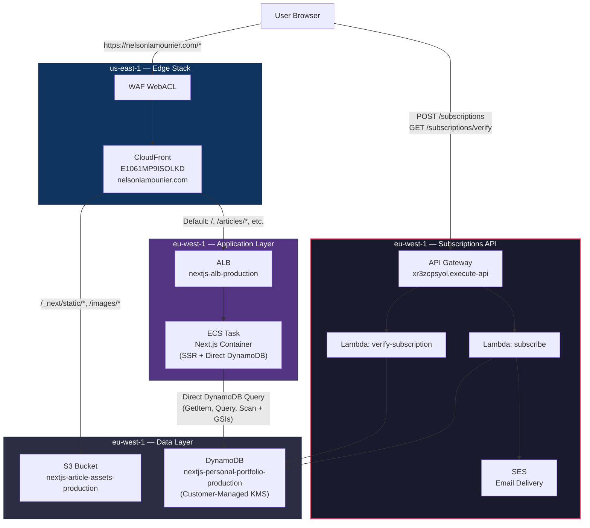

# CloudFront & API Gateway Architecture

> How articles and subscriptions are served on `nelsonlamounier.com`.

---

## Architecture Overview



---

## CloudFront Distribution

**Distribution ID:** `E1061MP9ISOLKD`
**Domain:** `nelsonlamounier.com` → `d1e1hawk9znypr.cloudfront.net`

### Origins

| Origin             | Type | Domain                                                        |
| ------------------ | ---- | ------------------------------------------------------------- |
| Origin 1 (default) | ALB  | `nextjs-alb-production-*.eu-west-1.elb.amazonaws.com`         |
| Origin 2           | S3   | `nextjs-article-assets-production.s3.eu-west-1.amazonaws.com` |

### Cache Behaviors (Routing Rules)

| Path Pattern      | Origin        | Cache Policy      | Purpose                                    |
| ----------------- | ------------- | ----------------- | ------------------------------------------ |
| `*` (default)     | **ALB → ECS** | Dynamic (0s TTL)  | SSR pages: `/`, `/articles/*`, etc.        |
| `/_next/static/*` | S3            | Static (365d TTL) | Immutable JS/CSS bundles                   |
| `/_next/data/*`   | S3            | Static            | ISR data files                             |
| `/images/*`       | S3            | Static            | Article images and media                   |
| `/api/*`          | **ALB → ECS** | No cache          | Next.js internal API routes (health, etc.) |

> **Note:** The `/api/*` behavior routes to the ALB (Next.js API routes), **not** to the API Gateway. These are two separate systems.

---

## How Articles Are Served

Articles are served entirely by the **ECS container** via server-side rendering. The Next.js application queries DynamoDB **directly** using the AWS SDK — there is no API Gateway involved in article delivery.

### Request Flow

```
User visits https://nelsonlamounier.com/articles/cdk-project-factory-pattern
  → CloudFront (default behavior, no path match)
    → ALB (HTTP)
      → ECS Task (Next.js SSR)
        → DynamoDB (direct GetItem/Query via AWS SDK)
          → Renders HTML page
```

### ECS Container Configuration

The container receives these environment variables for DynamoDB access:

| Variable              | Source        | Purpose                               |
| --------------------- | ------------- | ------------------------------------- |
| `DYNAMODB_TABLE_NAME` | SSM parameter | Table name for queries                |
| `DYNAMODB_GSI1_NAME`  | Hardcoded     | GSI for listing by status/date        |
| `DYNAMODB_GSI2_NAME`  | Hardcoded     | GSI for listing by tag/date           |
| `NEXT_PUBLIC_API_URL` | SSM parameter | API Gateway URL (client-side JS only) |

### IAM Permissions (ECS Task Role)

| Permission                          | Resource           | Purpose                                 |
| ----------------------------------- | ------------------ | --------------------------------------- |
| `dynamodb:GetItem`, `Query`, `Scan` | Table + `/index/*` | Read articles from DynamoDB             |
| `kms:Decrypt`, `kms:DescribeKey`    | DynamoDB KMS key   | Decrypt customer-managed encrypted data |
| `s3:GetObject`                      | Assets bucket      | Read article images                     |

> The KMS permissions are resolved from SSM at deploy time via `dynamoKmsKeySsmPath` in `compute-stack.ts`.

---

## How Subscriptions Are Served

Email subscriptions are the **only** API Gateway functionality. The API is accessed directly at its `execute-api` URL (not routed through CloudFront).

### API Gateway Endpoints

| Method | Path                    | Lambda                             | Purpose                   |
| ------ | ----------------------- | ---------------------------------- | ------------------------- |
| `POST` | `/subscriptions`        | `nextjs-subscribe-{env}`           | Create email subscription |
| `GET`  | `/subscriptions/verify` | `nextjs-verify-subscription-{env}` | Verify via HMAC token     |

### Features

- **Request validation:** JSON Schema model rejects malformed payloads before Lambda
- **WAF:** Skipped (redundant — CloudFront edge WAF protects all public traffic)
- **DLQs:** Per-function SQS queues with CloudWatch alarms and SNS email notifications
- **SES integration:** Sends verification emails with HMAC-signed tokens
- **KMS grants:** `kms:EncryptDecrypt` for reading/writing to the encrypted DynamoDB table

---

## DynamoDB Table: Single-Table Design

**Table:** `nextjs-personal-portfolio-production`
**Encryption:** Customer-managed KMS key (`f70feb03-e9b0-4972-9ff4-0192ad75c7df`)

| Entity       | Primary Key      | Sort Key       | GSI1 (status-date) | GSI2 (tag-date) |
| ------------ | ---------------- | -------------- | ------------------ | --------------- |
| Article      | `ARTICLE#<slug>` | `METADATA`     | `STATUS#published` | `TAG#<tag>`     |
| Subscription | `EMAIL#<email>`  | `SUBSCRIPTION` | `ENTITY#EMAIL`     | —               |

---

## What Was Removed (Feb 2025)

Article Lambda endpoints were identified as dead code and removed:

| Removed Resource                      | Reason                                       |
| ------------------------------------- | -------------------------------------------- |
| `GET /articles` Lambda + route        | ECS queries DynamoDB directly for SSR        |
| `GET /articles/{slug}` Lambda + route | ECS queries DynamoDB directly for SSR        |
| `lambda/articles/list.ts`             | Dead code — Lambda source file               |
| `lambda/articles/get.ts`              | Dead code — Lambda source file               |
| 2 DLQs + 2 CloudWatch alarms          | No longer needed without article Lambdas     |
| `checkArticleSource()` smoke test     | Validated via API Gateway (no longer exists) |

The API Gateway now exclusively handles email subscriptions.

---

## Source Files

| Component                             | File                                                 |
| ------------------------------------- | ---------------------------------------------------- |
| CloudFront + origins + behaviors      | `lib/stacks/nextjs/edge/edge-stack.ts`               |
| CloudFront construct                  | `lib/common/networking/cloudfront.ts`                |
| Path patterns                         | `lib/config/nextjs/configurations.ts` (L252-262)     |
| API Gateway + subscription Lambdas    | `lib/stacks/nextjs/networking/api-stack.ts`          |
| ECS Task Role (DynamoDB + KMS grants) | `lib/stacks/nextjs/compute/compute-stack.ts`         |
| Container env vars (GSI names, table) | `lib/stacks/nextjs/application/application-stack.ts` |
| DynamoDB table + KMS key              | `lib/stacks/nextjs/data/data-stack.ts`               |
| Factory (stack wiring)                | `lib/projects/nextjs/factory.ts`                     |
| Smoke tests                           | `scripts/deployment/smoke-tests-nextjs.ts`           |
