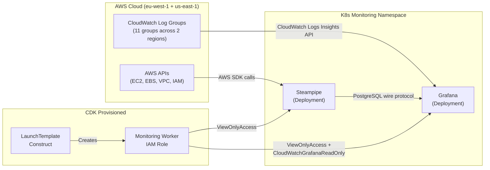

# CloudWatch & Steampipe Data Paths — Detailed Review Report

This report provides an in-depth review of how AWS resource data reaches the Grafana UI through two independent data paths: **CloudWatch Logs Insights** and **Steampipe SQL**.

---

## 1. End-to-End Architecture



> [!IMPORTANT]
> Both data paths share a single authentication source: the **EC2 instance IAM role** attached to the monitoring worker node. There are no static credentials, API keys, or secrets involved.

---

## 2. CloudWatch Data Path

### 2.1 How Grafana Queries CloudWatch

Grafana's built-in **CloudWatch datasource plugin** communicates directly with the CloudWatch Logs Insights API. No intermediary agent is required. The query flow is:

```
Dashboard Panel → CloudWatch Datasource Plugin → AWS CloudWatch Logs API → Response → Panel Rendering
```

Each panel specifies:
1. **Datasource UID** — `cloudwatch` (eu-west-1) or `cloudwatch-edge` (us-east-1)
2. **Log Group name** — e.g., `/aws/lambda/k8s-development-eip-failover`
3. **CloudWatch Logs Insights query** — written in [CloudWatch Logs Insights query syntax](https://docs.aws.amazon.com/AmazonCloudWatch/latest/logs/CWL_QuerySyntax.html)

### 2.2 Datasource Configuration

From `chart/templates/grafana-configmap.yaml`:

| Datasource | Region | UID | Auth Method |
|:---|:---|:---|:---|
| CloudWatch | `eu-west-1` | `cloudwatch` | `authType: default` (IAM instance profile) |
| CloudWatch Edge | `us-east-1` | `cloudwatch-edge` | `authType: default` (IAM instance profile) |

The `authType: default` setting means Grafana uses the **AWS SDK default credential chain**, which on an EC2 instance resolves to the instance's IAM role via the Instance Metadata Service (IMDSv2).

### 2.3 IAM Permissions (CDK)

The monitoring worker node's IAM role is granted CloudWatch read permissions in `infra/lib/stacks/kubernetes/monitoring-worker-stack.ts` (lines 269–284):

```typescript
// Sid: CloudWatchGrafanaReadOnly
actions: [
    'logs:DescribeLogGroups',
    'logs:GetLogEvents',
    'logs:FilterLogEvents',
    'logs:StartQuery',          // Required for Logs Insights
    'logs:StopQuery',           // Required for Logs Insights
    'logs:GetQueryResults',     // Required for Logs Insights
    'logs:DescribeLogStreams',
    'cloudwatch:GetMetricData', // For CloudWatch metrics (not yet used in dashboards)
    'cloudwatch:ListMetrics',   // For metric discovery
]
resources: ['*']  // All log groups in the account
```

> [!NOTE]
> The `resources: ['*']` scope means Grafana can query **any** CloudWatch Log Group in the account, not just the ones explicitly referenced in dashboards. This is intentional for ad-hoc exploration in the Grafana Explore view.

### 2.4 Log Group Origins (CDK Constructs → CloudWatch)

The log groups queried by the dashboards are created by various CDK constructs:

| Log Group Pattern | Created By | CDK Construct | Source File |
|:---|:---|:---|:---|
| `/aws/lambda/*` | Lambda service (auto) | `LambdaFunctionConstruct` | Creates explicit log group with retention + KMS |
| `/ec2/<prefix>/instances` | CDK (explicit) | `LaunchTemplateConstruct` | `new logs.LogGroup(logGroupName: '/ec2/${namePrefix}/instances')` |
| `/ssm/<prefix>/*` | SSM Automation (runtime) | `SsmAutomationStack` | Grants `logs:CreateLogGroup` + `logs:PutLogEvents` to SSM role |
| `/vpc/shared/<env>/flow-logs` | CDK (explicit) | `StandardVpcConstruct` | Creates log group + VPC Flow Log destination + KMS encryption |

### 2.5 Queried Log Groups by Dashboard

#### Dashboard: **AWS Logs** (eu-west-1)

| Row Section | Panel | Log Group | Query Language | Limit |
|:---|:---|:---|:---|:---|
| Lambda Function Logs | EIP Failover Lambda | `/aws/lambda/k8s-development-eip-failover` | Logs Insights | 100 |
| Lambda Function Logs | Subscribe Lambda | `/aws/lambda/nextjs-subscribe-development` | Logs Insights | 100 |
| Lambda Function Logs | Verify Subscription Lambda | `/aws/lambda/nextjs-verify-subscription-development` | Logs Insights | 100 |
| SSM Automation Logs | SSM Bootstrap Logs | `/ssm/k8s/development/bootstrap` | Logs Insights | 200 |
| SSM Automation Logs | SSM Deploy Logs | `/ssm/k8s/development/deploy` | Logs Insights | 200 |
| EC2 Instance Logs | Control Plane (cloud-init) | `/ec2/k8s-development/instances` | Logs Insights | 200 |
| EC2 Instance Logs | App Worker (cloud-init) | `/ec2/k8s-development-worker/instances` | Logs Insights | 200 |
| EC2 Instance Logs | Monitoring Worker (cloud-init) | `/ec2/k8s-development-mon-worker/instances` | Logs Insights | 200 |
| VPC Flow Logs | Rejected Traffic (table) | `/vpc/shared/development/flow-logs` | Logs Insights | 200 |
| VPC Flow Logs | Rejected Traffic Over Time (chart) | `/vpc/shared/development/flow-logs` | Logs Insights (stats) | — |

The VPC Flow Logs panels use two distinct query patterns:

```
# Raw log view (table)
fields @timestamp, srcAddr, dstAddr, srcPort, dstPort, protocol, packets, bytes, action, logStatus
| filter action = 'REJECT'
| sort @timestamp desc | limit 200

# Aggregation (timeseries bar chart)
stats count(*) as rejectedCount by bin(5m)
| filter action = 'REJECT'
```

#### Dashboard: **AWS Logs — Edge** (us-east-1)

| Row Section | Panel | Log Group | Region |
|:---|:---|:---|:---|
| ACM & DNS Lambda Logs | ACM DNS Validation Lambda | `/aws/lambda/nextjs-acm-dns-validation-development` | us-east-1 |
| ACM & DNS Lambda Logs | DNS Alias Provider Lambda | `/aws/lambda/nextjs-dns-alias-provider-development` | us-east-1 |
| ACM & DNS Lambda Logs | Certificate Provider Lambda | `/aws/lambda/nextjs-cert-provider-development` | us-east-1 |
| Mon. Edge Lambda Logs | K8s Cert Provider Lambda | `/aws/lambda/k8s-development-cert-provider-development` | us-east-1 |
| Mon. Edge Lambda Logs | Monitoring DNS Alias Lambda | `/aws/lambda/k8s-development-monitoring-dns-alias-development` | us-east-1 |

> [!TIP]
> The edge dashboard exists because ACM certificates for CloudFront must be in `us-east-1`, so the related Lambda functions also run in that region. The `cloudwatch-edge` datasource is configured to query that region specifically.

---

## 3. Steampipe Data Path

### 3.1 How Steampipe Works

Steampipe is a **query engine** that translates SQL `SELECT` statements into live AWS API calls and returns the results as table rows over a PostgreSQL-compatible wire protocol.

```
Grafana Panel (SQL) → PostgreSQL Datasource Plugin → Steampipe Service → AWS SDK → AWS API → SQL Result Set
```

Unlike CloudWatch (which reads stored logs), Steampipe queries are **live, real-time snapshots** of the current AWS resource state.

### 3.2 Deployment

From `chart/templates/steampipe-deployment.yaml`:

```yaml
command: ["steampipe", "service", "start", "--foreground",
          "--database-listen", "network",
          "--database-port", "<port>"]
```

- **Network mode**: `--database-listen network` makes Steampipe listen on all interfaces (required for Grafana to connect from another pod)
- **No persistent storage**: Steampipe does not cache results — every query triggers fresh AWS API calls
- **NodeSelector**: Pinned to the monitoring worker node via `nodeSelector`

### 3.3 Plugin Configuration

From `chart/templates/steampipe-configmap.yaml`:

```hcl
connection "aws" {
  plugin = "aws"
}
```

This minimal config uses the **default credential chain** — on the monitoring worker node, this resolves to the EC2 instance's IAM role.

### 3.4 IAM Permissions (CDK)

From `infra/lib/stacks/kubernetes/monitoring-worker-stack.ts` (lines 261–265):

```typescript
// Grant ViewOnlyAccess for Steampipe cloud inventory queries
// Covers EC2, EBS, VPC, IAM, and other AWS service read-only access
launchTemplateConstruct.instanceRole.addManagedPolicy(
    iam.ManagedPolicy.fromAwsManagedPolicyName('job-function/ViewOnlyAccess'),
);
```

The `ViewOnlyAccess` AWS managed policy provides read-only access to most AWS services, including:
- `ec2:Describe*` — EC2 instances, volumes, security groups, snapshots
- `iam:List*`, `iam:Get*` — IAM users, roles, policies
- `s3:List*`, `s3:Get*` — S3 bucket metadata
- `rds:Describe*` — RDS instances
- Many other services

### 3.5 Grafana Datasource Configuration

From `chart/templates/grafana-configmap.yaml`:

```yaml
- name: Steampipe
  type: postgres
  uid: steampipe
  url: steampipe.<namespace>.svc.cluster.local:<port>
  database: steampipe
  user: steampipe
  jsonData:
    sslmode: disable         # Internal cluster traffic
    postgresVersion: 1400    # PostgreSQL 14 compatible
  secureJsonData:
    password: "<from Helm values>"
```

### 3.6 Queried AWS Resources by Dashboard

#### Dashboard: **Cloud Inventory & Compliance**

| Section | Panel | Steampipe Table(s) | Query Purpose |
|:---|:---|:---|:---|
| **EBS Volumes & Snapshots** | | | |
| | Total EBS Volumes | `aws_ebs_volume` | Count all volumes |
| | Unencrypted Volumes | `aws_ebs_volume` | Count where `NOT encrypted` |
| | Total Snapshots | `aws_ebs_snapshot` + `aws_account` | Count owned snapshots |
| | Orphaned Volumes | `aws_ebs_volume` | Count where `attachments = 0` AND `state = 'available'` |
| | EBS Volume Inventory | `aws_ebs_volume` | Full table: ID, size, type, state, encryption, IOPS, instance |
| **Security Groups** | | | |
| | Open to Internet | `aws_vpc_security_group_rule` | Count ingress rules with `0.0.0.0/0` |
| | SSH Open (Port 22) | `aws_vpc_security_group_rule` | Count SSH ingress open to `0.0.0.0/0` |
| | Total Security Groups | `aws_vpc_security_group` | Count all SGs |
| | Ingress Rules Detail | `aws_vpc_security_group_rule` JOIN `aws_vpc_security_group` | Table of all `0.0.0.0/0` ingress rules |
| **EC2 & Cross-Service** | | | |
| | EC2 Instance Inventory | `aws_ec2_instance` | Table: ID, name, type, state, IPs, launch time |
| | EC2 → Volumes → Snapshots | `aws_ec2_instance` JOIN `aws_ebs_volume` JOIN `aws_ebs_snapshot` | Cross-service join showing instance→volume→snapshot relationships |

The cross-service join is the most complex query:

```sql
SELECT i.tags->>'Name' AS instance_name, i.instance_id, i.instance_type,
       v.volume_id, v.size AS vol_gb, v.volume_type, v.encrypted,
       count(s.snapshot_id) AS snapshots
FROM aws_ec2_instance i
LEFT JOIN aws_ebs_volume v
  ON v.attachments->0->>'InstanceId' = i.instance_id
LEFT JOIN aws_ebs_snapshot s
  ON s.volume_id = v.volume_id
  AND s.owner_id = (SELECT account_id FROM aws_account)
GROUP BY ...
ORDER BY i.tags->>'Name', v.size DESC;
```

---

## 4. Comparison: CloudWatch vs Steampipe

| Aspect | CloudWatch | Steampipe |
|:---|:---|:---|
| **Data type** | Historical logs (time-series) | Live resource inventory (point-in-time snapshots) |
| **Query language** | CloudWatch Logs Insights QL | Standard SQL (PostgreSQL) |
| **Grafana datasource** | Built-in CloudWatch plugin | Built-in PostgreSQL plugin |
| **Data freshness** | As fast as CloudWatch ingestion (near-real-time) | On-demand (each query triggers live AWS API calls) |
| **Authentication** | IAM instance profile (`authType: default`) | IAM instance profile (AWS SDK default chain) |
| **IAM policy** | `CloudWatchGrafanaReadOnly` (custom inline) | `ViewOnlyAccess` (AWS managed policy) |
| **Infrastructure** | No extra pods (Grafana connects directly to AWS API) | Requires Steampipe pod (PostgreSQL-compatible service) |
| **Multi-region** | Two datasources (eu-west-1 + us-east-1) | Single connection (queries default region only) |
| **Storage** | CloudWatch retains logs per retention policy | Stateless — no cached data |
| **Performance** | Depends on log volume and time range | Subject to AWS API rate limits and throttling |
| **Use case** | "What happened?" — historical debugging | "What exists now?" — infrastructure compliance |

---

## 5. Dashboard Provisioning Pipeline

Both data paths converge in Grafana through the same provisioning mechanism:

```
CDK Helm Chart → ConfigMap (JSON dashboard) → Projected Volume → /var/lib/grafana/dashboards/ → Dashboard Provider (60s scan)
```

From `chart/templates/grafana-deployment.yaml`:

```yaml
volumes:
  - name: dashboards
    projected:
      sources:
        - configMap: { name: grafana-dashboards-cloudwatch }       # CloudWatch panels
        - configMap: { name: grafana-dashboards-cloudwatch-edge }  # CloudWatch Edge panels
        - configMap: { name: grafana-dashboards-cloud-inventory }  # Steampipe panels
        # ... plus cluster, application, tracing dashboards
```

---

## 6. Security Model Summary

| Concern | Implementation |
|:---|:---|
| **Credential source** | EC2 instance IAM role (no static keys) |
| **Credential rotation** | Automatic (STS temporary credentials via IMDS) |
| **IMDSv2** | Enforced in `LaunchTemplateConstruct` (`requireImdsv2: true`) |
| **CloudWatch scope** | `resources: ['*']` — all log groups readable |
| **Steampipe scope** | `ViewOnlyAccess` managed policy — read-only across services |
| **EBS encryption visibility** | Dashboard highlights unencrypted volumes in red |
| **SG audit** | Dashboard flags `0.0.0.0/0` ingress rules and open SSH |
| **Steampipe network** | ClusterIP service (internal only, not exposed via Ingress) |
| **Steampipe auth** | Password from Helm values (cluster-internal, no external access) |
| **Log encryption** | KMS encryption on VPC Flow Logs and Lambda log groups |

---

## 7. Steampipe AWS Plugin — Troubleshooting Record

### 7.1 Symptom

All Steampipe panels in the **Cloud Inventory & Compliance** Grafana
dashboard returned empty results. Queries against any `aws_*` table
failed with:

```
ERROR: relation "aws_ec2_instance" does not exist
```

### 7.2 Root Cause

The `turbot/steampipe` Docker images (both Docker Hub and
`ghcr.io/turbot/steampipe`) ship **Steampipe v0.22.0**, which has a
known bug when pulling plugins from the Steampipe OCI registry
(`us-docker.pkg.dev`). The bug causes all plugin installs to fail
with a `403 Unauthenticated` error — including the AWS plugin that
the `steampipe.spc` config references.

```
response status code 403: denied: Unauthenticated request.
Unauthenticated requests do not have permission
"artifactregistry.repositories.downloadArtifacts" on resource
"projects/steampipe/locations/us/repositories/plugins"
```

This was fixed in **Steampipe v2.x**, but Turbot never published an
updated Docker image.

### 7.3 Diagnosis via EC2 SSM + kubectl

All debugging was performed by SSM-ing into the monitoring worker EC2
instance and running `kubectl` commands against the K3s cluster.

**Step 1 — Verify the pod is running:**

```bash
# SSM into the monitoring worker
aws ssm start-session \
  --target <monitoring-worker-instance-id> \
  --profile dev-account

# Check Steampipe pod status
kubectl get pods -n monitoring -l app=steampipe
# Output: steampipe-5d8ff996bf-7vgzk  1/1  Running  0  12h
```

**Step 2 — Check Steampipe logs:**

```bash
kubectl logs -n monitoring deployment/steampipe --tail=50
# Showed Steampipe service running on port 9193
# but NO plugin loading messages
```

**Step 3 — List installed plugins (confirmed the gap):**

```bash
kubectl exec -n monitoring deployment/steampipe \
  -- steampipe plugin list
# Output: "Not installed" for aws
```

**Step 4 — Attempt runtime plugin install:**

```bash
kubectl exec -n monitoring deployment/steampipe \
  -- steampipe plugin install aws
# Failed with 403 from us-docker.pkg.dev
```

**Step 5 — Verify outbound internet access:**

Reviewed CDK constructs to confirm the pod has internet access:

- VPC: `natGateways: 0`, `SubnetType.PUBLIC` with Internet Gateway
- Security Groups: default allows all egress
- K8s NetworkPolicy: `policyTypes: [Ingress]` only — egress is open

Outbound access is available. The 403 is from the registry itself.

### 7.4 Iterative Fix Attempts

| # | Approach | Result |
|:--|:--|:--|
| 1 | **initContainer** — `steampipe plugin install aws` in an init container with shared `emptyDir` | ❌ Same 403 from registry |
| 2 | **ResourceQuota fix** — added resource requests/limits to initContainer | ❌ Pod scheduled but init still 403 |
| 3 | **GHCR image** — switched to `ghcr.io/turbot/steampipe:latest` | ❌ Also ships v0.22.0, same 403 |
| 4 | **Docker config isolation** — `DOCKER_CONFIG=/tmp/docker-empty` in Dockerfile | ❌ Same 403 during Docker build |
| 5 | **GitHub releases binary** — download `.tar.gz` from turbot/steampipe-plugin-aws releases | ❌ Plugin binary not published there (only export/postgres/sqlite) |
| 6 | **Custom Debian image + Steampipe v2.4.0** from GitHub releases | ✅ `steampipe plugin install aws` succeeds |

### 7.5 Why Docker (Custom Image)

The Steampipe AWS plugin is **only** distributed through the Steampipe
OCI registry, and the v0.22.0 CLI cannot authenticate to it. Since:

1. No runtime install method works (pod, initContainer, or Dockerfile
   with the old CLI)
2. The plugin binary is not available on GitHub releases
3. Turbot never published a Docker image with Steampipe v2.x

The solution was to **build a custom Docker image** that:

1. Starts from `debian:bookworm-slim` (minimal base)
2. Installs Steampipe CLI v2.4.0 from GitHub releases (contains the
   registry auth fix)
3. Runs `steampipe plugin install aws` at build time (succeeds)
4. Pushes to ECR for the K8s Deployment to pull

**Dockerfile** (`kubernetes-app/app-deploy/monitoring/steampipe/Dockerfile`):

```dockerfile
FROM debian:bookworm-slim

ARG STEAMPIPE_VERSION=2.4.0
ARG TARGETARCH=amd64

RUN apt-get update -qq \
    && apt-get install -y -qq --no-install-recommends curl ca-certificates \
    && curl -sSL \
       "https://github.com/turbot/steampipe/releases/download/
        v${STEAMPIPE_VERSION}/steampipe_linux_${TARGETARCH}.tar.gz" \
       | tar -xz -C /usr/local/bin \
    && useradd -m steampipe \
    && apt-get remove -y curl && apt-get autoremove -y \
    && rm -rf /var/lib/apt/lists/*

USER steampipe
WORKDIR /home/steampipe
RUN steampipe plugin install aws

ENTRYPOINT ["steampipe"]
```

### 7.6 Docker Build, Tag, and Push to ECR

```bash
# Build for linux/amd64 (matching EC2 architecture)
cd kubernetes-app/app-deploy/monitoring/steampipe
docker build --platform linux/amd64 -t steampipe-aws:latest .

# Login to ECR
ECR_ACCOUNT=$(aws sts get-caller-identity \
  --query Account --output text --profile dev-account)
ECR_URI="${ECR_ACCOUNT}.dkr.ecr.eu-west-1.amazonaws.com"

aws ecr get-login-password --region eu-west-1 \
  --profile dev-account \
  | docker login --username AWS --password-stdin ${ECR_URI}

# Create ECR repo (one-time)
aws ecr create-repository \
  --repository-name steampipe-aws \
  --region eu-west-1 \
  --profile dev-account

# Tag and push
docker tag steampipe-aws:latest ${ECR_URI}/steampipe-aws:latest
docker push ${ECR_URI}/steampipe-aws:latest
```

### 7.7 Post-Deploy Verification (SSM + kubectl)

```bash
# SSM into monitoring worker
aws ssm start-session \
  --target <monitoring-worker-instance-id> \
  --profile dev-account

# Verify pod is Running
kubectl get pods -n monitoring -l app=steampipe
# NAME                         READY   STATUS    RESTARTS   AGE
# steampipe-5fbf75fcf7-w2l7l   1/1     Running   0          112s

# Verify AWS plugin is installed
kubectl exec -n monitoring deployment/steampipe \
  -- steampipe plugin list
# | Installed                                  | Version | Connections |
# | hub.steampipe.io/plugins/turbot/aws@latest | 1.29.0  | aws         |

# Test a live query
kubectl exec -n monitoring deployment/steampipe \
  -- steampipe query "SELECT count(*) FROM aws_ec2_instance"
```

---

## 8. Automation Next Steps — Docker Build in CI/CD

The Docker build/push is currently a **manual step**. The following
outlines how to automate it within the existing CI/CD pipeline using
the SSM Automation workflow.

### 8.1 Option A — GitHub Actions ECR Build Step

Add a new job to `_deploy-kubernetes.yml` (or create a dedicated
reusable workflow) that builds and pushes the Steampipe image to ECR
before ArgoCD syncs the Helm chart.

```yaml
# Proposed job in _deploy-kubernetes.yml
build-steampipe-image:
  name: Build Steampipe Image
  runs-on: ubuntu-latest
  environment: ${{ inputs.environment }}
  steps:
    - uses: actions/checkout@v4

    - name: Configure AWS Credentials
      uses: aws-actions/configure-aws-credentials@v4
      with:
        role-to-assume: ${{ secrets.AWS_OIDC_ROLE }}
        aws-region: eu-west-1

    - name: Login to ECR
      uses: aws-actions/amazon-ecr-login@v2

    - name: Build and Push Steampipe Image
      env:
        ECR_REGISTRY: ${{ steps.login-ecr.outputs.registry }}
      run: |
        docker build --platform linux/amd64 \
          -t ${ECR_REGISTRY}/steampipe-aws:latest \
          -t ${ECR_REGISTRY}/steampipe-aws:${{ github.sha }} \
          kubernetes-app/app-deploy/monitoring/steampipe/
        docker push ${ECR_REGISTRY}/steampipe-aws --all-tags
```

**Trigger conditions** — only rebuild when relevant files change:

```yaml
paths:
  - "kubernetes-app/app-deploy/monitoring/steampipe/Dockerfile"
```

### 8.2 Option B — SSM Automation Build Step

Leverage the existing SSM Automation pipeline to build and push the
image on the monitoring worker EC2 instance itself (where Docker and
ECR access are already available via the instance IAM role).

This approach adds a step to the existing bootstrap SSM document:

```yaml
# New step in the monitoring worker SSM Automation document
- name: BuildSteampipeImage
  action: aws:runCommand
  inputs:
    DocumentName: AWS-RunShellScript
    Parameters:
      commands:
        - |
          ECR_URI=$(aws sts get-caller-identity \
            --query Account --output text).dkr.ecr.eu-west-1.amazonaws.com
          aws ecr get-login-password --region eu-west-1 \
            | docker login --username AWS --password-stdin ${ECR_URI}
          cd /opt/monitoring/steampipe
          docker build --platform linux/amd64 \
            -t ${ECR_URI}/steampipe-aws:latest .
          docker push ${ECR_URI}/steampipe-aws:latest
```

> [!IMPORTANT]
> Option B requires Docker to be installed on the monitoring worker
> EC2 instance. The current user-data scripts install `containerd`
> for K3s but **not the Docker CLI**. Adding Docker would require
> updating the AMI or user-data builder.

### 8.3 Recommended Approach

**Option A (GitHub Actions)** is recommended because:

- It does not require Docker on the EC2 instance
- It runs on an isolated GitHub-hosted runner
- It integrates with the existing OIDC-based AWS auth pattern
- It supports image tagging by commit SHA for traceability
- It can be triggered independently from the infrastructure pipeline
