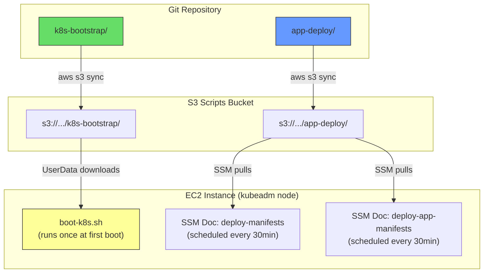
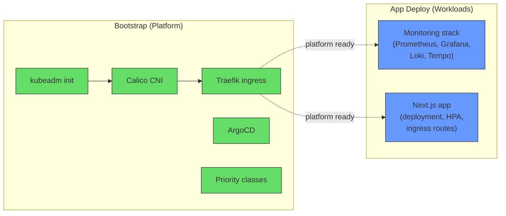
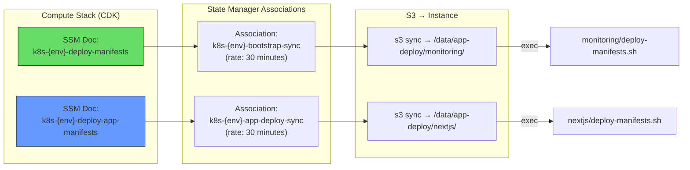

# Separation of Concerns: Bootstrap Sync vs App Deploy Sync

> **Last Updated:** February 2025
> Review report and gap analysis of the two-layer content sync architecture.

## Executive Summary

The Kubernetes platform uses two independent sync pipelines to manage software delivery onto the kubeadm cluster. This document reviews the design, validates the separation boundary, and identifies gaps.

| Aspect | Bootstrap Sync | App Deploy Sync |
| --- | --- | --- |
| **Directory** | `k8s-bootstrap/` (14 files) | `app-deploy/` (57 files) |
| **Workflow** | `sync-k8s-bootstrap-{env}.yml` | `sync-k8s-app-deploy-{env}.yml` |
| **SSM Document** | `k8s-{env}-deploy-manifests` | `k8s-{env}-deploy-app-manifests` |
| **Trigger** | Changes in `k8s-bootstrap/**` | Changes in `app-deploy/**` |
| **S3 Prefix** | `s3://{bucket}/k8s-bootstrap/` | `s3://{bucket}/app-deploy/` |
| **Concern** | Platform layer (cluster software) | Workload layer (application pods) |

---

## Architecture Design

### Two-Layer Content Model



### Design Decision: Why Two Layers?

The separation follows a **platform vs workload** boundary — the same pattern used by Kubernetes distributions (kubeadm manages the cluster, kubectl manages the workloads):



**Key benefits:**

1. **Independent velocity** — Updating a Grafana dashboard JSON or Next.js image tag only syncs `app-deploy/`, no re-run of kubeadm init or Calico install
2. **Blast radius control** — A mistake in a monitoring manifest can't accidentally break the cluster control plane
3. **Different change frequencies** — Platform changes are rare (upgrade Traefik, change CNI); workload changes are frequent (new dashboards, config tweaks)
4. **Selective rollback** — Roll back a broken Next.js deployment without touching the cluster infrastructure

---

## Detailed Content Breakdown

### Bootstrap Layer: `k8s-bootstrap/`

Responsible for everything needed to turn a bare EC2 instance into a functioning kubeadm Kubernetes cluster.

| Path | Purpose | Called By |
| --- | --- | --- |
| `boot/boot-k8s.sh` | Master boot script (564 lines) — EBS attach, kubeadm init, Calico CNI, kubectl setup, cfn-signal, secret seeding, ArgoCD bootstrap | EC2 UserData (first boot) |
| `base/kustomization.yaml` | Kustomize base referencing priority classes + apps | kustomize |
| `overlays/development/` | Dev-specific kustomize patches | kustomize |
| `overlays/production/` | Prod-specific kustomize patches | kustomize |
| `system/priority-classes.yaml` | Pod scheduling priority classes | kustomize base |
| `system/traefik/config.yaml` | Traefik ingress controller config | deploy-manifests.sh |
| `system/argocd/install.yaml` | ArgoCD installation manifest | bootstrap-argocd.sh |
| `system/argocd/bootstrap-argocd.sh` | ArgoCD namespace + initial setup | boot-k8s.sh (step 9) |
| `system/argocd/ingress.yaml` | ArgoCD dashboard IngressRoute | kustomize |
| `system/argocd/namespace.yaml` | ArgoCD namespace definition | kustomize |
| `system/argocd/repo-secret.yaml` | Git repository credentials | kustomize |
| `system/argocd/applications/monitoring.yaml` | ArgoCD Application for monitoring | ArgoCD controller |
| `system/argocd/applications/nextjs.yaml` | ArgoCD Application for Next.js | ArgoCD controller |

**Boot script execution order** (9 steps):

```
1. Start CloudWatch Agent (log streaming from boot start)
2. Attach + mount EBS volume
3. Send cfn-signal SUCCESS (infrastructure ready)
4. kubeadm init (cluster control plane)  ← idempotent guard
5. Install Calico CNI                    ← idempotent guard
6. Configure kubectl access              ← idempotent guard
7. Download + deploy monitoring manifests from S3
8. Pre-seed Next.js secrets from SSM
9. Bootstrap ArgoCD
```

> [!IMPORTANT]
> Steps 4–6 have a **second-run guard**: if `/etc/kubernetes/admin.conf` exists (cluster already initialised), they are skipped entirely. This makes the boot script safe for SSM re-invocation and instance reboots.

### App Deploy Layer: `app-deploy/`

Contains the Kubernetes workload manifests. Two independent application stacks:

#### Monitoring (`app-deploy/monitoring/`)

| Component | Files | Purpose |
| --- | --- | --- |
| `deploy-manifests.sh` | 1 | Orchestrator — SSM secrets, kustomize apply, pod readiness, endpoint registration |
| Prometheus | deployment, configmap, PVC, RBAC, service | Metrics collection |
| Grafana | deployment, configmap, PVC, secret, service + 11 dashboard JSONs | Visualization |
| Loki | deployment, configmap, PVC, service | Log aggregation |
| Tempo | deployment, configmap, PVC, service | Trace collection |
| Promtail | daemonset, configmap, service | Log shipping |
| Node Exporter | daemonset, service | Host metrics |
| Kube State Metrics | deployment, RBAC, service | K8s object metrics |
| GitHub Actions Exporter | deployment | CI/CD pipeline metrics |
| Steampipe | deployment, configmap | Cloud compliance |
| Network Policy | 1 | Namespace network isolation |
| Resource Quota | 1 | Namespace resource limits |

#### Next.js (`app-deploy/nextjs/`)

| Component | Files | Purpose |
| --- | --- | --- |
| `deploy-manifests.sh` | 1 | Orchestrator — SSM secrets, kustomize apply, pod rollout |
| deployment.yaml | 1 | Next.js pod spec |
| hpa.yaml | 1 | Horizontal Pod Autoscaler |
| configmap.yaml | 1 | Runtime environment config |
| alloy-configmap.yaml | 1 | Grafana Alloy (OpenTelemetry) sidecar config |
| IngressRoute + middleware | 4 | Traefik routing rules |
| namespace + service | 2 | Namespace and ClusterIP |

---

## SSM Document Architecture

Each layer has a dedicated SSM document created by the **Compute stack** (CDK):



**How the deployment scripts work:**

1. Sync manifest files from S3 to local disk
2. Resolve secrets from SSM Parameter Store
3. Apply manifests via `kubectl apply --server-side -k`
4. Create/update Kubernetes Secrets (idempotent)
5. Wait for deployment rollout
6. (Monitoring only) Register Loki/Tempo endpoints in SSM

---

## Gap Analysis

### 🔴 Critical Gaps

#### 1. Boot Script References Old S3 Path Structure

The `boot-k8s.sh` at line 463 syncs from `s3://${S3_BUCKET}/k8s/` but the sync workflow uploads to `s3://{bucket}/k8s-bootstrap/`. This means the initial boot won't find the manifests at the expected path if the S3 prefix doesn't match.

**Files:**

- `boot-k8s.sh` line 463: `S3_MANIFEST_PREFIX="s3://${S3_BUCKET}/k8s/"`
- `sync-k8s-bootstrap-dev.yml`: `s3-prefix: k8s-bootstrap`

**Impact:** First-boot manifest deployment may fail (mitigated by the 5-minute retry loop, and SSM State Manager picks it up later).

**Recommendation:** Align the S3 prefix in `boot-k8s.sh` with the sync workflow, or parameterise it via the CDK UserData.

#### 2. Monitoring Deploy Script Path Mismatch

The boot script at line 492 calls `$K8S_DIR/apps/monitoring/deploy-manifests.sh`, but the actual file in `app-deploy/` is at `monitoring/deploy-manifests.sh` (no `apps/` prefix). The SSM document (Compute stack line 217) references `/data/app-deploy/monitoring/deploy-manifests.sh`.

**Impact:** The boot script's initial monitoring deploy may fail to find the script.

**Recommendation:** Align the boot script's path references with the actual `app-deploy/` directory structure.

### 🟡 Minor Gaps

#### 3. No Ordering Guarantee Between SSM Associations

Both SSM State Manager associations run on the same `rate(30 minutes)` schedule. There's no guarantee that the monitoring stack deploys before the Next.js stack. If Next.js pods reference monitoring services (e.g., Loki push endpoint), they may fail on first deploy.

**Current mitigation:** SSM associations re-run every 30 minutes, so eventual consistency is achieved. ArgoCD also watches for drift.

**Recommendation:** Not urgent — the current retry approach is acceptable for a single-node cluster.

#### 4. No Health Check After SSM Association Apply

The "Apply Association Now" step in `_sync-k8s-content.yml` triggers the association but doesn't wait for completion or check if the deployment script succeeded.

**Current mitigation:** The `deploy-manifests.sh` scripts write logs visible in SSM Run Command history. CI pipeline doesn't gate on on-instance execution success.

**Recommendation:** Consider adding an SSM `command-invocation` wait step that polls for completion status.

#### 5. ArgoCD Applications Reference Git, Not S3

The ArgoCD Application manifests (`system/argocd/applications/monitoring.yaml`, `nextjs.yaml`) likely point at the Git repository directly. This creates a dual-source situation: SSM State Manager syncs from S3, ArgoCD syncs from Git.

**Current mitigation:** Both converge to the same desired state (Git → S3 → instance, Git → ArgoCD → cluster). ArgoCD acts as a secondary reconciliation loop.

**Recommendation:** Document the dual-source design explicitly. Consider whether ArgoCD should be the sole deployment mechanism (removing SSM associations) in production.

---

## Summary: Is the Separation Correct?

**Yes — the boundary is well-placed.** The separation follows the industry-standard platform vs workload model:

| Criteria | Bootstrap | App Deploy | Verdict |
| --- | --- | --- | --- |
| Changes independently? | ✅ | ✅ | Correct |
| Different change frequency? | Rare (weeks/months) | Frequent (daily) | Correct |
| Different blast radius? | Cluster-wide | Namespace-scoped | Correct |
| Independent rollback? | ✅ | ✅ | Correct |
| Different SSM documents? | ✅ | ✅ | Correct |
| Clear ownership boundary? | Infra/Platform team | App/Dev team | Correct |

The two critical gaps (S3 path mismatches) should be resolved to ensure first-boot reliability, but they don't affect the architectural separation itself.
