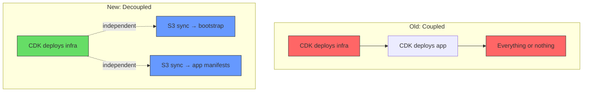
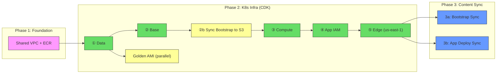
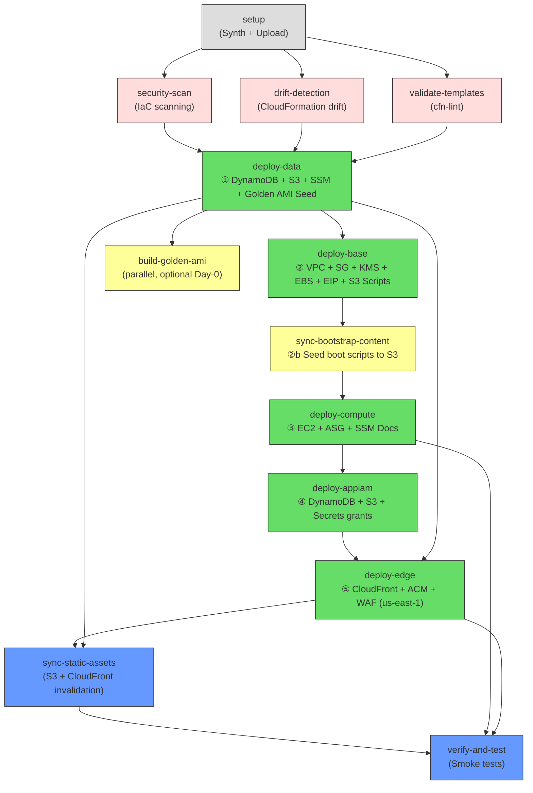
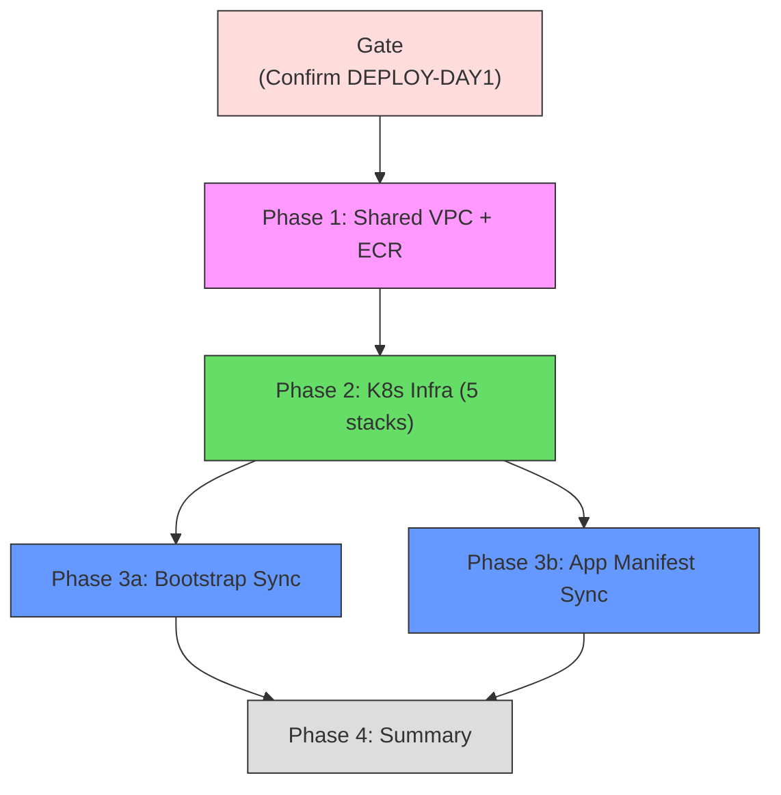

# Kubernetes Pipeline Deployment Guide

> **Last Updated:** February 2025
> Reference guide for the kubeadm Kubernetes platform deployment order, covering infrastructure provisioning, cluster bootstrapping, and application delivery.

## Architecture Overview

The Kubernetes deployment follows a **three-layer decoupled architecture**:

| Layer | Responsibility | Pipeline | Trigger |
|-------|---------------|----------|---------|
| **Infrastructure** | AWS resources (EC2, VPC, S3, IAM, CloudFront) | `_deploy-kubernetes.yml` | Push to `main`/`develop` |
| **Bootstrap** | k3s, Traefik, ArgoCD, Helm charts | `sync-k8s-bootstrap-{env}.yml` | Push changes to `k8s-bootstrap/` |
| **Application** | Next.js pods, IngressRoutes, namespaces | `sync-k8s-app-deploy-{env}.yml` | Push changes to `app-deploy/` |

### Design Decision: Why Decouple?

**Benefits:**
- **Blast radius** — Updating a Kubernetes manifest doesn't re-deploy EC2 instances
- **Independent velocity** — App changes deploy in ~60s (S3 sync), not ~15min (CDK)
- **Day-0 safety** — Infrastructure can deploy even when no application exists yet
- **GitOps ready** — ArgoCD watches Git for manifest changes, SSM enforces state via associations

---

## Full Deployment Order

### End-to-End Pipeline Flow

---

## Phase 1: Foundation — Shared VPC + ECR

| Detail | Value |
|--------|-------|
| **Workflow** | `_deploy-stack.yml` |
| **Stack** | `Shared-Infra-{env}` |
| **Purpose** | VPC with public subnets, ECR repository |
| **When** | Only on Day-0 or when networking changes |

The Shared stack provides the VPC that all Kubernetes stacks consume. It rarely changes after initial deployment.

---

## Phase 2: K8s Infrastructure (CDK)

**Workflow:** [`_deploy-kubernetes.yml`](.github/workflows/_deploy-kubernetes.yml)

This is the core infrastructure pipeline. It orchestrates 5 CDK stacks plus ancillary jobs (security scan, drift detection, template validation, verification).

### Internal Job Dependency Graph

### Stack Details

#### ① Data Stack — `Monitoring-K8s-Data-{env}`
| Resource | Purpose |
|----------|---------|
| DynamoDB Table | Personal portfolio data (articles, subscriptions) |
| S3 Assets Bucket | Static assets for Next.js |
| S3 Access Logs Bucket | Audit trail for assets bucket |
| SSM Parameters | Cross-stack discovery (table name, bucket, region) |
| **Golden AMI SSM Seed** | Seeds `/k8s/{env}/golden-ami/latest` with parent AL2023 AMI ID |

> [!IMPORTANT]
> The Golden AMI SSM parameter **must** be created in the Data stack (not Compute) to avoid Day-0 `ValidationError`. The Compute stack's LaunchTemplate uses `{{resolve:ssm:...}}` which CloudFormation resolves before any resources are created.

#### ② Base Stack — `Monitoring-K8s-Base-{env}`
| Resource | Purpose |
|----------|---------|
| VPC (imported) | Public subnets from Shared stack |
| Security Group | Ingress rules for k8s ports (6443, 80, 443, etc.) |
| KMS Key | Encryption for EBS volumes |
| EBS Volume | Persistent storage for Prometheus/Grafana data |
| Elastic IP | Static IP for the k8s node |
| S3 Scripts Bucket | Boot scripts and manifests storage |

#### ②b Sync Bootstrap Content
Runs `aws s3 sync` to seed boot scripts from `k8s-bootstrap/` into the S3 scripts bucket. This ensures `boot-k8s.sh` is available when the EC2 instance launches during the Compute stack deployment.

> [!NOTE]
> This is a Day-1 safety mechanism. Without it, the EC2 instance would launch but `boot-k8s.sh` wouldn't exist in S3, causing the bootstrap to silently fail.

#### ③ Compute Stack — `Monitoring-K8s-Compute-{env}`
| Resource | Purpose |
|----------|---------|
| Launch Template | AMI (from SSM), instance type, UserData |
| Auto Scaling Group | Single-instance ASG with cfn-signal |
| SSM Documents | `deploy-manifests`, `deploy-app-manifests` |
| State Manager Associations | Continuous config enforcement |
| Instance Role | EC2 instance IAM permissions |

#### ④ App IAM Stack — `Monitoring-K8s-AppIam-{env}`
| Resource | Purpose |
|----------|---------|
| IAM Policies | DynamoDB, S3, Secrets Manager, SSM access |
| Attached to | Compute stack's instance role |

> [!TIP]
> App IAM is separated from Compute so that adding a new DynamoDB table only redeploys the IAM policy — not the ASG or Launch Template. This prevents unnecessary instance replacements.

#### ⑤ Edge Stack — `Monitoring-K8s-Edge-{env}` (us-east-1)
| Resource | Purpose |
|----------|---------|
| ACM Certificate | TLS for `dev.nelsonlamounier.com` |
| WAF WebACL | Rate limiting, IP reputation |
| CloudFront Distribution | CDN routing to EIP origin |
| Route53 Records | DNS CNAME/Alias to CloudFront |

---

## Phase 3: Content Sync (Post-Infrastructure)

After CDK provisions the hardware, two independent pipelines deploy the software layer:

### 3a: Bootstrap Sync

**Workflow:** [`sync-k8s-bootstrap-{env}.yml`](.github/workflows/sync-k8s-bootstrap-dev.yml)
**Reusable:** [`_sync-k8s-content.yml`](.github/workflows/_sync-k8s-content.yml)
**Trigger:** Push to `k8s-bootstrap/**`

| Step | Action |
|------|--------|
| 1 | Discover S3 bucket from SSM (`/k8s/{env}/scripts-bucket`) |
| 2 | `aws s3 sync k8s-bootstrap/ → s3://{bucket}/k8s-bootstrap/` |
| 3 | Create/update SSM State Manager association |
| 4 | Trigger immediate association apply |

**What gets installed:**
- k3s (lightweight Kubernetes)
- Traefik (ingress controller → EIP starts responding)
- ArgoCD (GitOps controller)
- Helm charts (Prometheus, Grafana, cert-manager)

### 3b: App Deploy Sync

**Workflow:** [`sync-k8s-app-deploy-{env}.yml`](.github/workflows/sync-k8s-app-deploy-dev.yml)
**Reusable:** [`_sync-k8s-content.yml`](.github/workflows/_sync-k8s-content.yml)
**Trigger:** Push to `app-deploy/**`

| Step | Action |
|------|--------|
| 1 | Discover S3 bucket from SSM |
| 2 | `aws s3 sync app-deploy/ → s3://{bucket}/app-deploy/` |
| 3 | Create/update SSM State Manager association |
| 4 | Trigger immediate association apply |

**What gets deployed:**
- Next.js application pods
- IngressRoutes (Traefik → Next.js)
- Kubernetes namespaces, ResourceQuotas, NetworkPolicies

> [!NOTE]
> Phases 3a and 3b **can run in parallel**. Bootstrap installs the cluster software; app deploy pushes the workload manifests. SSM State Manager ensures they're applied in the correct order on the instance.

---

## Day-1 Orchestration — All-in-One

For fresh environments, the [`day-1-orchestration.yml`](.github/workflows/day-1-orchestration.yml) workflow chains everything:

| Feature | Detail |
|---------|--------|
| **Trigger** | Manual only (`workflow_dispatch`) |
| **Safety** | Requires typing `DEPLOY-DAY1` to confirm |
| **Concurrency** | One run per environment |
| **Toggleable** | Each phase can be independently skipped via inputs |

---

## What Runs When?

### On Push to `main` / `develop`

| Changed Files | Pipeline Triggered | What Deploys |
|--------------|-------------------|--------------|
| `infra/**` | `deploy-kubernetes-{env}.yml` | CDK stacks (Data → Base → Compute → AppIam → Edge) |
| `k8s-bootstrap/**` | `sync-k8s-bootstrap-{env}.yml` | Boot scripts → S3 → SSM association |
| `app-deploy/**` | `sync-k8s-app-deploy-{env}.yml` | App manifests → S3 → SSM association |
| Both infra + bootstrap | Both pipelines (independent) | Infrastructure + bootstrap in parallel |

### Manual Triggers

| Workflow | When to Use |
|----------|-------------|
| `day-1-orchestration.yml` | Fresh environment (Day-0 → Day-1) |
| `build-golden-ami-{env}.yml` | Force a new Golden AMI bake |
| `sync-k8s-bootstrap-{env}.yml` | Re-apply bootstrap manually |
| `sync-k8s-app-deploy-{env}.yml` | Re-apply app manifests manually |

---

## Troubleshooting

### Day-0: `ValidationError: Unable to fetch parameters`
**Cause:** Golden AMI SSM parameter doesn't exist when Compute stack deploys.
**Fix:** The Data stack now seeds `/k8s/{env}/golden-ami/latest` with the parent AL2023 AMI ID. Ensure the Data stack deploys before Compute.

### Day-0: EIP HTTP unreachable
**Cause:** CDK provisions the instance but Traefik isn't installed yet.
**Fix:** Run `sync-k8s-bootstrap-{env}.yml` to install k3s + Traefik. The smoke test classifies this as non-critical.

### Day-0: CloudFront returns 404
**Cause:** CloudFront is configured but the origin (EIP) isn't serving content.
**Fix:** After bootstrap + app deploy sync, Next.js pods start → Traefik routes traffic → CloudFront returns 200.

### API Stack: NOT_FOUND
**Cause:** The API stack is optional (application-layer, deployed separately).
**Status:** The smoke test treats this as non-critical and logs a warning.

---

## Related Files

| File | Purpose |
|------|---------|
| [_deploy-kubernetes.yml](.github/workflows/_deploy-kubernetes.yml) | Reusable infra deployment workflow |
| [_sync-k8s-content.yml](.github/workflows/_sync-k8s-content.yml) | Reusable S3 content sync workflow |
| [day-1-orchestration.yml](.github/workflows/day-1-orchestration.yml) | Full Day-1 orchestrator |
| [stacks.ts](infra/scripts/deployment/stacks.ts) | Stack configuration and naming |
| [factory.ts](infra/lib/projects/kubernetes/factory.ts) | CDK stack instantiation and wiring |
| [smoke-tests-kubernetes.ts](infra/scripts/deployment/smoke-tests-kubernetes.ts) | Post-deploy verification |
| [golden-ami-pipeline-review.md](docs/golden-ami-pipeline-review.md) | Golden AMI lifecycle deep-dive |
