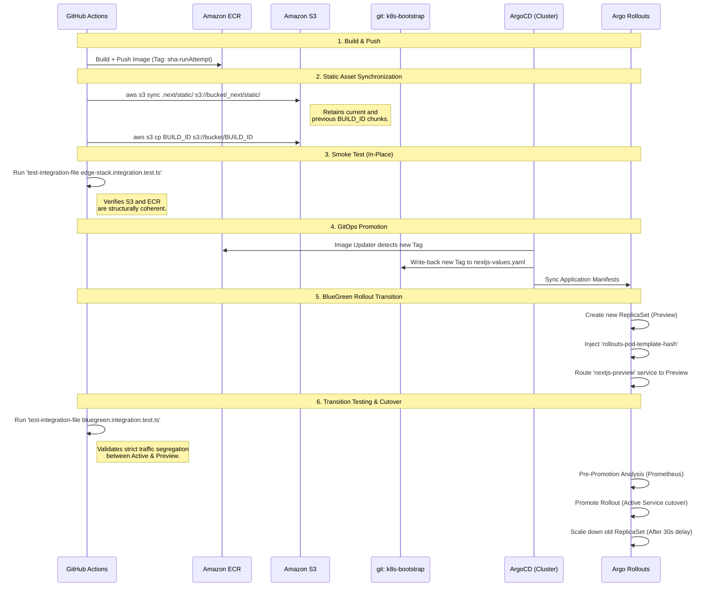

# Frontend Operations & Deployment Pipeline

This directory contains the operational scripts and utilities for deploying the Next.js frontend to the Kubernetes cluster using Argo Rollouts and ArgoCD.

## End-to-End BlueGreen Deployment Flow

The frontend deployment follows a strict GitOps BlueGreen progression leveraging AWS ECR, S3, and ArgoCD Image Updater. This architecture ensures ZERO downtime and eliminates the risk of missing static assets (CSS/JS 404s) during the transition window.

## Core Deployment Pipeline Steps

### 1. Docker Image Push
The CI runner builds the Next.js standalone container. To prevent tag overwriting across pipeline retries, the image is uniquely tagged using `${{ github.sha }}-r${{ github.run_attempt }}`.

### 2. S3 Static & Builder ID Sync
The `sync-static-to-s3.ts` script handles the synchronization of Next.js static assets to the CloudFront S3 origin. 
- It parses the internal `.next/BUILD_ID`.
- It executes an additive `aws s3 sync`.
- **Crucial:** It explicitly queries the `s3://bucket/_next/static/` prefix and deletes old chunk folders EXCEPT for the newly deployed `BUILD_ID` and the immediately preceding `BUILD_ID`. This guarantees that the older pods representing the "Stable" environment during a BlueGreen transition will not experience 404s when requesting their CSS/JS files.

### 3. Test In-Place (Edge Stack)
Before initiating the Kubernetes rollout, `edge-stack.integration.test.ts` asserts that the S3 bucket is properly seeded with the active `BUILD_ID` and that the application image published to ECR matches the expectations.

### 4. BlueGreen Deployment (Argo Rollouts)
ArgoCD Image Updater detects the new ECR tag and writes the change back to the deployment repository. ArgoCD syncs the cluster state, which prompts Argo Rollouts to begin the BlueGreen transition:
- A new "Preview" ReplicaSet is created.
- The `nextjs-preview` Kubernetes Service is patched with the new `rollouts-pod-template-hash`.
- The `nextjs` (Active) Kubernetes Service remains securely pinned to the old stable ReplicaSet.

### 5. BlueGreen Deployment Test
The secondary integration test `bluegreen.integration.test.ts` executes over an active SSM tunnel (`just k8s-tunnel-auto development`). It programmatically evaluates the Kubernetes API to guarantee that traffic routing is correctly segregated and the active service hash remains isolated from the preview hash.

### 6. Cutover
If pre-promotion PromQL queries evaluating error rates and P95 latencies are satisfied, the active service routes are seamlessly swapped over to the preview ReplicaSet, and the old ReplicaSet scales to zero after a cooldown period.
