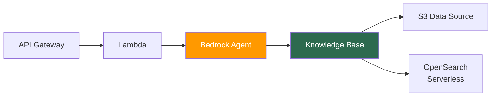

# Bedrock Stacks

> AI-powered content pipeline — AWS Bedrock agents, knowledge bases, and API for article generation.

## Stacks

| Stack | File | Purpose |
| :---- | :--- | :------ |
| **Data** | `data-stack.ts` | S3 knowledge base bucket, OpenSearch Serverless collection |
| **AI Content** | `ai-content-stack.ts` | Bedrock Knowledge Base, data source ingestion, embedding model |
| **Agent** | `agent-stack.ts` | Bedrock Agent with action groups, Lambda handlers, guardrails |
| **API** | `api-stack.ts` | API Gateway REST API, Lambda integration, usage plans |

## Architecture

## Key Patterns

- **RAG Pipeline** — Bedrock Knowledge Base indexes S3 documents into OpenSearch Serverless for retrieval-augmented generation
- **Agent Orchestration** — Bedrock Agent uses action groups to invoke Lambda handlers for structured article generation
- **API Layer** — REST API with usage plans and API keys for controlled access to the content generation pipeline
