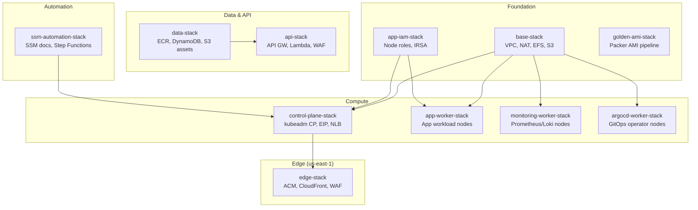

# Kubernetes Stacks

> Self-managed Kubernetes cluster on EC2 — 12 stacks covering networking, compute, security, edge delivery, and automated bootstrap.

## Stack Map

## Stacks

| Stack | File | Lines | Purpose |
| :---- | :--- | ----: | :------ |
| **Base** | `base-stack.ts` | 790 | VPC, subnets, NAT, EFS, S3 scripts bucket, KMS |
| **Control Plane** | `control-plane-stack.ts` | 690 | kubeadm control plane, EIP, NLB, ASG, SecurityGroups |
| **App Worker** | `app-worker-stack.ts` | 590 | Application workload nodes, ASG, user-data bootstrap |
| **Monitoring Worker** | `monitoring-worker-stack.ts` | 665 | Prometheus/Grafana/Loki dedicated nodes |
| **ArgoCD Worker** | `argocd-worker-stack.ts` | 555 | GitOps operator node with ArgoCD management |
| **App IAM** | `app-iam-stack.ts` | 215 | Node IAM roles, instance profiles, IRSA policies |
| **Data** | `data-stack.ts` | 420 | ECR, DynamoDB, S3 static assets, SSM secrets |
| **API** | `api-stack.ts` | 710 | API Gateway, Lambda handlers, regional WAF |
| **Edge** | `edge-stack.ts` | 747 | ACM certificate, CloudFront CDN, global WAF (us-east-1) |
| **SSM Automation** | `ssm-automation-stack.ts` | 416 | SSM Automation docs, Step Functions orchestrator |
| **Golden AMI** | `golden-ami-stack.ts` | 173 | EC2 Image Builder pipeline for Kubernetes node AMIs |

## Key Patterns

- **SSM-Based Discovery** — stacks publish resource IDs to SSM Parameter Store (`/{project}/{env}/type/name`); consumers use `valueFromLookup()` during synthesis
- **Construct Composition** — delegates to reusable constructs in [`constructs/`](../../constructs/)
- **Bootstrap Orchestration** — EventBridge → Step Functions → SSM Automation → RunCommand chain for zero-touch instance bootstrap
- **Cross-Region** — Edge stack deploys to `us-east-1` for CloudFront + ACM; all other stacks deploy to `eu-west-1`
