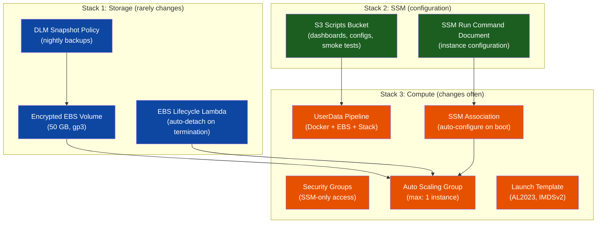
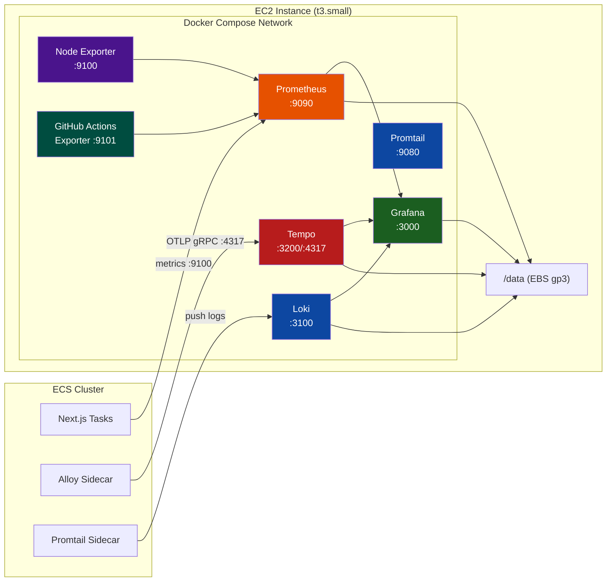
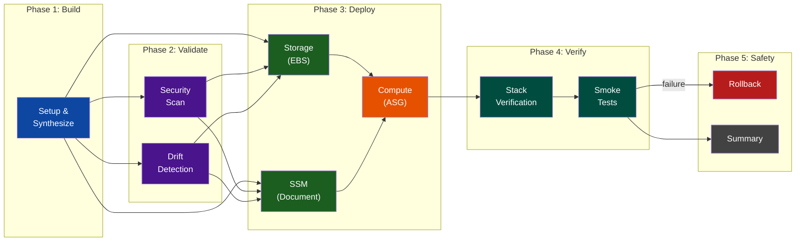

# Building a Production Observability Platform on AWS: EC2/ASG Monitoring with Prometheus, Grafana, Loki, and Tempo

> **TL;DR** — A self-hosted observability platform running 7 containerized services on a single
> EC2 instance behind an Auto Scaling Group, with persistent EBS storage, SSM-based configuration
> management, and a CI/CD pipeline featuring security scanning, drift detection, smoke tests,
> and automated rollback. Deployed as Infrastructure as Code with AWS CDK across 3 modular stacks.

---

## 1. Why Build This?

### The Problem

The portfolio's Next.js application runs on ECS with CloudFront, API Gateway, Lambda, and DynamoDB — a 6-stack architecture with dozens of moving parts. Without observability, a failing ECS task, a misconfigured Prometheus target, or a Loki ingestion failure is invisible until a user reports it. AWS CloudWatch provides basic metrics, but:

- **No unified dashboard** — switching between CloudWatch, ECS console, and EC2 console to diagnose a single incident
- **No log aggregation** — application logs scattered across CloudWatch Log Groups without correlation
- **No distributed tracing** — no visibility into request flows from CloudFront → ECS → DynamoDB
- **No host-level metrics** — CPU, memory, and disk usage at the instance level (not just container level)
- **Cost** — managed observability services (Datadog, New Relic, Grafana Cloud) cost $50-200+/month for a portfolio project

### The Solution

Build a self-hosted observability stack that runs on a single EC2 instance (t3.small, ~$12/month) behind an ASG, providing:

- **Prometheus** for metrics collection with EC2 service discovery
- **Grafana** for unified dashboards (9 pre-provisioned dashboards)
- **Loki** for centralized log aggregation
- **Tempo** for distributed tracing via OTLP
- **Promtail** for log shipping from instance to Loki
- **Node Exporter** for host-level metrics
- **GitHub Actions Exporter** for CI/CD pipeline metrics

All managed through Docker Compose, with persistent data on an encrypted EBS volume that survives instance replacements.

---

## 2. Architecture Overview

### 3-Stack Domain Split



| Stack       | Change Frequency | Deploy Time | What It Owns                                    |
| :---------- | :--------------- | :---------- | :---------------------------------------------- |
| **Storage** | Monthly          | ~2 min      | EBS volume, DLM backups, lifecycle Lambda       |
| **SSM**     | Weekly           | ~2 min      | SSM document, S3 scripts bucket                 |
| **Compute** | Daily            | ~5 min      | Security groups, ASG, Launch Template, UserData |

### Why 3 Stacks?

The split follows the **change frequency principle**: storage infrastructure (EBS volumes, backup policies) changes monthly, configuration (SSM documents, scripts) changes weekly, and compute resources change with every deployment. Deploying a new Grafana dashboard (Compute stack) never risks touching the persistent EBS volume (Storage stack) or the SSM Run Command document (SSM stack).

All stacks communicate via **SSM Parameter Store** instead of CloudFormation cross-stack exports. This eliminates the "stack locked" problem where modifying an exported value requires updating every importing stack first.

---

## 3. The Service Architecture

### 7-Container Docker Compose Stack



| Service                 | Image                                   | Purpose                         | Data Persistence         |
| :---------------------- | :-------------------------------------- | :------------------------------ | :----------------------- |
| Prometheus              | `prom/prometheus:v3.9.1`                | Metrics collection engine       | `/prometheus` → EBS      |
| Grafana                 | `grafana/grafana:12.3.0`                | Dashboard visualization         | `/var/lib/grafana` → EBS |
| Node Exporter           | `prom/node-exporter:v1.8.2`             | Host-level CPU/RAM/Disk metrics | Stateless                |
| Loki                    | `grafana/loki:3.0.0`                    | Log aggregation                 | `/loki` → EBS            |
| Promtail                | `grafana/promtail:3.0.0`                | Log shipping from host          | Stateless                |
| Tempo                   | `grafana/tempo:2.6.1`                   | Distributed tracing backend     | `/var/tempo` → EBS       |
| GitHub Actions Exporter | `ghcr.io/labbs/github-actions-exporter` | CI/CD pipeline metrics          | Stateless                |

### Security Model: Zero Public Ingress

All services bind to `127.0.0.1` — no ports are exposed to the internet:

```yaml
ports:
  - "127.0.0.1:9090:9090" # Prometheus — localhost only
  - "127.0.0.1:3000:3000" # Grafana — localhost only
```

The only exception is Tempo's OTLP receivers (`0.0.0.0:4317` and `:4318`), which must accept traces from ECS tasks within the VPC. All developer access goes through **SSM Session Manager port forwarding** — never SSH, never public ingress.

---

## 4. Design Decisions and Trade-offs

### Single EC2 Over ECS/Fargate

**Decision**: Run the monitoring stack on a standalone EC2 instance, not as ECS services.

**Rationale**: The monitoring stack needs host-level `/proc` and `/sys` access for Node Exporter, persistent EBS volumes for Prometheus/Grafana/Loki data retention, and Docker Compose orchestration for coordinated multi-service startup. ECS Fargate does not expose host filesystems, and ECS on EC2 would require managing a separate cluster just for monitoring. A single EC2 instance with Docker Compose provides all three capabilities at ~$12/month.

**Trade-off**: No built-in horizontal scaling or self-healing beyond the ASG's single-instance replacement.

### ASG Max Capacity = 1 (The EBS Constraint)

**Decision**: Force `maxCapacity: 1` on the ASG, accepting brief downtime during updates.

**Rationale**: The monitoring stack uses a single EBS volume for persistent data. EBS volumes can only be attached to one instance at a time. If `maxCapacity > 1`, a rolling update would launch a new instance while the old one is still running — the new instance would fail to attach the EBS volume, send a CloudFormation FAILURE signal, and trigger an `UPDATE_ROLLBACK`.

**Trade-off**: Instance replacement (AMI updates, instance type changes) requires brief downtime as the old instance terminates, the EBS volume detaches, the new instance launches, and the volume re-attaches.

### SSM Parameter Discovery Over CloudFormation Exports

**Decision**: All cross-stack communication uses SSM Parameter Store.

**Rationale**: CloudFormation exports create permanent coupling — you cannot delete or modify an exported value without first updating every importing stack. SSM parameters are intentionally decoupled: the Storage stack writes `/{namePrefix}/ebs/volume-id`, and the Compute stack reads it during synthesis. Stack refactoring never requires consumer changes.

### SSM Association Over UserData SSM Trigger

**Decision**: Replace inline UserData SSM triggers with an SSM State Manager Association.

**Rationale**: The original architecture embedded an `aws ssm send-command` call inside user-data to trigger the SSM Run Command document after instance bootstrap. This created a tight coupling between the UserData script and the SSM stack. An SSM State Manager Association (`ssm.CfnAssociation`) targets instances via ASG tags and automatically runs the SSM document on new instances — decoupling configuration from bootstrap and ensuring consistent application on every instance replacement.

### S3-Gated Configuration Pattern

**Decision**: Store large configurations (dashboards, Prometheus configs, scripts) in S3 and download at boot.

**Rationale**: EC2 UserData has a 16KB limit. The monitoring stack's configuration — Prometheus rules, Grafana dashboard JSON files, Loki/Promtail configs — exceeds this limit. The pattern: upload artifacts to S3 during CDK deployment (`BucketDeployment`), download them during instance bootstrap (`aws s3 sync`).

---

## 5. The CI/CD Pipeline

### Pipeline Architecture



### Pipeline Stages

| Stage        | Job                | Purpose                     | Details                                                    |
| :----------- | :----------------- | :-------------------------- | :--------------------------------------------------------- |
| **Build**    | Setup & Synthesize | CDK synth + artifact upload | TypeScript build → `synthesize-ci.ts` → stack name outputs |
| **Validate** | Security Scan      | Checkov IaC analysis        | Policy-as-code with custom CDK-Nag checks                  |
|              | Drift Detection    | `cdk diff` comparison       | Pre-deployment change visibility (staging/prod)            |
| **Deploy**   | Storage            | EBS + DLM + Lambda          | Parallel with SSM — independent resources                  |
|              | SSM                | Document + S3 bucket        | Parallel with Storage — no shared dependencies             |
|              | Compute            | SG + ASG + LaunchTemplate   | Sequential — depends on both Storage and SSM               |
| **Verify**   | Stack Verification | AWS SDK health checks       | TypeScript script validates CloudFormation stack status    |
|              | Smoke Tests        | 6-category production test  | Via SSM Run Command on the live instance                   |
| **Safety**   | Rollback           | CloudFormation rollback     | Triggered when verify or smoke tests fail (staging/prod)   |
|              | Summary            | GitHub Step Summary         | Renders full pipeline status with stacked results          |

### Key Pipeline Features

**Parallel Stack Deployment**: Storage and SSM stacks deploy in parallel (they share no dependencies), reducing total pipeline time by ~2 minutes.

**Automated Rollback**: If verification or smoke tests fail on staging/production, the pipeline automatically triggers `scripts/deployment/rollback.ts` to roll back the Compute stack to the previous known-good CloudFormation template. Storage and SSM stacks are left intact — they are configuration/storage resources that should not be rolled back.

**Production-Ready Smoke Tests**: The smoke test script runs 6 categories of checks on the live instance via SSM Run Command:

| Category              | What It Tests                                                            |
| :-------------------- | :----------------------------------------------------------------------- |
| Container Health      | All 7 containers running (6 required + 1 optional)                       |
| HTTP Health           | Service-specific health/ready APIs for all endpoints                     |
| Grafana Validation    | Datasource connectivity, dashboard count (≥4 datasources, ≥9 dashboards) |
| Prometheus Validation | Active scrape targets, alert rules loaded, query API functional          |
| Data Pipeline         | Loki log stream ingestion, Promtail targets, Tempo readiness             |
| Infrastructure        | EBS mount at `/data`, disk usage thresholds, Docker daemon health        |

---

## 6. DevOps Skills Demonstrated

### Infrastructure as Code (CDK L2/L3 Constructs)

All infrastructure is defined in TypeScript using AWS CDK v2. The project uses the **Project Factory pattern** — a factory class that orchestrates multi-stack creation with a standardized interface:

```typescript
// lib/projects/monitoring/factory.ts
const factory = new MonitoringProjectFactory(environment);
const stacks = factory.createAllStacks(app, context);
```

The factory handles VPC discovery, naming conventions, stack dependencies, and environment-specific overrides. Each stack uses L2 constructs (e.g., `ec2.AutoScalingGroup`, `ssm.CfnDocument`) with custom L3 constructs for shared patterns (`EncryptedEbsVolumeConstruct`, `SecurityGroupConstruct`, `SsmRunCommandDocument`).

### Secrets Management

Grafana admin password is passed via GitHub Actions secrets (`GRAFANA_ADMIN_PASSWORD`), bridged through the CDK synthesis process, and stored in the SSM Run Command document. At no point is the password committed to source control or embedded in CloudFormation templates.

### Observability-as-Code

Grafana dashboards are stored as JSON definitions in `scripts/monitoring/grafana/dashboards/` (9 dashboards), provisioned automatically via Grafana's provisioning API. Prometheus alert rules, scrape configurations, and Loki/Tempo configs are all version-controlled and deployed through the S3 sync pattern.

### Builder Pattern (UserDataBuilder)

The `UserDataBuilder` class provides a fluent interface for constructing complex EC2 user-data scripts:

```typescript
new UserDataBuilder(userData)
    .systemUpdate()
    .installDocker()
    .installAwsCli()
    .attachEbsVolume({ ... })
    .sendCfnSignal({ ... });
```

This pattern eliminates inline bash strings in CDK stacks, provides method-level testability, and ensures CDK Token resolution by operating directly on `ec2.UserData` objects.

### Policy-as-Code

CDK bootstrap uses custom execution policies (`scripts/bootstrap/policies/CDKCloudFormationEx.json`) that scope CloudFormation's IAM permissions to only the actions required by the monitoring stacks. Combined with Checkov security scanning in the pipeline, this enforces least-privilege at both deployment time and synthesis time.

### SSM-Based Remote Execution

The SSM Run Command document (`MonitoringSsmStack`) provides idempotent instance configuration — downloading Docker Compose files, Grafana provisioning configs, and dashboards from S3, then starting the monitoring stack. The SSM State Manager Association ensures this runs automatically on every new instance joining the ASG.

---

## 7. Deployment Challenges Faced

### Challenge 1: EBS Volume Race Condition During Rolling Updates

**Problem**: During ASG rolling updates, the lifecycle hook Lambda detaches the EBS volume from the terminating instance. The new instance's UserData immediately tries to attach the same volume — but detachment takes 10-30 seconds. The `aws ec2 attach-volume` call fails with "volume is in-use."

**Solution**: Implemented a polling loop in the `UserDataBuilder.attachEbsVolume()` method that waits up to 120 seconds for the volume to become `available`, handling three states: `in-use` (still attached to terminating instance), `detaching` (in progress), and `available` (ready to attach). The loop also handles NVMe device mapping on Nitro instances where `/dev/xvdf` maps to `/dev/nvmeXn1`.

### Challenge 2: CloudFormation Execution Role Missing IAM Permissions

**Problem**: The SSM stack deployment failed with `AccessDenied: iam:CreatePolicy`. The CDK bootstrap execution role lacked permissions to create IAM managed policies, which the SSM stack's `SsmRunCommandDocument` construct requires for its execution role.

**Solution**: Updated `scripts/bootstrap/policies/CDKCloudFormationEx.json` to include `iam:CreatePolicy`, `iam:DeletePolicy`, `iam:GetPolicy`, `iam:CreatePolicyVersion`, `iam:DeletePolicyVersion`, and `iam:ListPolicyVersions`. Re-bootstrapped CDK with the updated policy.

### Challenge 3: SSM Smoke Test Timeout (100 seconds is not enough)

**Problem**: The smoke test script runs 6 categories of checks with a 60-second warm-up phase. The `aws ssm wait command-executed` waiter has a hard limit of ~100 seconds (20 attempts × 5 seconds). The smoke tests consistently exceeded this, causing the pipeline to fail with `Max attempts exceeded` even though tests would have passed.

**Solution**: Replaced the AWS CLI waiter with a custom polling loop (600-second budget, 15-second intervals). Added an SSM Association completion check before running tests. Staged the smoke test script via S3 instead of using `base64 -w0` encoding (which is GNU-specific and fails on AL2023).

### Challenge 4: UserData CDK Token Resolution

**Problem**: The `UserDataBuilder` originally returned plain strings. CDK Tokens (e.g., `ec2.Volume.volumeId`) embedded in these strings were never resolved — they appeared as literal `${Token[TOKEN.xxx]}` in the rendered UserData, causing runtime failures.

**Solution**: Refactored `UserDataBuilder` to accept and operate directly on CDK `ec2.UserData` objects using `addCommands()`. This ensures CDK Tokens are resolved at synthesis time, not rendered as literal strings.

### Challenge 5: Cross-Stack Dependency Ordering

**Problem**: The Compute stack creates an SSM Association referencing the SSM document from the SSM stack. Without explicit dependencies, CDK may deploy the Compute stack before the SSM stack, causing the Association to reference a non-existent document.

**Solution**: Added explicit CDK dependency: `computeStack.addDependency(ssmStack)`. The pipeline enforces this ordering at the workflow level too — Compute deploys only after both Storage and SSM succeed.

### Challenge 6: Bootstrap Script Shell Portability

**Problem**: The `environment-deployment.sh` bootstrap script failed with `unbound variable` errors. Root causes: `BASH_SOURCE[1]` (index 1 references the caller, not the current script), `export $(grep ... | xargs)` breaking on values with spaces/URLs, and `while read` skipping the last line of `.env` files without a trailing newline.

**Solution**: Fixed `BASH_SOURCE[0]` indexing, replaced `export $(xargs)` with a `while IFS='=' read` loop that handles quoted values, and added `|| [[ -n "$key" ]]` to process the last line regardless of trailing newline.

---

## 8. Grafana Dashboards (Provisioned as Code)

9 dashboards are provisioned automatically from JSON definitions stored in `scripts/monitoring/grafana/dashboards/`:

| Dashboard                   | Source            | Key Metrics                                  |
| :-------------------------- | :---------------- | :------------------------------------------- |
| System Overview             | Node Exporter     | CPU, RAM, Disk, Network at instance level    |
| ECS/Next.js                 | Prometheus EC2 SD | Application task count, container health     |
| Next.js Application Metrics | Custom Prometheus | Request rates, response times, error rates   |
| Next.js OTEL                | Tempo             | Distributed traces, latency histograms       |
| Loki Logs                   | Loki              | Centralized log search, filter by job/level  |
| CloudWatch Logs             | CloudWatch        | Cross-reference with native AWS logging      |
| Deployment Logs             | Promtail          | Instance boot logs, UserData execution       |
| GitHub Actions              | GH Exporter       | Workflow run duration, success/failure rates |
| Node Exporter               | Node Exporter     | Detailed host metrics (per-CPU, per-disk)    |

---

## 9. Operational Tooling

### Connect Script (`scripts/connect-monitoring.sh`)

A developer-friendly script that automates SSM port forwarding:

```bash
./scripts/connect-monitoring.sh grafana     # Grafana on localhost:3000
./scripts/connect-monitoring.sh prometheus  # Prometheus on localhost:9090
./scripts/connect-monitoring.sh both        # Both services
```

Features: automatic instance discovery via tags, port conflict detection with interactive resolution (kill process/use alternative port/abort), and service health pre-check via SSM before establishing the tunnel.

### Bootstrap Script (`scripts/bootstrap/environment-deployment.sh`)

Automates CDK bootstrap for new environments: creates custom execution policies, attaches them to the CDK roles, and bootstraps with the correct qualifier. Loads configuration from `.env.bootstrap` with shell-safe parsing.

---

## 10. Cost Analysis

| Resource         | Monthly Cost   | Notes                            |
| :--------------- | :------------- | :------------------------------- |
| EC2 (`t3.small`) | ~$12           | Single monitoring instance       |
| EBS (50 GB gp3)  | ~$4            | Persistent data volume           |
| S3               | ~$0.10         | Scripts bucket (minimal storage) |
| DLM Snapshots    | ~$0.50         | Nightly backup retention         |
| Data Transfer    | ~$0.50         | Intra-VPC metric/log traffic     |
| **Total**        | **~$17/month** | Full observability platform      |

Compared to managed alternatives: Datadog (~$70/month), Grafana Cloud (~$50/month), New Relic (~$100/month). The self-hosted approach saves ~$50-80/month while providing full customization and data sovereignty.

---

## 11. Tech Stack Summary

| Category       | Technology                                                   |
| :------------- | :----------------------------------------------------------- |
| Infrastructure | AWS CDK v2 (TypeScript, 3-stack architecture)                |
| Compute        | EC2 on ASG (AL2023, IMDSv2, t3.small)                        |
| Storage        | Encrypted EBS gp3 + DLM snapshots                            |
| Configuration  | SSM Run Command + State Manager Association                  |
| Orchestration  | Docker Compose (7 services)                                  |
| Metrics        | Prometheus v3.9.1 + Node Exporter v1.8.2                     |
| Dashboards     | Grafana 12.3.0 (9 provisioned dashboards)                    |
| Logs           | Loki 3.0.0 + Promtail 3.0.0                                  |
| Traces         | Tempo 2.6.1 (OTLP gRPC receiver)                             |
| CI/CD          | GitHub Actions (8-stage pipeline)                            |
| Security       | SSM-only access, Checkov scanning, custom bootstrap policies |
| Discovery      | SSM Parameter Store (zero CloudFormation exports)            |

---

## 12. Related Files

| File                                                  | Description                                  |
| :---------------------------------------------------- | :------------------------------------------- |
| `lib/stacks/monitoring/storage/storage-stack.ts`      | EBS + DLM + lifecycle Lambda (550 lines)     |
| `lib/stacks/monitoring/ssm/ssm-stack.ts`              | SSM document + S3 scripts bucket (402 lines) |
| `lib/stacks/monitoring/compute/compute-stack.ts`      | Security groups + ASG + UserData (521 lines) |
| `lib/projects/monitoring/factory.ts`                  | Project Factory (203 lines)                  |
| `lib/common/compute/builders/user-data-builder.ts`    | Fluent UserData builder (692 lines)          |
| `scripts/monitoring/docker-compose.yml`               | 7-service Docker Compose (138 lines)         |
| `scripts/monitoring/smoke-test.sh`                    | Production smoke tests (460 lines)           |
| `scripts/connect-monitoring.sh`                       | SSM port forwarding helper (420 lines)       |
| `.github/workflows/_deploy-monitoring.yml`            | 8-stage deployment pipeline (411 lines)      |
| `.github/workflows/_smoke-tests.yml`                  | Reusable smoke test workflow                 |
| `scripts/bootstrap/environment-deployment.sh`         | CDK bootstrap automation                     |
| `scripts/bootstrap/policies/CDKCloudFormationEx.json` | Custom execution role policy                 |
