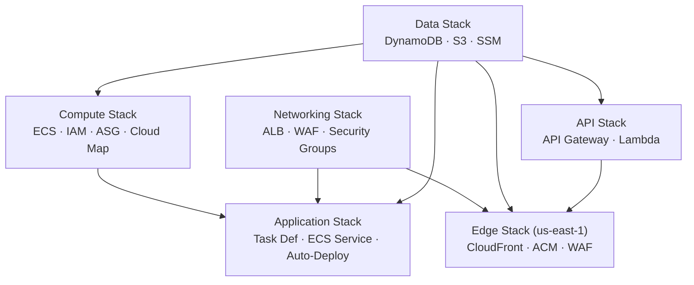
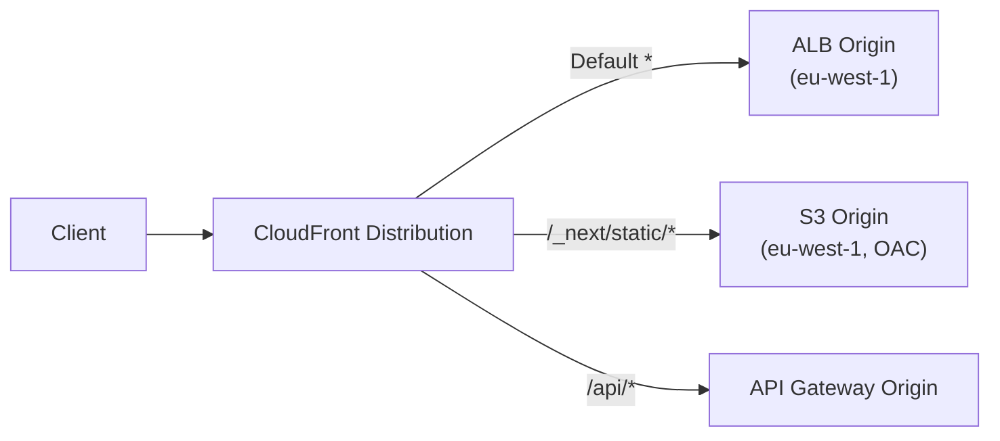
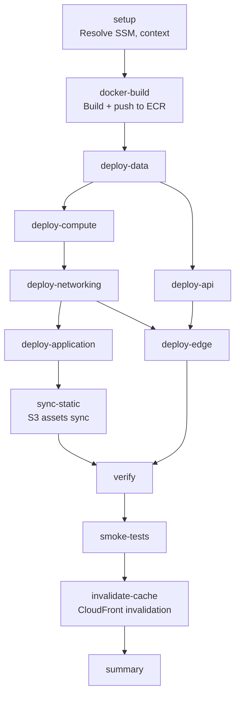

# Next.js Infrastructure Deep-Dive Reference

> **Scope**: Complete technical reference for the Next.js ECS-on-EC2 application infrastructure managed by the `cdk-monitoring` CDK project.
>
> **Source of Truth**: All values are extracted directly from the source code — see file links throughout.

---

## Table of Contents

1. [Architecture Overview](#1-architecture-overview)
2. [Data Layer — `NextJsDataStack`](#2-data-layer)
3. [Compute Layer — `NextJsComputeStack`](#3-compute-layer)
4. [Networking Layer — `NextJsNetworkingStack`](#4-networking-layer)
5. [Application Layer — `NextJsApplicationStack`](#5-application-layer)
6. [API Layer — `NextJsApiStack`](#6-api-layer)
7. [Edge Layer — `NextJsEdgeStack`](#7-edge-layer)
8. [Configuration System](#8-configuration-system)
9. [CI/CD Pipeline](#9-cicd-pipeline)
10. [Deployment Scripts](#10-deployment-scripts)

---

## 1. Architecture Overview

### 1.1 Six-Stack Consolidated Domain Architecture

The Next.js project uses a **consolidated domain-based** stack design — 6 stacks (down from 14+ in the legacy architecture) grouped by change-frequency domain. Each stack maps to a distinct AWS service layer.

| Phase | Stack       | CDK Name Pattern           | Region    | Domain             |
| ----- | ----------- | -------------------------- | --------- | ------------------ |
| 1     | Data        | `NextJS-Data-{env}`        | eu-west-1 | Rarely changes     |
| 2     | Compute     | `NextJS-Compute-{env}`     | eu-west-1 | Rarely changes     |
| 3     | Networking  | `NextJS-Networking-{env}`  | eu-west-1 | Rarely changes     |
| 4     | Application | `NextJS-Application-{env}` | eu-west-1 | Frequent changes   |
| 5     | API         | `NextJS-Api-{env}`         | eu-west-1 | Separate lifecycle |
| 6     | Edge        | `NextJS-Edge-{env}`        | us-east-1 | Rarely changes     |

> [!NOTE]
> A 7th stack, `NodeExporterTaskDefinitionStack`, defines the Prometheus node-exporter daemon. In practice it is created inline within the Application stack's `addNodeExporterDaemon()` method.

### 1.2 Dependency Graph



Dependency edges are wired via `addDependency()` calls in [factory.ts#L234–L355](file:///Users/nelsonlamounier/Desktop/revamp-portfolio-iac/cdk-monitoring/lib/projects/nextjs/factory.ts#L234-L355).

### 1.3 Factory Pattern

The `ConsolidatedNextJSFactory` in [factory.ts](file:///Users/nelsonlamounier/Desktop/revamp-portfolio-iac/cdk-monitoring/lib/projects/nextjs/factory.ts) implements `IProjectFactory<ConsolidatedFactoryContext>`:

1. **Loads typed config** — `getNextJsConfigs(environment)` for the target tier
2. **Resolves VPC** — synth-time lookup via `shared-vpc-{environment}` name tag
3. **Soft-validates** — warns (but doesn't fail synthesis) when Edge or email config is incomplete
4. **Creates all 6 stacks** — wiring inter-stack dependencies via direct references and SSM paths
5. **Returns `ProjectStackFamily`** — `{ stacks[], stackMap{} }` for the app entry point

Context overrides flow: **CLI env vars → `ConsolidatedFactoryContext` → typed config fallback**.

### 1.4 Shared Infrastructure

The Next.js project consumes the **Shared VPC** (`Shared-Infra-{env}`) and **Shared ECR** repository. Both are discovered through SSM, never via CloudFormation cross-stack exports:

| Resource | SSM Path Pattern                                  | Published By   |
| -------- | ------------------------------------------------- | -------------- |
| VPC      | `Vpc.fromLookup()` by name tag `shared-vpc-{env}` | SharedVpcStack |
| ECR ARN  | `/shared/ecr/{env}/repository-arn`                | SharedVpcStack |
| ECR Name | `/shared/ecr/{env}/repository-name`               | SharedVpcStack |
| ECR URI  | `/shared/ecr/{env}/repository-uri`                | SharedVpcStack |

> [!IMPORTANT]
> SSM-based discovery is intentional. CloudFormation exports create **lock-in** — you cannot delete an exporting stack while any importing stack exists. The project uses direct references (same-project stacks) and SSM lookups (cross-project stacks) to avoid this. See [CROSS-STACK-EXPORT-LOCK-IN.md](file:///Users/nelsonlamounier/Desktop/revamp-portfolio-iac/cdk-monitoring/docs/troubleshooting/cross-stack-export-lock-in/CROSS-STACK-EXPORT-LOCK-IN.md).

---

## 2. Data Layer

**Source**: [data-stack.ts](file:///Users/nelsonlamounier/Desktop/revamp-portfolio-iac/cdk-monitoring/lib/stacks/nextjs/data/data-stack.ts) (509 lines)

### 2.1 DynamoDB — Personal Portfolio Table

Single-table design storing **Articles** and **Email Subscriptions**.

| Key           | Attribute | Type   |
| ------------- | --------- | ------ |
| Partition Key | `pk`      | String |
| Sort Key      | `sk`      | String |

**Entity: Articles**

```
pk: ARTICLE#<slug>
sk: METADATA | CONTENT#<version>
GSI1: gsi1pk=STATUS#<status>, gsi1sk=<date>#<slug>    → Query by status + date
GSI2: gsi2pk=TAG#<tag>,       gsi2sk=<date>#<slug>    → Query by tag
```

**Entity: Email Subscriptions**

```
pk: EMAIL#<email>
sk: SUBSCRIPTION
GSI1: gsi1pk=ENTITY#EMAIL,    gsi1sk=<timestamp>      → List all subscriptions
TTL: ttl attribute — pending (unverified) subscriptions expire after 48 hours
```

**Environment tiering**:

| Setting                | Dev/Staging       | Production                                 |
| ---------------------- | ----------------- | ------------------------------------------ |
| Billing                | `PAY_PER_REQUEST` | `PAY_PER_REQUEST`                          |
| Encryption             | `AWS_MANAGED`     | `CUSTOMER_MANAGED` (KMS with key rotation) |
| Point-in-time recovery | ✅                | ✅                                         |
| Deletion protection    | ❌                | ✅                                         |
| Removal policy         | `DESTROY`         | `RETAIN`                                   |

### 2.2 S3 — Assets Bucket

Stores article images, diagrams, and media. Named `{namePrefix}-assets-{environment}`.

- **Block all public access** — served exclusively via CloudFront OAC
- **Versioning** — enabled for content recovery
- **Access logging** → separate access-logs bucket (`{namePrefix}-access-logs-{env}`, SSE-S3 only)
- **CloudFront OAC policy** — `AllowCloudFrontOACAccess` allows `s3:GetObject` from `cloudfront.amazonaws.com` service principal, scoped by `AWS:SourceAccount`
- **Lifecycle rules**:
  - `archive-old-versions`: noncurrent version expiration after configurable days
  - `delete-incomplete-uploads`: abort incomplete multipart uploads after 7 days
  - Intelligent Tiering transition after configurable days (staging + production only)

### 2.3 SSM Parameters — Cross-Stack Discovery

Published via `AwsCustomResource` with `PutParameter(Overwrite: true)` + `DeleteParameter` on stack removal:

| SSM Path                                  | Value               |
| ----------------------------------------- | ------------------- |
| `/{namePrefix}/{env}/dynamodb-table-name` | DynamoDB table name |
| `/{namePrefix}/{env}/assets-bucket-name`  | S3 bucket name      |
| `/{namePrefix}/{env}/aws-region`          | Stack deploy region |

> [!NOTE]
> Using `AwsCustomResource` instead of `ssm.StringParameter` ensures **idempotent re-deployment** — `Overwrite: true` avoids `ParameterAlreadyExists` errors. The `onDelete` handler cleans up parameters on stack teardown.

---

## 3. Compute Layer

**Source**: [compute-stack.ts](file:///Users/nelsonlamounier/Desktop/revamp-portfolio-iac/cdk-monitoring/lib/stacks/nextjs/compute/compute-stack.ts) (683 lines)

### 3.1 IAM Roles

Three roles with least-privilege boundaries:

**EC2 Instance Role** (`{namePrefix}-ec2-instance-{env}`)

| Managed Policy                        | Purpose                    |
| ------------------------------------- | -------------------------- |
| `AmazonEC2ContainerServiceforEC2Role` | ECS agent communication    |
| `AmazonSSMManagedInstanceCore`        | SSM Session Manager access |
| `CloudWatchAgentServerPolicy`         | CloudWatch metrics + logs  |

**Task Execution Role** (`{namePrefix}-task-exec-{env}`)

| Policy                             | Purpose                                                         |
| ---------------------------------- | --------------------------------------------------------------- |
| `AmazonECSTaskExecutionRolePolicy` | ECR pull, CloudWatch Logs                                       |
| CloudWatch Logs inline             | `logs:CreateLogStream`, `PutLogEvents` on `/ecs/{namePrefix}/*` |
| SSM inline                         | `ssm:GetParameter(s)` on `/{namePrefix}/{env}/*`                |
| Secrets Manager inline             | `secretsmanager:GetSecretValue` on `{namePrefix}/{env}/*`       |

**Task Role** (`{namePrefix}-task-role-{env}`)

| Policy          | Purpose                                                         |
| --------------- | --------------------------------------------------------------- |
| S3 inline       | `s3:GetObject`, `GetObjectVersion` on assets bucket             |
| DynamoDB inline | `GetItem`, `Query`, `Scan` on portfolio table + all GSI indexes |

> **Design Decision**: Task role gets **read-only** DynamoDB access for SSR queries. Writes go through `API Gateway → Lambda` (API stack).

### 3.2 ECS Cluster

- **Name**: `{namePrefix}-cluster-{environment}`
- **Capacity**: EC2-backed with `AsgCapacityProvider` (managed scaling)
- **Container Insights**: enabled
- **Execute Command**: enabled with KMS-encrypted CloudWatch logging

### 3.3 Auto Scaling Group

- **AMI**: `EcsOptimizedImage.amazonLinux2023()`
- **Instance type**: `t3.small` (default)
- **IMDSv2**: enforced via Launch Template
- **Subnets**: **PUBLIC** — avoids ~$30–90/mo NAT Gateway cost
- **Signals**: disabled (`useSignals: false`) — ECS manages instance readiness
- **Scaling policy**: disabled in ASG (`disableScalingPolicy: true`) — ECS capacity provider manages scaling

> [!WARNING]
> Public subnets are a deliberate cost tradeoff for this portfolio project. Security is maintained through: (1) security groups restrict inbound, (2) IMDSv2 enforced, (3) `ECS_AWSVPC_BLOCK_IMDS=true` in ECS config. For production workloads, use private subnets + NAT Gateway.

**UserData** — configures ECS agent:

```bash
ECS_CLUSTER={clusterName}
ECS_ENABLE_TASK_IAM_ROLE=true
ECS_ENABLE_TASK_ENI=true
ECS_AWSVPC_BLOCK_IMDS=true
```

### 3.4 Cloud Map — Service Discovery

```
Namespace: {namePrefix}.local  (PrivateDnsNamespace)
```

ECS automatically registers/deregisters task IPs in Cloud Map when tasks start/stop. The Monitoring stack's Prometheus uses `dns_sd_configs` to scrape discovered endpoints. Namespace name is published to SSM at `/{namePrefix}/{env}/cloudmap/namespace-name`.

### 3.5 Security Group

The `EcsSecurityGroupConstruct` allows:

- Monitoring EC2 → port **9100** (Node Exporter) and port **3000** (app `/metrics`) — resolved from SSM path `/monitoring-{env}/security-group/id`
- ALB → container port (added by Networking stack)

---

## 4. Networking Layer

**Source**: [networking-stack.ts](file:///Users/nelsonlamounier/Desktop/revamp-portfolio-iac/cdk-monitoring/lib/stacks/nextjs/networking/networking-stack.ts) (507 lines)

### 4.1 Application Load Balancer

- **Scheme**: internet-facing, dual-stack
- **Deletion protection**: enabled in production
- **Access logging**: enabled to S3 bucket
- **HTTPS listener** (443): terminates TLS with ACM certificate

### 4.2 Target Group

| Setting               | Value                  |
| --------------------- | ---------------------- |
| Protocol              | HTTP                   |
| Port                  | 3000                   |
| Health check path     | `/api/health`          |
| Health check interval | Per environment config |
| Healthy threshold     | Per environment config |
| Unhealthy threshold   | Per environment config |
| Deregistration delay  | Configurable           |

### 4.3 Task Security Group

Created separately from the ECS instance SG (Compute stack). Allows:

- ALB SG → container port (3000)
- Monitoring SG → port 3000 (Prometheus `/metrics` endpoint scraping)

### 4.4 WAF Web ACL (Regional)

Applied directly to the ALB. Rules:

| Rule                                    | Type    | Purpose                         |
| --------------------------------------- | ------- | ------------------------------- |
| `AWSManagedRulesCommonRuleSet`          | Managed | OWASP Top 10 protections        |
| `AWSManagedRulesKnownBadInputsRuleSet`  | Managed | Blocks known malicious patterns |
| `AWSManagedRulesAmazonIpReputationList` | Managed | Blocks known-bad IPs            |
| Rate Limiting                           | Custom  | Per-IP request rate limiting    |

### 4.5 SSM Parameter Publishing

The ALB DNS name is published to SSM at `/{namePrefix}/{env}/alb-dns-name`. This is consumed by the Edge stack in us-east-1 via cross-region `AwsCustomResource` reads.

---

## 5. Application Layer

**Source**: [application-stack.ts](file:///Users/nelsonlamounier/Desktop/revamp-portfolio-iac/cdk-monitoring/lib/stacks/nextjs/application/application-stack.ts) (965 lines)

### 5.1 Task Definition

| Setting                  | Value                                                                 |
| ------------------------ | --------------------------------------------------------------------- |
| Family                   | `{namePrefix}-app-{environment}`                                      |
| Launch type              | EC2 (`awsvpc` networking)                                             |
| User                     | `1001` (non-root)                                                     |
| Init process             | enabled (`initProcessEnabled`)                                        |
| Capabilities             | all dropped (`dropAllCapabilities`)                                   |
| `readonlyRootFilesystem` | `false` — ISR writes updated pages to `/app/.next/server/` at runtime |
| tmpfs                    | `/app/.next/cache` for Next.js ISR cache (size per environment)       |
| NOFILE ulimit            | 65536                                                                 |

**Container Environment Variables**:

| Variable                  | Value          | Notes                               |
| ------------------------- | -------------- | ----------------------------------- |
| `NODE_ENV`                | `production`   | Always production in all tiers      |
| `PORT`                    | `3000`         |                                     |
| `NEXT_TELEMETRY_DISABLED` | `1`            | Disable Next.js anonymous telemetry |
| `HOSTNAME`                | `0.0.0.0`      | Listen on all interfaces            |
| `DYNAMODB_GSI1_NAME`      | GSI1 name      | For SSR direct DynamoDB queries     |
| `DYNAMODB_GSI2_NAME`      | GSI2 name      | For SSR direct DynamoDB queries     |
| `OTEL_SDK_DISABLED`       | `true`/`false` | Based on Alloy sidecar enablement   |

**Secrets from SSM** (resolved at task start):

| Env Var               | SSM Path                                  |
| --------------------- | ----------------------------------------- |
| `DYNAMODB_TABLE_NAME` | `/{namePrefix}/{env}/dynamodb-table-name` |
| `ASSETS_BUCKET_NAME`  | `/{namePrefix}/{env}/assets-bucket-name`  |
| `NEXT_PUBLIC_API_URL` | `/{namePrefix}/{env}/api-gateway-url`     |

**Container Health Check**:

```bash
CMD node -e "require('http').get('http://localhost:3000/api/health',(r)=>{process.exit(r.statusCode===200?0:1)}).on('error',()=>process.exit(1))"
```

### 5.2 Sidecar Containers

#### Promtail (Log Forwarding)

- **Image**: `grafana/promtail:{version}`
- **Resources**: 128 MiB memory, 64 CPU units
- **Essential**: `false` (sidecar crash doesn't kill the task)
- **Config delivery**: inline via `PROMTAIL_CONFIG` env var, piped to stdin at runtime
- **Loki endpoint**: resolved from SSM path `/monitoring/loki/endpoint`
- **Volumes**: shared `logs` volume (Next.js writes, Promtail reads), `promtail-positions` tmpfs

#### Grafana Alloy (Trace Collection)

- **Image**: `grafana/alloy:{version}`
- **Resources**: 128 MiB memory, 64 CPU units
- **Essential**: `false`
- **Receives**: OTLP gRPC on `localhost:4317` from the Next.js app
- **Forwards**: traces to Tempo endpoint from SSM path `/monitoring/tempo/endpoint`

#### Node Exporter (Host Metrics)

Runs as a **daemon service** (separate task definition per instance, `HOST` network mode):

- **Image**: `prom/node-exporter:{version}`
- **Port**: 9100 (host network)
- **Bind mounts**: `/proc`, `/sys`, `/` (all read-only)
- **Scraped by**: Prometheus on the monitoring EC2 instance

### 5.3 ECS Service

| Setting             | Dev                | Staging | Production |
| ------------------- | ------------------ | ------- | ---------- |
| Desired count       | 1                  | 1       | 2+         |
| `minHealthyPercent` | 0%                 | 0%      | 100%       |
| `maxHealthyPercent` | 200%               | 200%    | 200%       |
| Circuit breaker     | ✅ (with rollback) | ✅      | ✅         |
| Execute command     | ✅                 | ✅      | ✅         |

> **Why `minHealthy=0%` in dev/staging**: `t3.small` has ENI constraints — setting `minHealthy=100%` would require 2 instances to deploy. `0%` allows brief downtime during deployments.

**Cloud Map Registration**: ECS auto-registers task IPs under `{namePrefix}-app` in the Cloud Map namespace. Prometheus uses `dns_sd_configs` to discover these.

### 5.4 Auto-Deploy Lambda

Currently **disabled** (`autoDeploy: { enabled: false }`). When enabled:

1. EventBridge rule watches ECR `PutImage` events for specific tags (default: `['latest']`)
2. Lambda function calls `ecs:UpdateService` with `forceNewDeployment: true`
3. SQS Dead Letter Queue captures failed invocations

The frontend pipeline uses **direct `ecs:UpdateService`** instead (Service-Only deployment strategy via CI/CD).

### 5.5 Service Auto-Scaling

Per-environment targets (from [allocations.ts](file:///Users/nelsonlamounier/Desktop/revamp-portfolio-iac/cdk-monitoring/lib/config/nextjs/allocations.ts)):

| Setting       | Dev | Staging | Production |
| ------------- | --- | ------- | ---------- |
| Min capacity  | 1   | 1       | 2          |
| Max capacity  | 4   | 6       | 10         |
| CPU target    | 70% | 70%     | 70%        |
| Memory target | 80% | 80%     | 80%        |

---

## 6. API Layer

**Source**: [api-stack.ts](file:///Users/nelsonlamounier/Desktop/revamp-portfolio-iac/cdk-monitoring/lib/stacks/nextjs/networking/api-stack.ts) (617 lines)

### 6.1 API Gateway

- **Type**: REST API
- **Stage**: per-environment stage name
- **Throttling**: rate + burst limits from config
- **CloudWatch logging**: enabled
- **X-Ray tracing**: enabled
- **CORS**: per-environment allowed origins, methods, headers

### 6.2 Lambda Functions

Articles CRUD and contact form handlers. Each function:

- Discovers DynamoDB table name and S3 bucket name via SSM parameters (published by Data stack)
- Has its own **SQS Dead Letter Queue** with configurable retention
- Logs to CloudWatch with per-environment retention

**Traffic flow**: `Client → CloudFront → /api/* behavior → API Gateway → Lambda → DynamoDB/S3/SES`

### 6.3 WAF

The API Gateway's regional WAF is **skipped** (`skipWaf: true`). Rationale: all public API traffic routes through CloudFront (`/api/*` behavior), which already has its own CLOUDFRONT-scope WAF in the Edge stack. A separate regional WAF would be redundant.

---

## 7. Edge Layer

**Source**: [edge-stack.ts](file:///Users/nelsonlamounier/Desktop/revamp-portfolio-iac/cdk-monitoring/lib/stacks/nextjs/edge/edge-stack.ts) (652 lines)

> [!IMPORTANT]
> This stack **must be deployed in us-east-1**. CloudFront requires ACM certificates and WAF `CLOUDFRONT` scope in us-east-1.

### 7.1 Cross-Region SSM Reads

The Edge stack runs in `us-east-1` but needs values from `eu-west-1` stacks. It uses `AwsCustomResource` with `SSM.getParameter` to read:

| SSM Path (eu-west-1)                     | Used For                         |
| ---------------------------------------- | -------------------------------- |
| `/{namePrefix}/{env}/alb-dns-name`       | CloudFront ALB origin domain     |
| `/{namePrefix}/{env}/assets-bucket-name` | CloudFront S3 origin bucket name |

These use `onUpdate` only (no `onDelete`) — they are read-only lookups.

### 7.2 ACM Certificate

- **DNS validation** with cross-account Route53 role assumption
- Cross-account role ARN passed as prop (`crossAccountRoleArn`)
- This enables the dev account to create DNS validation records in the root account's hosted zone

### 7.3 WAF Web ACL (CLOUDFRONT Scope)

| Rule                           | Purpose                             |
| ------------------------------ | ----------------------------------- |
| AWS Managed Common Rule Set    | OWASP Top 10                        |
| AWS Managed Known Bad Inputs   | Malicious patterns                  |
| AWS Managed IP Reputation List | Known-bad IP filtering              |
| Per-IP Rate Limiting           | 5000 requests per IP (configurable) |

### 7.4 CloudFront Distribution — Multi-Origin Routing



**Origins**:

| Origin      | Path Pattern      | Type          | Notes                           |
| ----------- | ----------------- | ------------- | ------------------------------- |
| ALB         | Default (`*`)     | HTTP origin   | Dynamic Next.js pages           |
| S3          | `/_next/static/*` | S3 OAC origin | Static assets (CSS, JS, images) |
| API Gateway | `/api/*`          | HTTP origin   | REST API                        |

**Cache Policies**:

| Behavior                          | Cache Strategy                                    | TTL                     |
| --------------------------------- | ------------------------------------------------- | ----------------------- |
| Static assets (`/_next/static/*`) | Long-lived, immutable content-hash filenames      | Max TTL from config     |
| Dynamic pages (default)           | Short-lived, honours `Cache-Control` from Next.js | Default TTL from config |
| API (`/api/*`)                    | No caching                                        | 0                       |

**Origin Verification**: A custom header secret is set between CloudFront and ALB to prevent direct ALB access bypass. See [CLOUDFRONT-MULTI-ORIGIN-ROUTING-CONFLICT.md](file:///Users/nelsonlamounier/Desktop/revamp-portfolio-iac/cdk-monitoring/docs/troubleshooting/cloudfront-routing-conflict/CLOUDFRONT-MULTI-ORIGIN-ROUTING-CONFLICT.md).

### 7.5 CI/CD Helper

The stack exposes `getCacheInvalidationCommand(paths)` — returns the `aws cloudfront create-invalidation` command for use in pipeline jobs.

---

## 8. Configuration System

**Source**: [lib/config/nextjs/](file:///Users/nelsonlamounier/Desktop/revamp-portfolio-iac/cdk-monitoring/lib/config/nextjs)

### 8.1 Allocations vs Configurations

The configuration is split into two files following a clean separation:

| File                                                                                                                               | Philosophy                                           | Example                                         |
| ---------------------------------------------------------------------------------------------------------------------------------- | ---------------------------------------------------- | ----------------------------------------------- |
| [allocations.ts](file:///Users/nelsonlamounier/Desktop/revamp-portfolio-iac/cdk-monitoring/lib/config/nextjs/allocations.ts)       | **"How much"** — compute resources, capacity, sizing | CPU, memory, ASG min/max, DynamoDB capacity     |
| [configurations.ts](file:///Users/nelsonlamounier/Desktop/revamp-portfolio-iac/cdk-monitoring/lib/config/nextjs/configurations.ts) | **"How it behaves"** — policies, limits, settings    | Throttling, CORS, timeouts, deployment strategy |

### 8.2 Allocation Types

```
NextJsAllocations
├── lambda:          LambdaAllocation        (memoryMiB, reservedConcurrency)
├── ecs:             EcsAllocation           (cpu, memoryMiB)
├── ecsTask:         EcsTaskAllocation       (cpu, memoryMiB, tmpfsSizeMiB, nofileLimit, stopTimeoutSeconds)
├── asg:             AsgAllocation           (minCapacity, maxCapacity, desiredCapacity)
├── dynamodb:        DynamoDbAllocation      (readCapacity, writeCapacity)
└── serviceScaling:  ServiceScalingAllocation (min/maxCapacity, cpu/memoryTargetPercent)
```

### 8.3 Environment Tiering

| Resource           | Development     | Staging        | Production        |
| ------------------ | --------------- | -------------- | ----------------- |
| ECS Task CPU       | 256 (0.25 vCPU) | 512 (0.5 vCPU) | 512 (0.5 vCPU)    |
| ECS Task Memory    | 512 MiB         | 1024 MiB       | 1024 MiB          |
| tmpfs (ISR cache)  | 128 MiB         | 256 MiB        | 256 MiB           |
| Stop timeout       | 30s             | 60s            | 120s              |
| Lambda memory      | 256 MiB         | 512 MiB        | 512 MiB           |
| Lambda concurrency | unlimited       | unlimited      | 10 (cost control) |
| ASG min/max        | 1/2             | 1/3            | 2/4               |
| Service min/max    | 1/4             | 1/6            | 2/10              |

### 8.4 Configuration Types

Key configuration interfaces include:

- **`ThrottleConfig`** — API Gateway rate + burst limits
- **`CorsConfig`** — allowed origins, methods, headers
- **`CloudFrontConfig`** — price class, protocol version, cache headers, cache TTLs
- **`DeploymentConfig`** — `minHealthyPercent`/`maxHealthyPercent`
- **`HealthCheckConfig`** — interval, timeout, retries, start period
- **`AlarmsConfig`** — CPU/memory threshold percentages
- **`EcsTaskConfig`** — composite of log retention, deployment strategy, health check, security flags

### 8.5 Resource Names & SSM Path Registry

| File                                                                                                                               | Purpose                                                           |
| ---------------------------------------------------------------------------------------------------------------------------------- | ----------------------------------------------------------------- |
| [resource-names.ts](file:///Users/nelsonlamounier/Desktop/revamp-portfolio-iac/cdk-monitoring/lib/config/nextjs/resource-names.ts) | Centralized AWS resource naming (bucket names, table names, etc.) |
| [ssm-paths.ts](file:///Users/nelsonlamounier/Desktop/revamp-portfolio-iac/cdk-monitoring/lib/config/ssm-paths.ts)                  | All SSM parameter paths for inter-stack discovery                 |

**SSM Path Convention**:

```
Next.js app:     /{namePrefix}/{environment}/...
Shared ECR:      /shared/ecr/{environment}/...
Shared VPC:      /shared/vpc/{environment}/...
Monitoring:      /monitoring-{environment}/...
```

Full SSM path inventory (from [ssm-paths.ts](file:///Users/nelsonlamounier/Desktop/revamp-portfolio-iac/cdk-monitoring/lib/config/ssm-paths.ts)):

| Path                                         | Published By      | Consumed By             |
| -------------------------------------------- | ----------------- | ----------------------- |
| `/{ns}/{env}/dynamodb-table-name`            | Data Stack        | Application, API        |
| `/{ns}/{env}/assets-bucket-name`             | Data Stack        | Application, API, Edge  |
| `/{ns}/{env}/aws-region`                     | Data Stack        | Application             |
| `/{ns}/{env}/alb-dns-name`                   | Networking Stack  | Edge Stack              |
| `/{ns}/{env}/task-security-group-id`         | Networking Stack  | —                       |
| `/{ns}/{env}/api-gateway-url`                | API Stack         | Application             |
| `/{ns}/{env}/ecs/cluster-name`               | Compute Stack     | CI/CD Pipeline          |
| `/{ns}/{env}/ecs/cluster-arn`                | Compute Stack     | CI/CD Pipeline          |
| `/{ns}/{env}/ecs/service-name`               | Application Stack | CI/CD Pipeline          |
| `/{ns}/{env}/ecs/service-arn`                | Application Stack | CI/CD Pipeline          |
| `/{ns}/{env}/cloudmap/namespace-name`        | Compute Stack     | Monitoring (Prometheus) |
| `/{ns}/{env}/acm-certificate-arn`            | Edge Stack        | —                       |
| `/{ns}/{env}/cloudfront/waf-arn`             | Edge Stack        | —                       |
| `/{ns}/{env}/cloudfront/distribution-domain` | Edge Stack        | —                       |
| `/shared/ecr/{env}/repository-*`             | SharedVpcStack    | Application Stack       |
| `/monitoring-{env}/security-group/id`        | Monitoring Stack  | Compute, Networking     |
| `/monitoring/loki/endpoint`                  | Monitoring Stack  | Application (Promtail)  |
| `/monitoring/tempo/endpoint`                 | Monitoring Stack  | Application (Alloy)     |

---

## 9. CI/CD Pipeline

**Source**: [\_deploy-nextjs.yml](file:///Users/nelsonlamounier/Desktop/revamp-portfolio-iac/cdk-monitoring/.github/workflows/_deploy-nextjs.yml) (674 lines, 14 jobs)

### 9.1 Reusable Workflow Pattern

The deploy workflow is a **reusable workflow** (`workflow_call`) invoked by environment-specific callers:

```
deploy-nextjs-dev.yml      → _deploy-nextjs.yml (environment=development)
deploy-nextjs-staging.yml  → _deploy-nextjs.yml (environment=staging)
deploy-nextjs-prod.yml     → _deploy-nextjs.yml (environment=production)
```

### 9.2 Job Chain



### 9.3 Golden Artifact Pattern

The Docker image is built **once** and reused across all environments:

1. `docker-build` job uses `docker/build-push-action` to build and push to ECR
2. The **image digest** is exported as a job output
3. All downstream deploy jobs reference this exact digest — no rebuilds

### 9.4 Static Asset Sync

After the Application stack deploys, `sync-static` extracts `.next/static` from the Docker image and syncs to S3:

1. Pulls the exact image by digest
2. Creates a temporary container, copies `.next/static` out
3. Syncs to the S3 assets bucket with `Cache-Control: public, max-age=31536000, immutable`
4. Clears stale local assets to prevent content-hash mismatches

### 9.5 Service-Only Updates

The workflow supports a `service-only` input that **skips all stack deployments** and only:

1. Builds and pushes the new Docker image
2. Calls `ecs:UpdateService` with `forceNewDeployment: true`
3. Syncs static assets
4. Invalidates CloudFront cache

This is the fast path for application-only changes (no infrastructure modifications needed).

### 9.6 Authentication

All AWS operations use **OIDC authentication** via `aws-actions/configure-aws-credentials@v4` with `role-to-assume`. No static AWS credentials are stored in GitHub Secrets.

---

## 10. Deployment Scripts

**Source**: [scripts/deployment/](file:///Users/nelsonlamounier/Desktop/revamp-portfolio-iac/cdk-monitoring/scripts/deployment)

### 10.1 CLI Tool

The [cli.ts](file:///Users/nelsonlamounier/Desktop/revamp-portfolio-iac/cdk-monitoring/scripts/deployment/cli.ts) provides a Commander.js CLI with commands:

| Command           | Description                                |
| ----------------- | ------------------------------------------ |
| `deploy`          | Deploy CDK stacks with dependency ordering |
| `synth`           | Synthesize CloudFormation templates        |
| `verify`          | Post-deploy verification checks            |
| `rollback`        | Rollback to previous deployment            |
| `drift-detection` | Detect CloudFormation stack drift          |

### 10.2 Stack Registry

[stacks.ts](file:///Users/nelsonlamounier/Desktop/revamp-portfolio-iac/cdk-monitoring/scripts/deployment/stacks.ts) is the **single source of truth** for all 4 projects:

| Project      | Stacks                                                     | Description                      |
| ------------ | ---------------------------------------------------------- | -------------------------------- |
| `shared`     | 1 (Shared Infrastructure)                                  | VPC + ECR                        |
| `monitoring` | 3 (Storage, SSM, Compute)                                  | Prometheus + Grafana             |
| `nextjs`     | 6 (Data → Compute → Networking → Application → API → Edge) | Next.js application              |
| `org`        | 1 (DNS Role)                                               | Cross-account Route53 delegation |

Each `StackConfig` defines:

- `id` — short identifier for CLI
- `getStackName(env)` — full CDK stack name (e.g., `NextJS-Data-development`)
- `dependsOn` — stack IDs this depends on
- `region` — override deployment region (e.g., `us-east-1` for Edge)
- `optional` / `requiredContext` — for conditional stacks

### 10.3 Deploy Command

[deploy.ts](file:///Users/nelsonlamounier/Desktop/revamp-portfolio-iac/cdk-monitoring/scripts/deployment/deploy.ts) supports both **interactive** and **CLI** modes:

- **Interactive**: prompts for project, environment, and stack selection
- **CLI**: `--project nextjs --stack data --environment development`
- **Deploy all**: `--all` flag uses CDK's built-in dependency ordering
- **Individual stacks**: deployed with `--exclusively` flag, preserving user-specified order
- **Production gate**: requires interactive confirmation (`confirmDestructiveAction`)

### 10.4 Profile Mapping

| Environment | AWS Profile       |
| ----------- | ----------------- |
| development | `dev-account`     |
| staging     | `staging-account` |
| production  | `prod-account`    |

Default region: `eu-west-1` (configurable).

---

## Appendix: Quick Reference

### Stack Deployment Commands

```bash
# Deploy all Next.js stacks (interactive)
npx ts-node scripts/deployment/cli.ts deploy --project nextjs --all --environment development

# Deploy a single stack
npx ts-node scripts/deployment/cli.ts deploy --project nextjs --stack data --environment development

# CDK synth (from project root)
npx cdk synth --context project=nextjs --context environment=development
```

### Key File Locations

| Category                | Path                                                    |
| ----------------------- | ------------------------------------------------------- |
| Factory                 | `lib/projects/nextjs/factory.ts`                        |
| Stack Definitions       | `lib/stacks/nextjs/{domain}/{domain}-stack.ts`          |
| Config (Allocations)    | `lib/config/nextjs/allocations.ts`                      |
| Config (Configurations) | `lib/config/nextjs/configurations.ts`                   |
| Config (Resource Names) | `lib/config/nextjs/resource-names.ts`                   |
| Config (SSM Paths)      | `lib/config/ssm-paths.ts`                               |
| Pipeline                | `.github/workflows/_deploy-nextjs.yml`                  |
| Deploy Scripts          | `scripts/deployment/*.ts`                               |
| Lambda Functions        | `lambda/articles/`, `lambda/dns/`, `lambda/ecr-deploy/` |
| Common Constructs       | `lib/common/{compute,networking,security,storage}/`     |
