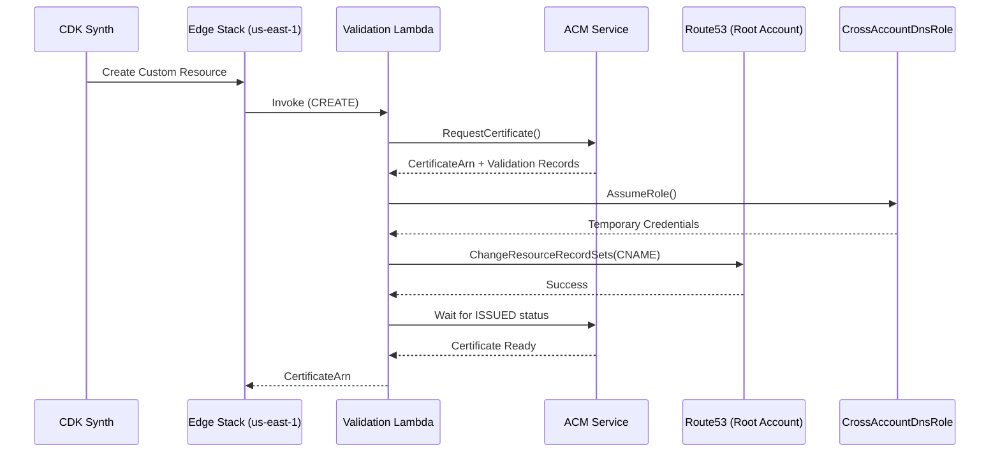

# NextJS Edge Stack (`NextJsEdgeStack`)

This document provides comprehensive documentation for the Edge Stack, including the architectural decisions, implementation constraints, and verification guidance.

---

## Overview

The **NextJS Edge Stack** consolidates all global edge infrastructure for the Next.js application into a single deployment unit. This stack **MUST** be deployed in the `us-east-1` region.

### Resources Created

| Resource                    | Purpose                                                 |
| :-------------------------- | :------------------------------------------------------ |
| **ACM Certificate**         | SSL/TLS certificate with cross-account DNS validation   |
| **WAF Web ACL**             | CloudFront protection with AWS Managed Rules            |
| **CloudFront Distribution** | Global CDN with multi-origin routing                    |
| **Validation Lambda**       | Custom resource for cross-account DNS record management |
| **SSM Parameters**          | Published outputs for cross-stack/region discovery      |

---

## Context and Constraints

### Requirements

The Edge Stack was designed to fulfill the following requirements:

1. **Global Edge Delivery**: Provide low-latency content delivery for a Next.js application serving users worldwide via AWS CloudFront.
2. **SSL/TLS Termination**: Enable HTTPS for custom domains (`*.nelsonlamounier.com`) with automatic certificate renewal.
3. **Security-First**: Protect the application from common web exploits (SQLi, XSS), known bad inputs, and DDoS attacks at the edge layer.
4. **Multi-Origin Routing**: Route traffic to different backends based on path patterns:
   - Static assets → S3 bucket
   - Dynamic pages → Application Load Balancer (ECS)
   - API routes → API Gateway (Lambda)
5. **Cross-Account DNS**: Validate ACM certificates against a Route53 Hosted Zone in a separate management/root account.
6. **Multi-Environment Support**: Support separate configurations for Development, Staging, and Production environments.

### Constraints

| Constraint                  | Rationale                                                                                                                                                                            |
| :-------------------------- | :----------------------------------------------------------------------------------------------------------------------------------------------------------------------------------- |
| **Region: `us-east-1`**     | CloudFront requires ACM certificates and WAF Web ACLs (with `CLOUDFRONT` scope) to be in `us-east-1`. This is an AWS hard requirement.                                               |
| **Cross-Region References** | The S3 bucket (static assets) resides in `eu-west-1`, requiring `crossRegionReferences: true` on the stack.                                                                          |
| **Cross-Account DNS**       | The Route53 Hosted Zone is in the root/management account, requiring a Lambda-based custom resource with IAM role assumption.                                                        |
| **Cost Optimization**       | For solo developers, the ALB remains public (internet-facing) to avoid the ~$44/month VPC Endpoint costs. Security is maintained via CloudFront WAF and Security Group IP filtering. |
| **No Cyclic Dependencies**  | S3 bucket is imported by ARN (not object reference) to prevent CDK from creating back-references when granting CloudFront access.                                                    |

---

## Architecture Design

### Stack Consolidation Rationale

The Edge Stack consolidates three previously separate concerns (ACM, WAF, CloudFront) into one deployment unit because:

1. **Atomic Deployment**: Certificate, firewall, and distribution are functionally coupled. Deploying them together ensures consistent state.
2. **Regional Isolation**: All `us-east-1` resources are grouped together, making cross-region dependency management explicit and auditable.
3. **Simplified State**: Eliminates the need for cross-stack SSM parameters to link WAF/Cert to CloudFront within the edge layer.
4. **Dependency Clarity**: The factory can express stack dependencies cleanly: `Edge → Networking + Data + API`.

### Trade-offs Evaluated

| Decision                             | Alternatives Considered                                     | Why This Approach                                                                                            |
| :----------------------------------- | :---------------------------------------------------------- | :----------------------------------------------------------------------------------------------------------- |
| **Consolidated Edge Stack**          | Separate ACM, WAF, and CloudFront stacks                    | Reduces from 3 stacks to 1, faster deployments, simpler dependency graph                                     |
| **Cross-Account DNS via Lambda**     | `DnsValidatedCertificate` (deprecated) or manual validation | The native construct is deprecated; Lambda custom resource gives full control over the validation lifecycle  |
| **S3Origin with OAC**                | OAI (Origin Access Identity)                                | OAC is the modern standard and avoids cyclic dependency issues with cross-stack/cross-region bucket policies |
| **Import Bucket by ARN**             | Pass bucket object directly                                 | Breaks the cyclic dependency where CDK tries to modify the bucket policy from the Edge Stack                 |
| **Public ALB + Edge WAF**            | Internal ALB + VPC Endpoints                                | Saves ~$44/month for solo projects; security maintained via WAF + SG IP filtering                            |
| **Managed `CachingDisabled` Policy** | Custom cache policy with TTL=0                              | AWS API restriction: custom policies with TTL=0 cannot specify header/cookie/query behaviors                 |

---

## Implementation Details

### Origin Strategy

```
┌─────────────────────────────────────────────────────────────────────────────┐
│                           CloudFront Distribution                            │
├─────────────────────────────────────────────────────────────────────────────┤
│ Path Pattern          │ Origin              │ Cache Policy                  │
├───────────────────────┼─────────────────────┼───────────────────────────────┤
│ /_next/static/*       │ S3 Bucket           │ 1 Year (Immutable)            │
│ /_next/data/*         │ S3 Bucket           │ Dynamic/ISR                   │
│ /images/*             │ S3 Bucket           │ 1 Year                        │
│ /api/*                │ ALB (ECS)           │ CachingDisabled (pass-through)│
│ /articles/*           │ API Gateway         │ CachingDisabled (pass-through)│
│ /* (default)          │ ALB (ECS)           │ Dynamic/ISR                   │
└───────────────────────┴─────────────────────┴───────────────────────────────┘
```

### WAF Protection Layers

| Rule                                    | Priority | Action           | Purpose                                                                           |
| :-------------------------------------- | :------- | :--------------- | :-------------------------------------------------------------------------------- |
| `AWSManagedRulesCommonRuleSet`          | 1        | None (inherited) | OWASP protection (SQLi, XSS). Excludes `SizeRestrictions_BODY` for large uploads. |
| `AWSManagedRulesKnownBadInputsRuleSet`  | 2        | None             | Blocks known malicious patterns (Log4j, etc.)                                     |
| `AWSManagedRulesAmazonIpReputationList` | 3        | None             | Blocks traffic from known malicious IPs                                           |
| `RateLimitRule`                         | 4        | Block            | Rate-based DDoS protection: 5000 requests/5min per IP                             |

### Cache Policy Configuration

| Policy                          | Default TTL           | Use Case                                                 |
| :------------------------------ | :-------------------- | :------------------------------------------------------- |
| `StaticAssetsCachePolicy`       | 365 days              | `/_next/static/*`, `/images/*` — immutable hashed assets |
| `DynamicContentCachePolicy`     | 0 seconds (max: 300s) | Default behavior, ISR pages                              |
| `CachingDisabled` (AWS Managed) | 0                     | `/api/*`, `/articles/*` — never cache                    |

### Cross-Account DNS Validation Flow



---

## Environment-Specific Configuration

Configuration is driven by [`lib/config/nextjs/configurations.ts`](file:///Users/nelsonlamounier/Desktop/revamp-portfolio-iac/cdk-monitoring/lib/config/nextjs/configurations.ts):

| Setting          | Development               | Staging                        | Production                 |
| :--------------- | :------------------------ | :----------------------------- | :------------------------- |
| **Price Class**  | `PRICE_CLASS_100` (US/EU) | `PRICE_CLASS_200` (US/EU/Asia) | `PRICE_CLASS_ALL` (Global) |
| **Logging**      | Disabled                  | Enabled                        | Enabled                    |
| **TLS Version**  | TLS 1.2 (2021)            | TLS 1.2 (2021)                 | TLS 1.2 (2021)             |
| **HTTP Version** | HTTP/2 + HTTP/3           | HTTP/2 + HTTP/3                | HTTP/2 + HTTP/3            |
| **Error TTL**    | 60 seconds                | 60 seconds                     | 60 seconds                 |

---

## Deployment

### Prerequisites

1. **Root Account Role**: The `CrossAccountDnsRoleStack` must be deployed to the management account first.
2. **Environment Variables**: The following must be set in `.env` or CI/CD secrets:

   | Variable                 | Description                                              |
   | :----------------------- | :------------------------------------------------------- |
   | `DEV_DOMAIN_NAME`        | Domain for development (e.g., `dev.nelsonlamounier.com`) |
   | `STAGING_DOMAIN_NAME`    | Domain for staging                                       |
   | `PROD_DOMAIN_NAME`       | Domain for production                                    |
   | `HOSTED_ZONE_ID`         | Route53 Hosted Zone ID in root account                   |
   | `CROSS_ACCOUNT_ROLE_ARN` | IAM role ARN for DNS access                              |

### Deployment Command

```bash
# Deploy Edge Stack (us-east-1)
yarn cli deploy -p NextJS -e development \
  --profile dev-account \
  -c domainName=dev.nelsonlamounier.com \
  -c hostedZoneId=Z04763221QPB6CZ9R77GM \
  -c crossAccountRoleArn=arn:aws:iam::711387127421:role/Route53DnsValidationRole
```

### Stack Dependencies

```
NextJsEdgeStack
├── Depends on: NextJsNetworkingStack (provides: ALB)
├── Depends on: NextJsDataStack (provides: S3 Bucket ARN)
└── Depends on: NextJsApiStack (provides: API Gateway)
```

---

## SSM Parameters Published

| Parameter Path                                   | Value             | Purpose                                 |
| :----------------------------------------------- | :---------------- | :-------------------------------------- |
| `/{prefix}/{env}/acm-certificate-arn`            | Certificate ARN   | Cross-region reference for other stacks |
| `/{prefix}/{env}/cloudfront/waf-arn`             | WAF Web ACL ARN   | Audit and monitoring integration        |
| `/{prefix}/{env}/cloudfront/distribution-domain` | CloudFront domain | DNS alias target for Route53 records    |

---

## Troubleshooting

### Common Errors

| Error                                         | Cause                            | Solution                                                  |
| :-------------------------------------------- | :------------------------------- | :-------------------------------------------------------- |
| `Edge stack MUST be deployed in us-east-1`    | Stack deployed to wrong region   | Ensure `env.region: 'us-east-1'` in factory               |
| `description must match regular expression`   | WAF description contains `()`    | Use dashes/underscores instead of parentheses             |
| `HeaderBehavior.none()` with disabled caching | Custom cache policy conflict     | Use `CachePolicy.CACHING_DISABLED` for no-cache routes    |
| Cyclic dependency with S3 bucket              | Bucket passed as object, not ARN | Pass `bucket.bucketArn` and import with `fromBucketArn()` |
| Certificate validation timeout                | Lambda cannot reach Route53      | Verify cross-account role trust policy and permissions    |

### Lambda Bundling

The validation Lambda requires both its handler code and the `cfn-response` module to be bundled:

```typescript
new LambdaFunctionConstruct(this, "ValidationLambda", {
  codePath: "dist/lambda", // Bundle entire directory
  handler: "dns/acm-certificate-dns-validation.handler", // Relative to codePath
  // ...
});
```

---

## Related Documentation

- [Networking and Edge Knowledge](file:///Users/nelsonlamounier/.gemini/antigravity/knowledge/cdk_comprehensive_knowledge/artifacts/infrastructure/networking_and_edge.md) — Comprehensive edge architecture guide
- [CloudFront Construct](file:///Users/nelsonlamounier/Desktop/revamp-portfolio-iac/cdk-monitoring/lib/common/networking/cloudfront.ts) — Reusable CloudFront blueprint
- [ACM Validation Construct](file:///Users/nelsonlamounier/Desktop/revamp-portfolio-iac/cdk-monitoring/lib/common/security/acm-certificate.ts) — Cross-account DNS validation pattern
- [NextJS Factory](file:///Users/nelsonlamounier/Desktop/revamp-portfolio-iac/cdk-monitoring/lib/projects/nextjs/factory.ts) — Stack orchestration and dependency management
