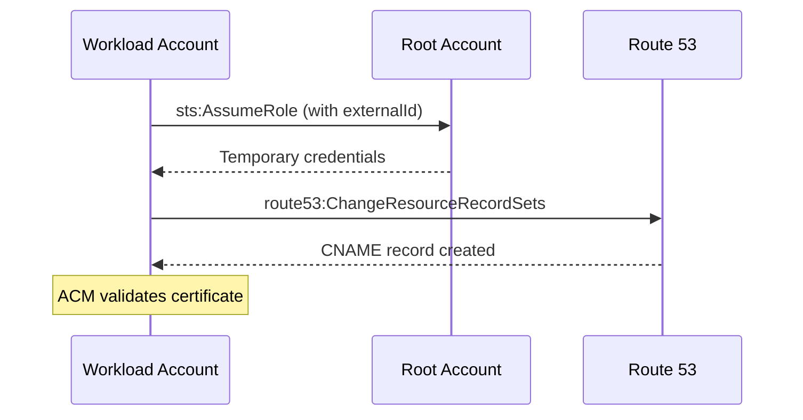

# Org Stacks

> Governance tier — cross-account resources deployed to the AWS root/management account.

## Stacks

| Stack | File | Purpose |
| :---- | :--- | :------ |
| **DNS Role** | `dns-role-stack.ts` | Cross-account IAM role for ACM DNS validation via Route 53 |

## How It Works

The DNS Role stack creates an IAM role in the **root account** (where Route 53 hosted zones live) that can be assumed by the **workload account** (where ACM certificates are requested). This enables automated DNS validation for ACM certificates without manually creating Route 53 records.

## Deployment

Deployed via a dedicated workflow (`deploy-org.yml`) using the root account's OIDC role. This stack is deployed independently from all other projects.
