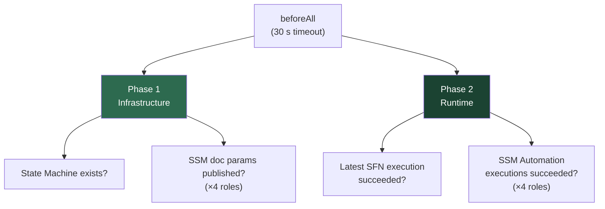

# SSM Automation Runtime — Integration Test Review

> Pipeline step: `verify-ssm-automation` in [_deploy-ssm-automation.yml](../../.github/workflows/_deploy-ssm-automation.yml)

---

## 1. Pipeline Position & Execution Mechanics

### Where it runs

| Attribute | Value |
|---|---|
| **Job name** | `verify-ssm-automation` |
| **Pipeline** | `_deploy-ssm-automation.yml` (Pipeline 2 — bootstrap & runtime) |
| **Depends on** | `watch-bootstrap` (SSM Automation executions must complete) |
| **Runs in parallel with** | `post-bootstrap-config` (secrets deployment is independent) |
| **Container** | `ghcr.io/nelson-lamounier/cdk-monitoring/ci:latest` |
| **Timeout** | 10 minutes |

### Why Pipeline 2 (not Pipeline 1)

Pipeline 1 (`_deploy-kubernetes.yml`) deploys the SSM Automation stack (documents + IAM role) but does **not** trigger SSM Automation. Pipeline 2 (`_deploy-ssm-automation.yml`) syncs scripts, triggers bootstrap, and observes execution — making it the correct location for runtime verification.

### How it runs

```
just ci-integration-test kubernetes/ssm-automation-runtime $CDK_ENV --verbose
```

The `justfile` recipe (line 328) expands this to:

```bash
cd infra && CDK_ENV=$CDK_ENV npx jest \
  --config jest.integration.config.js \
  --testPathPattern="tests/integration/kubernetes/ssm-automation-runtime" \
  --verbose
```

- **Jest config**: `jest.integration.config.js` — 60 s per-test timeout, `ts-jest` transform, node environment.
- **Credentials**: OIDC-assumed role via `aws-actions/configure-aws-credentials`.
- **Environment vars**: `CDK_ENV` (e.g. `development`) and `AWS_REGION` (default `eu-west-1`).

---

## 2. Test File Overview

**File**: `ssm-automation-runtime.integration.test.ts`
**Lines**: 295 | **AWS SDK clients**: SFN, SSM, STS

### Two-Phase Verification Strategy

The test uses a deliberate **two-phase** design:



---

## 3. What the `beforeAll` Fetches (Single API-Call Layer)

All AWS API calls happen in the top-level `beforeAll` (line 159–223). No API call is made inside any `it()` block.

| # | API Call | Purpose | Failure Handling |
|---|---|---|---|
| 1 | `STS:GetCallerIdentity` | Resolve AWS account ID to construct the state machine ARN | `stateMachineArn = undefined` |
| 2 | `SFN:DescribeStateMachine` | Verify the bootstrap orchestrator state machine exists | `stateMachineArn = undefined` |
| 3 | `SFN:ListExecutions` | Fetch the most recent orchestrator execution (max 1) | `latestSfnExecution = undefined` |
| 4 | `SSM:GetParameter` ×4 | Resolve document names from SSM paths for each role | Skips target on error |
| 5 | `SSM:DescribeAutomationExecutions` ×4 | Fetch the latest automation execution per document | Skips target if no execution |

Results are cached in module-level Maps (`ssmResults`, `resolvedDocNames`) and variables (`stateMachineArn`, `latestSfnExecution`).

---

## 4. Phase 1 — Infrastructure Assertions (Always Run)

These tests **must pass** immediately after the SSM Automation stack deploys, regardless of whether any EC2 instance has launched.

### 4a. Step Functions State Machine

| Test | Assertion |
|---|---|
| *should have the bootstrap orchestrator state machine* | `stateMachineArn` is defined **and** contains `k8s-dev-bootstrap-orchestrator` |

### 4b. SSM Document Parameters (×4 roles via `describe.each`)

Iterates over all four automation targets:

| Role | SSM Parameter Path |
|---|---|
| Control Plane | `/k8s/development/bootstrap/control-plane-doc-name` |
| App Worker | `/k8s/development/bootstrap/app-worker-doc-name` |
| Mon Worker | `/k8s/development/bootstrap/mon-worker-doc-name` |
| ArgoCD Worker | `/k8s/development/bootstrap/argocd-worker-doc-name` |

| Test | Assertion |
|---|---|
| *should have the SSM parameter published* | Document name is defined **and** matches the pattern `^k8s-dev-` |

---

## 5. Phase 2 — Runtime Assertions (Conditional / Vacuous Pass)

> [!IMPORTANT]
> Phase 2 tests **pass vacuously** (return early without asserting) if no execution exists. This is by design — on a fresh deploy with no instances launched, there are no SSM Automation executions to validate.

### 5a. Step Functions Orchestrator

| Test | Assertion | Vacuous Condition |
|---|---|---|
| *should have a successful latest execution (if any)* | Latest execution status is `SUCCEEDED` | `latestSfnExecution` is undefined |

### 5b. SSM Automation Executions (×4 roles via `describe.each`)

For each of the four roles:

| Test | Assertion | Vacuous Condition |
|---|---|---|
| *should have completed successfully (if executed)* | Execution status is `Success` | No execution found for document |
| *should have document name matching expected pattern (if executed)* | Document name matches `^k8s-dev-` | No execution found for document |

---

## 6. Total Assertion Count

| Category | Tests | Always Run? |
|---|---|---|
| State machine exists | 1 | ✅ Always |
| SSM parameters published | 4 (one per role) | ✅ Always |
| SFN orchestrator execution | 1 | ⚠️ Vacuous if no executions |
| SSM execution success | 4 (one per role) | ⚠️ Vacuous if no executions |
| SSM execution doc name | 4 (one per role) | ⚠️ Vacuous if no executions |
| **Total** | **14** | **5 guaranteed, 9 conditional** |

---

## 7. Code Quality Observations

| Area | Assessment |
|---|---|
| **Resource caching (Rule 1)** | ✅ All API calls in `beforeAll`, zero calls inside `it()` |
| **Non-null assertions (Rule 2)** | ✅ Uses `requireResult` helper instead of `!` |
| **Named constants (Rule 3)** | ✅ `SSM_SUCCESS_STATUSES`, `SFN_SUCCESS_STATUSES`, `NAME_PREFIX` etc. |
| **Environment parsing (Rule 4)** | ⚠️ Uses `as Environment` cast on line 52 instead of a `parseEnvironment` validator — minor deviation from Rule 4 |
| **Conditionals in `it()` (Rule 11)** | ⚠️ Phase 2 tests use `if (!execution) return;` inside `it()` — this is a pragmatic deviation to enable vacuous pass on fresh deploys |
| **Helper scope (Rule 10)** | ✅ `getParam` and `requireResult` are module-level |
| **API response narrowing (Rule 8)** | ✅ Optional chaining + explicit skip when undefined |

---

## 8. Summary

The `ci-integration-test kubernetes/ssm-automation-runtime` step validates **two concerns** in a single test suite:

1. **Infrastructure correctness** — The Step Functions state machine and all four SSM Automation document parameters exist and follow naming conventions. These 5 tests always run and always assert.

2. **Runtime correctness** — When SSM Automation has been triggered (i.e. EC2 instances exist), the 9 conditional tests verify that both the Step Functions orchestrator and per-role SSM Automation documents completed with `Success`/`SUCCEEDED` status.

This test runs in Pipeline 2 (`_deploy-ssm-automation.yml`) — the pipeline that triggers and observes SSM Automation — ensuring Phase 2 runtime assertions execute against real execution results rather than passing vacuously.
