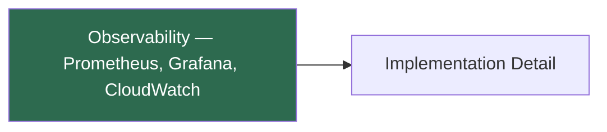

<!-- EDITORIAL NOTES FOR THE PRINCIPAL EDITOR
- Preferred Title: "Building Observability — Prometheus, Grafana, CloudWatch — A Solo DevOps Implementation"
- Include a "Junior Corner" callout explaining observability for readers who are new to the domain.
- Emphasise the "WHY" behind every technical decision.
- Ensure first-person singular voice throughout.
-->

# Observability — Prometheus, Grafana, CloudWatch

## Executive Summary

This implementation covers **2** skills across **1** categories.

### Skills Demonstrated

- **Prometheus** (high demand) — Evidence: `docs/kubernetes/monitoring-troubleshooting-guide.md`, `docs/kubernetes/prometheus-targets-troubleshooting.md`
- **CloudWatch** (high demand) — Evidence: `docs/cloudwatch-steampipe-data-paths.md`, `infra/lib/constructs/observability/cloudwatch-dashboard.ts`

## Architecture Overview

<!-- IMAGE: Architecture diagram for this implementation -->

## Implementation Evidence

| Skill | Evidence Files |
| :--- | :--- |
| Prometheus | `docs/kubernetes/monitoring-troubleshooting-guide.md`, `docs/kubernetes/prometheus-targets-troubleshooting.md`, `kubernetes-app/platform/argocd-apps/monitoring.yaml` |
| CloudWatch | `docs/cloudwatch-steampipe-data-paths.md`, `infra/lib/constructs/observability/cloudwatch-dashboard.ts`, `kubernetes-app/platform/charts/monitoring/chart/dashboards/cloudwatch-edge.json` |

## Decision Log

> Document the key "WHY X over Y" trade-offs for this implementation.
> See `docs/adrs/` for formal Architecture Decision Records.

## Lessons Learned

<!-- Fill in 3-4 bullet points (never exactly 5). Vary grammatical structure. -->

---

*Generated by mcp-portfolio-docs — evidence-only, no fabricated claims.*