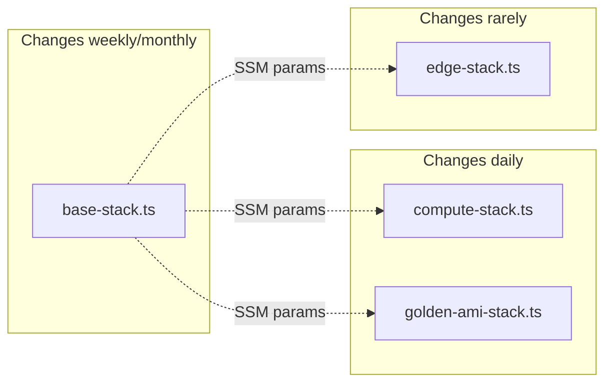

# KubernetesBaseStack — Foundation Infrastructure

**Source**: [base-stack.ts](file:///Users/nelsonlamounier/Desktop/portfolio/cdk-monitoring/infra/lib/stacks/kubernetes/base-stack.ts) (613 lines)
**Factory**: [kubernetes/factory.ts](file:///Users/nelsonlamounier/Desktop/portfolio/cdk-monitoring/infra/lib/projects/kubernetes/factory.ts) — Stack 2 in the dependency graph
**Resources Created**: ~20 AWS resources | **SSM Outputs**: 14

---

## Problem Statement

A self-managed Kubernetes cluster on AWS requires persistent networking, security, storage, DNS, and load-balancing infrastructure that must **outlive** the compute layer. Without isolating these resources from the EC2 instances and Auto Scaling Groups:

1. **AMI updates destroy networking** — changing a Golden AMI would trigger CloudFormation replacement of security groups, breaking all node-to-node communication
2. **Instance cycling destroys cluster data** — ASG scale-in or spot reclamation would delete the EBS volume holding etcd state, requiring a full cluster rebuild
3. **Tight coupling prevents independent scaling** — adding a new SG rule would force redeployment of every EC2 instance in the cluster
4. **No stable ingress** — without a static IP, CloudFront origin and DNS records would break on every instance replacement

The `KubernetesBaseStack` solves these by extracting all long-lived infrastructure into an independent CloudFormation stack with a weekly-to-monthly change cadence, decoupled from the daily-changing compute layer.

---

## Architecture

```mermaid
flowchart TB
    subgraph "KubernetesBaseStack (this stack)"
        VPC["VPC Lookup"]
        SG1["Cluster Base SG"]
        SG2["Control Plane SG"]
        SG3["Ingress SG"]
        SG4["Monitoring SG"]
        KMS["KMS Key"]
        EBS["EBS Volume"]
        DLM["DLM Snapshot Policy"]
        EIP["Elastic IP"]
        NLB["Network Load Balancer"]
        NLBSG["NLB Security Group"]
        NLBLOGS["NLB Access Logs Bucket"]
        R53["Route 53 Private Zone"]
        S3["Scripts Bucket"]
        S3LOGS["Scripts Access Logs Bucket"]
        SSM["SSM Parameters ×14"]
    end

    subgraph "Downstream Stacks (consume via SSM)"
        COMPUTE["Compute Stack"]
        GOLDEN["Golden AMI Stack"]
        EDGE["Edge Stack"]
        OBS["Observability Stack"]
        WORKER["Worker Stacks"]
    end

    VPC --> SG1 & SG2 & SG3 & SG4
    VPC --> R53
    VPC --> NLB
    EIP --> NLB
    NLB --> NLBLOGS
    NLB --> NLBSG
    EBS --> DLM
    S3 --> S3LOGS

    SSM -.->|"SSM parameter read"| COMPUTE & GOLDEN & EDGE & OBS & WORKER
```



---

## Resources — Problem → Solution Breakdown

### VPC Lookup (Not Created — Referenced)

| Attribute | Value |
|-----------|-------|
| **Method** | `Vpc.fromLookup()` by Name tag |
| **Source** | Shared VPC created by `deploy-shared` workflow |
| **Lookup key** | `shared-vpc-{environment}` |

**Problem**: The VPC is a multi-project shared resource. Creating it inside this stack would couple Kubernetes lifecycle to VPC lifecycle — destroying the K8s stack would destroy the VPC used by other services.

**Solution**: Look up the existing VPC by name at synth time. This returns a concrete VPC ID (not a CloudFormation token), so downstream references create no cross-stack exports.

---

### Security Groups ×4 (Config-Driven)

All four SGs are created via a **data-driven loop** using `SecurityGroupConstruct.fromK8sRules()`. Rules are defined in [configurations.ts](file:///Users/nelsonlamounier/Desktop/portfolio/cdk-monitoring/infra/lib/config/kubernetes/configurations.ts) and converted to `addIngressRule()` calls at synth time.

#### Cluster Base SG (`k8s-cluster`)

**Problem**: A kubeadm cluster requires ~19 port rules for etcd, kubelet, API server, CNI overlay, DNS, and metrics scraping. Managing these imperatively in CDK leads to 50+ lines of `addIngressRule()` calls — error-prone, hard to audit, and impossible to test data-driven.

**Solution**: Define rules as typed `K8sPortRule[]` data in the config layer. The `SecurityGroupConstruct` iterates the array. Adding a rule is a one-line config change — no CDK construct code needed.

| Port(s) | Protocol | Source | Service |
|---------|----------|--------|---------|
| 2379-2380 | TCP | Self | etcd client + peer |
| 6443 | TCP | VPC CIDR | K8s API server |
| 10250 | TCP | Self | kubelet API |
| 10257 | TCP | Self | kube-controller-manager |
| 10259 | TCP | Self | kube-scheduler |
| 4789 | UDP | Self | VXLAN overlay (Calico) |
| 179 | TCP | Self | Calico BGP |
| 30000-32767 | TCP | Self | NodePort range |
| 53 | TCP+UDP | Self | CoreDNS |
| 5473 | TCP | Self | Calico Typha |
| 9100 | TCP | Self | Traefik metrics |
| 9101 | TCP | Self | Node Exporter |
| 6443, 10250, 53, 9100, 9101 | TCP | Pod CIDR | Pod-to-node access |
| 53 | UDP | Pod CIDR | Pod DNS |
| All | All | 0.0.0.0/0 | **Egress** (unrestricted) |

> [!IMPORTANT]
> Without these rules, `kubeadm init` fails at etcd quorum, pods can't resolve DNS, and the CNI can't establish routes.

#### Control Plane SG (`k8s-control-plane`)

**Problem**: The K8s API server must be accessible from within the VPC (for SSM port-forwarding via `aws ssm start-session --port 6443`), but not from the public internet.

**Solution**: Dedicated SG attached **only** to control plane instances. Port 6443 from VPC CIDR. Egress is restricted (not `allowAllOutbound`).

#### Ingress SG (`k8s-ingress`)

**Problem**: Traefik needs traffic from two sources that can't be expressed in static config: CloudFront (region-specific prefix list) and admin IPs (dynamic, stored in SSM).

**Solution**: Port 80 from VPC CIDR (NLB health checks) is config-driven. CloudFront prefix list is resolved at deploy time via `AwsCustomResource` calling `DescribeManagedPrefixLists`. Admin IPs are injected from SSM at synth time.

#### Monitoring SG (`k8s-monitoring`)

**Problem**: Prometheus, Loki, and Tempo need specific ports opened, but only on the monitoring worker — not all cluster nodes.

**Solution**: Isolated SG applied only to the monitoring node. Ports 9090, 9100, 30100, 30417 from VPC CIDR and pod CIDR.

> [!TIP]
> The 4-SG architecture follows **blast-radius reduction**. A compromise in the ingress SG doesn't expose etcd ports. A misconfigured monitoring rule doesn't open NodePorts to the internet.

---

### KMS Key

**Problem**: CloudWatch log groups store sensitive cluster logs (kubelet, API server audit). AWS requires a customer-managed KMS key for CloudWatch encryption at rest.

**Solution**: A dedicated KMS key with annual automatic rotation, scoped to the CloudWatch Logs service principal with an ARN condition — it cannot be used for anything else.

| Attribute | Value |
|-----------|-------|
| **Alias** | `{namePrefix}-log-group` |
| **Rotation** | Enabled (annual) |
| **Removal policy** | DESTROY (dev) / RETAIN (prod) |

---

### EBS Volume

**Problem**: etcd state, PersistentVolumes, and monitoring data must survive instance replacement. If the EBS volume is created in the compute stack, `cdk destroy` on compute destroys all cluster data.

**Solution**: Create the EBS volume in the base stack with a DESTROY (dev) / RETAIN (prod) removal policy. The compute stack's user-data script attaches it at boot.

| Attribute | Value |
|-----------|-------|
| **Type** | GP3 (3,000 IOPS, 125 MiB/s baseline) |
| **Size** | 30 GB (dev) / 50 GB (prod) |
| **AZ** | `{region}a` (locked to match compute) |
| **Encryption** | Enabled (AWS-managed key) |
| **Tag** | `ManagedBy: MonitoringStack` |

---

### DLM Snapshot Policy

**Problem**: A single-node cluster with one EBS volume has no redundancy. etcd corruption or EBS hardware failure means rebuilding the entire cluster from scratch.

**Solution**: Daily snapshots at 03:00 UTC with 7-day retention. Targets volumes tagged `Name: {namePrefix}-data`.

| Attribute | Value |
|-----------|-------|
| **Schedule** | Daily at 03:00 UTC |
| **Retention** | 7 snapshots |
| **Cost** | ~£0.50/month (30 GB) |

---

### Elastic IP

**Problem**: Without a static IP, CloudFront origin configuration and DNS records break every time an instance is replaced.

**Solution**: VPC-domain EIP that persists across instance lifecycle. Used by NLB (SubnetMapping), CloudFront (origin), and ops DNS records.

---

### Network Load Balancer (NLB)

**Problem**: Direct EIP-to-instance routing has no health checking, no multi-target support, and fails silently when an instance is unhealthy.

**Solution**: Internet-facing NLB with TCP pass-through on ports 80 and 443. Traefik handles TLS termination.

| Attribute | Value |
|-----------|-------|
| **Scheme** | Internet-facing |
| **AZ** | `{region}a` (single-AZ, cost optimised) |
| **Listeners** | Port 80 (TCP), Port 443 (TCP) |
| **Health Check** | Port 80 (Traefik always listens on 80) |

**Traffic flow**:
```
Internet → CloudFront → NLB:80 → Traefik → K8s Pods
Admin    →              NLB:443 → Traefik → K8s Pods (ArgoCD, Grafana)
```

**NLB Access Logs Bucket**: SSE-S3 encrypted (NLB requires SSE-S3, not SSE-KMS), 3-day lifecycle for cost control.

---

### Route 53 Private Hosted Zone

**Problem**: `kubeadm init` needs a stable DNS endpoint (`--control-plane-endpoint`) that survives control plane re-provisioning. Hardcoding an IP breaks when instances are replaced.

**Solution**: Private hosted zone `k8s.internal` with an A record `k8s-api.k8s.internal → 10.0.0.1` (placeholder). The control plane's user-data script overwrites it with the instance's private IP at boot.

| Attribute | Value |
|-----------|-------|
| **Zone** | `k8s.internal` (VPC-only) |
| **TTL** | 30 seconds (fast failover) |

---

### S3 Scripts Bucket

**Problem**: EC2 user-data scripts need to download bootstrap artefacts (kubeadm scripts, Calico manifests, Helm values) before the compute stack is fully deployed — a chicken-and-egg dependency.

**Solution**: Create the bucket in the base stack. CI uploads scripts before compute deploys. Both control plane and worker nodes read from this bucket.

---

### SSM Parameters (14 Outputs)

**Problem**: CloudFormation's `Fn::ImportValue` creates hard cross-stack dependencies that prevent independent stack updates. Removing a consuming stack requires first removing the import.

**Solution**: All cross-stack discovery uses SSM Parameter Store. Downstream stacks read via `StringParameter.valueFromLookup()` (synth time) or `AwsCustomResource` (deploy time).

| Parameter | Consumed By |
|-----------|-------------|
| `vpcId` | Compute, Edge, Observability |
| `elasticIp` | Edge (CloudFront origin) |
| `elasticIpAllocationId` | Compute (NLB subnet mapping) |
| `securityGroupId` | Compute (instance SG) |
| `controlPlaneSgId` | Compute (control plane) |
| `ingressSgId` | Compute (ingress nodes) |
| `monitoringSgId` | Compute (monitoring worker) |
| `ebsVolumeId` | Compute (user-data attaches) |
| `scriptsBucket` | CI pipeline, user-data |
| `hostedZoneId` | Compute (DNS update) |
| `apiDnsName` | Compute (kubeadm endpoint) |
| `kmsKeyArn` | Observability (CloudWatch encryption) |
| `nlbHttpTargetGroupArn` | Compute (ASG registration) |
| `nlbHttpsTargetGroupArn` | Compute (ASG registration) |

---

## Design Patterns

### Config-Driven Security Groups

Rules are **data**, not imperative code:

```typescript
// Config layer (data)
{ port: 2379, endPort: 2380, protocol: 'tcp', source: 'self', description: 'etcd' }

// Construct layer (logic)
SecurityGroupConstruct.fromK8sRules(rules, vpc, podCidr)
// → addIngressRule(Peer.self(), Port.tcpRange(2379, 2380), 'etcd')
```

**Benefit**: Adding a new SG rule requires editing **one line** in the config file — no CDK construct changes.

### Lifecycle Separation



### Runtime vs Config-Time Rules

Two ingress SG rules require deploy-time API lookups:

1. **CloudFront prefix list** → `AwsCustomResource` calls `DescribeManagedPrefixLists`
2. **Admin IPs** → sourced from SSM (`/admin/allowed-ips`) at synth time

These are added imperatively after the config-driven loop.

---

## Cost Estimate (Development)

| Resource | Monthly Cost |
|----------|-------------|
| VPC lookup | Free |
| Security Groups ×5 | Free |
| KMS Key | ~£1.00 |
| EBS Volume (30 GB GP3) | ~£2.40 |
| DLM Snapshots (7 daily) | ~£0.50 |
| Elastic IP (attached) | Free |
| NLB (single AZ, low traffic) | ~£16.00 |
| NLB Access Logs S3 | < £0.01 |
| Route 53 Hosted Zone | £0.50 |
| S3 Scripts Bucket | < £0.10 |
| SSM Parameters (14) | Free (standard tier) |
| **Total** | **~£20.50/month** |

> [!NOTE]
> The NLB is the dominant cost (~78%). This is the trade-off for automated health-check failover vs the previous Lambda-based EIP failover approach, which was cheaper (~£3/month) but operationally fragile.

---

## Failure Impact Analysis

| Service | Impact If Missing |
|---------|-------------------|
| **VPC** | Nothing deploys — every resource needs a VPC |
| **Cluster Base SG** | kubeadm init fails (no etcd, no kubelet, no DNS) |
| **Control Plane SG** | No API server access — kubectl and all controllers stop |
| **Ingress SG** | No HTTP/HTTPS traffic reaches Traefik — site offline |
| **Monitoring SG** | Prometheus can't scrape, Loki can't receive logs |
| **KMS Key** | CloudWatch log groups fail to create |
| **EBS Volume** | etcd data lost on instance replacement — full rebuild |
| **DLM Policy** | No backups — etcd corruption = permanent data loss |
| **Elastic IP** | CloudFront origin breaks, DNS points nowhere |
| **NLB** | No traffic reaches the cluster — complete outage |
| **Route 53** | Workers can't find API server — kubelet fails to register |
| **S3 Scripts** | User-data can't download bootstrap scripts — join fails |
| **SSM Parameters** | Downstream stacks can't discover resources — deploys fail |

---

## Testing

The KubernetesBaseStack is the **reference implementation** for CDK testing, with dual-layer coverage:

- **108 unit tests** — synth-time template assertions validating all resources, SG rules, NLB config, SSM parameters, and stack exports
- **~80 integration assertions** — post-deployment AWS API verification confirming live resource state

See [stack-overview.md → CDK Testing Strategy](infrastructure/stack-overview.md) for full details.

---

## Transferable Skills Demonstrated

- **Lifecycle-aware stack design** — separating long-lived infrastructure from frequently-changing compute prevents unnecessary CloudFormation churn
- **Config-driven security** — data-driven SG rules eliminate imperative boilerplate and enable one-line rule additions
- **SSM-based loose coupling** — replacing `Fn::ImportValue` with SSM parameters enables independent stack lifecycles
- **Cost-conscious architecture** — single-AZ NLB, 3-day log retention, and DLM snapshots balance reliability with solo-developer budget constraints

## Summary

The KubernetesBaseStack provisions ~20 long-lived AWS resources (VPC lookup, 4 security groups, KMS key, EBS volume, DLM snapshots, Elastic IP, NLB, Route 53 private zone, S3 scripts bucket, and 14 SSM parameters) that form the foundation of the self-managed Kubernetes cluster. It is deliberately decoupled from the compute layer so that AMI updates, boot script changes, and instance replacements do not affect networking, storage, or security. The config-driven SG pattern and SSM-based cross-stack discovery are the key design innovations.

## Keywords

kubernetes, base-stack, cdk, security-groups, vpc, nlb, ebs, kms, route53, ssm, s3, elastic-ip, dlm, config-driven, lifecycle-separation
