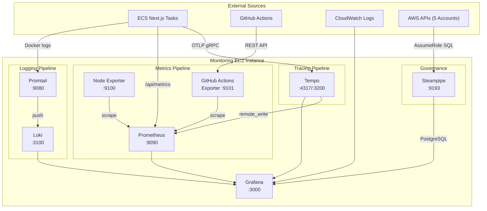
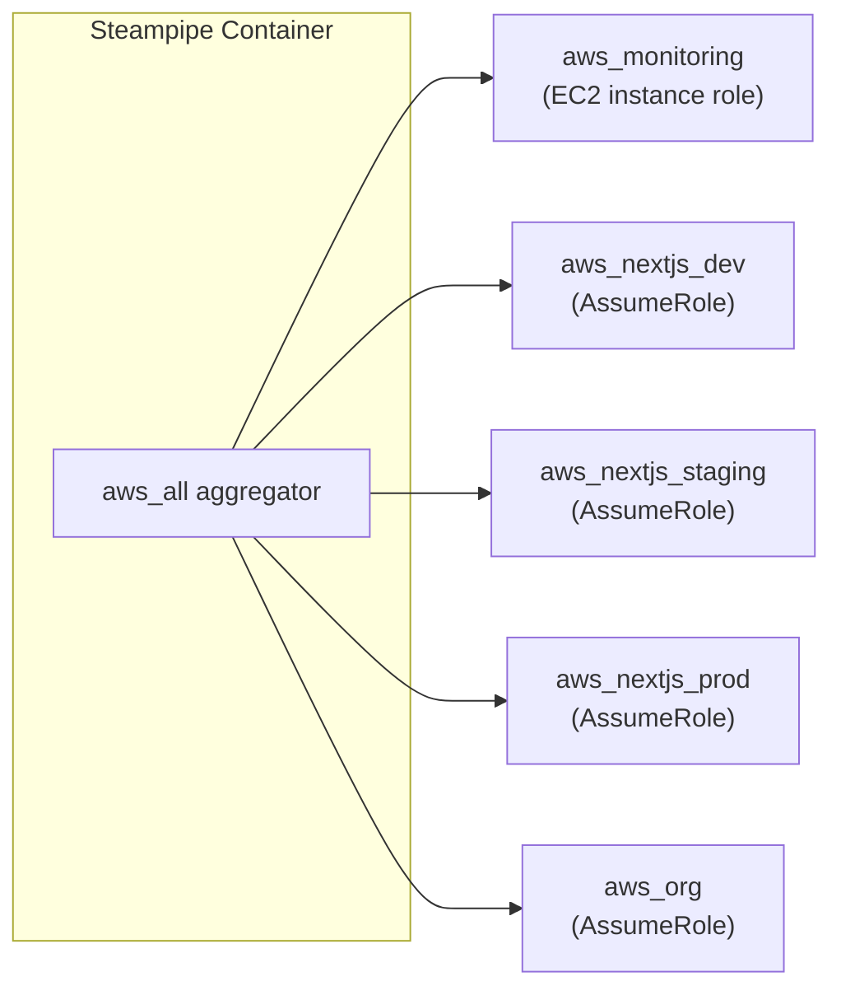
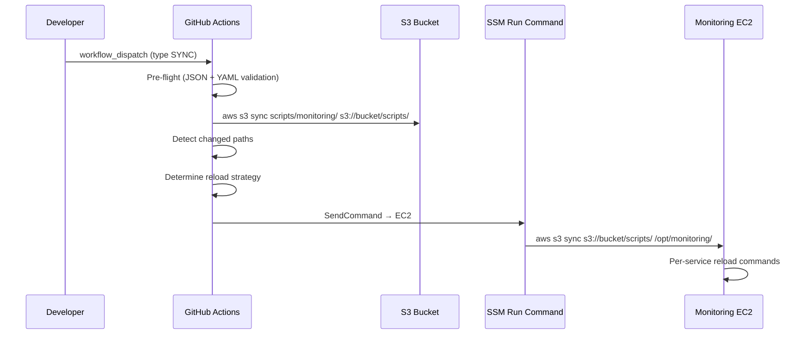
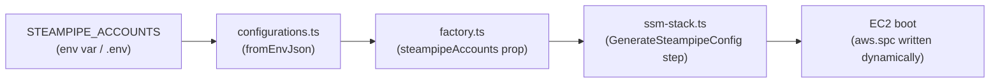

# Monitoring Stack — Architecture & Operations Reference

> Centralized observability platform running on a single EC2 instance with 8 Docker containers. Collects metrics, logs, traces, CI/CD data, and cloud governance insights across 5+ AWS accounts.

---

## System Architecture



### Design Principles

| Principle                      | Implementation                                                                                                 |
| ------------------------------ | -------------------------------------------------------------------------------------------------------------- |
| **Single-node simplicity**     | All services on one EC2 instance via Docker Compose — no Kubernetes, no distributed coordination               |
| **File-based provisioning**    | Dashboards and datasources are Git-tracked JSON/YAML files, deployed via S3 into bind-mounted volumes          |
| **Decoupled updates**          | Config sync pipeline allows updating dashboards, Prometheus rules, and Steampipe queries without CDK redeploys |
| **Multi-signal observability** | Metrics (Prometheus), Logs (Loki), Traces (Tempo) unified in Grafana with cross-signal linking                 |
| **Cross-account governance**   | Steampipe SQL queries span all AWS accounts via IAM AssumeRole aggregator                                      |

---

## Subsystem Design

### 1. Prometheus (Metrics)

| Property       | Value                                       |
| -------------- | ------------------------------------------- |
| **Image**      | `prom/prometheus:v3.9.1`                    |
| **Port**       | `:9090` (localhost only)                    |
| **Retention**  | 15 days                                     |
| **Storage**    | Docker volume `prometheus_data`             |
| **Hot-Reload** | `--web.enable-lifecycle` → `POST /-/reload` |

**Scrape Targets:**

| Job                          | Target                  | Discovery                          | Interval |
| ---------------------------- | ----------------------- | ---------------------------------- | -------- |
| `prometheus`                 | Self                    | Static                             | 15s      |
| `node-exporter`              | Monitoring host         | Static                             | 15s      |
| `ecs-nextjs-node-exporter`   | ECS EC2 hosts           | EC2 SD (tag: `Purpose=NextJS`)     | 15s      |
| `nextjs-application-metrics` | Next.js containers      | DNS SD (`nextjs-app.nextjs.local`) | 30s      |
| `github-actions`             | GitHub Actions Exporter | Static                             | 30s      |

**Authentication:** The `nextjs-application-metrics` job uses Bearer token auth. The token is generated by the SSM document, written to `/etc/prometheus/secrets/metrics-token`, and stored in SSM Parameter Store for the Next.js app to read.

**Configuration files:**

- [prometheus.yml](file:///Users/nelsonlamounier/Desktop/revamp-portfolio-iac/cdk-monitoring/scripts/monitoring/prometheus/prometheus.yml) — scrape config and service discovery
- [alert_rules.yml](file:///Users/nelsonlamounier/Desktop/revamp-portfolio-iac/cdk-monitoring/scripts/monitoring/prometheus/alert_rules.yml) — alerting rules

---

### 2. Loki (Logs)

| Property      | Value                                          |
| ------------- | ---------------------------------------------- |
| **Image**     | `grafana/loki:3.0.0`                           |
| **Port**      | `:3100` (localhost only)                       |
| **Retention** | 15 days                                        |
| **Storage**   | Local filesystem via Docker volume `loki_data` |
| **Schema**    | TSDB v13                                       |
| **Cache**     | Embedded in-memory (100 MB)                    |

**Log sources:** Loki receives logs via Promtail's push API at `http://loki:3100/loki/api/v1/push`. It does not scrape logs directly.

**Configuration:** [loki/config.yml](file:///Users/nelsonlamounier/Desktop/revamp-portfolio-iac/cdk-monitoring/scripts/monitoring/loki/config.yml)

---

### 3. Promtail (Log Collection)

| Property  | Value                    |
| --------- | ------------------------ |
| **Image** | `grafana/promtail:3.0.0` |
| **Port**  | `:9080` (localhost only) |

**Scrape targets:**

| Source            | Path                         | Labels                              |
| ----------------- | ---------------------------- | ----------------------------------- |
| Docker containers | `/var/lib/docker/containers` | `container_name`, `compose_service` |
| Syslog            | `/var/log/messages`          | `job=syslog`                        |
| User data log     | `/var/log/user-data.log`     | `job=user-data`                     |

**Configuration:** [promtail/config.yml](file:///Users/nelsonlamounier/Desktop/revamp-portfolio-iac/cdk-monitoring/scripts/monitoring/promtail/config.yml)

---

### 4. Tempo (Distributed Tracing)

| Property      | Value                                                        |
| ------------- | ------------------------------------------------------------ |
| **Image**     | `grafana/tempo:2.6.1`                                        |
| **Ports**     | `:3200` (HTTP API), `:4317` (OTLP gRPC), `:4318` (OTLP HTTP) |
| **Retention** | 7 days                                                       |
| **Storage**   | Local filesystem via Docker volume `tempo_data`              |

**Trace sources:** ECS Next.js tasks run a Grafana Alloy sidecar that forwards OTLP traces to `http://<monitoring-ip>:4317`.

**Derived metrics:** Tempo generates span-metrics and service-graphs, written to Prometheus via `remote_write` at `http://prometheus:9090/api/v1/write`.

**Configuration:** [tempo/config.yml](file:///Users/nelsonlamounier/Desktop/revamp-portfolio-iac/cdk-monitoring/scripts/monitoring/tempo/config.yml)

---

### 5. Node Exporter (Host Metrics)

| Property  | Value                       |
| --------- | --------------------------- |
| **Image** | `prom/node-exporter:v1.8.2` |
| **Port**  | `:9100` (localhost only)    |

Exports CPU, memory, disk, network, and filesystem metrics from the monitoring host. Also reads custom textfile metrics from `/opt/monitoring/node-exporter/textfile/`.

---

### 6. GitHub Actions Exporter

| Property    | Value                                          |
| ----------- | ---------------------------------------------- |
| **Image**   | `ghcr.io/labbs/github-actions-exporter:latest` |
| **Port**    | `:9101` (localhost only)                       |
| **Refresh** | 30 seconds                                     |

Polls the GitHub REST API for workflow run data. Exports metrics: `github_workflow_run_status`, `github_workflow_run_duration_ms`. Configured via environment variables `GITHUB_TOKEN` and `GITHUB_REPOS`.

---

### 7. Steampipe (Cloud Governance)

| Property      | Value                              |
| ------------- | ---------------------------------- |
| **Image**     | `turbot/steampipe:latest`          |
| **Port**      | `:9193` (PostgreSQL wire protocol) |
| **Cache TTL** | 5 minutes                          |

Exposes AWS resources as SQL tables via a PostgreSQL-compatible endpoint. Grafana connects as a standard PostgreSQL datasource.

**Multi-account architecture:**



**Authentication chain:**

1. Monitoring EC2 instance role is the source credential
2. Steampipe assumes `SteampipeReadOnly` role in each target account
3. The IAM policy `SteampipeCrossAccountAssumeRole` in [ssm-stack.ts](file:///Users/nelsonlamounier/Desktop/revamp-portfolio-iac/cdk-monitoring/lib/stacks/monitoring/ssm/ssm-stack.ts) grants `sts:AssumeRole` to `arn:aws:iam::*:role/SteampipeReadOnly`

**Cross-account role deployment:** Use the CloudFormation template at [steampipe-readonly-role.yml](file:///Users/nelsonlamounier/Desktop/revamp-portfolio-iac/cdk-monitoring/scripts/monitoring/steampipe/steampipe-readonly-role.yml) to deploy `SteampipeReadOnly` to each target account. The role grants `ViewOnlyAccess` + `SecurityAudit` managed policies.

**Configuration files:**

- [aws.spc](file:///Users/nelsonlamounier/Desktop/revamp-portfolio-iac/cdk-monitoring/scripts/monitoring/steampipe/config/aws.spc) — per-account connections + aggregator
- [default.spc](file:///Users/nelsonlamounier/Desktop/revamp-portfolio-iac/cdk-monitoring/scripts/monitoring/steampipe/config/default.spc) — cache, telemetry, port settings

---

### 8. Grafana (Visualization)

| Property              | Value                                           |
| --------------------- | ----------------------------------------------- |
| **Image**             | `grafana/grafana:12.3.0`                        |
| **Port**              | `:3000` (localhost only)                        |
| **Storage**           | Docker volume `grafana_data`                    |
| **Plugins**           | `grafana-clock-panel`, `grafana-piechart-panel` |
| **Dashboard refresh** | File polling every 30 seconds                   |

---

## Data Flows to Grafana

### Datasources

| Name           | Type         | UID          | Source                   | Protocol         |
| -------------- | ------------ | ------------ | ------------------------ | ---------------- |
| **Prometheus** | `prometheus` | `prometheus` | `http://prometheus:9090` | PromQL           |
| **Loki**       | `loki`       | `loki`       | `http://loki:3100`       | LogQL            |
| **CloudWatch** | `cloudwatch` | `cloudwatch` | AWS API (instance role)  | CloudWatch API   |
| **Tempo**      | `tempo`      | `tempo`      | `http://tempo:3200`      | TraceQL          |
| **Steampipe**  | `postgres`   | `steampipe`  | `steampipe:9193`         | SQL (PostgreSQL) |

### Cross-Signal Linking

Grafana is configured with trace-to-log and trace-to-metric correlation:

| From              | To                 | Filter                        |
| ----------------- | ------------------ | ----------------------------- |
| Tempo trace       | Loki logs          | `traceID`, `spanID`           |
| Tempo trace       | Prometheus metrics | service-graph derived metrics |
| Tempo service map | Prometheus         | `datasourceUid: prometheus`   |

**Provisioning files:**

- [datasources.yml](file:///Users/nelsonlamounier/Desktop/revamp-portfolio-iac/cdk-monitoring/scripts/monitoring/grafana/provisioning/datasources/datasources.yml)
- [dashboards.yml](file:///Users/nelsonlamounier/Desktop/revamp-portfolio-iac/cdk-monitoring/scripts/monitoring/grafana/provisioning/dashboards/dashboards.yml)

---

## Dashboard Inventory

| Dashboard                                                                                                                                                           | Datasource        | Purpose                                          | Key Variables                  |
| ------------------------------------------------------------------------------------------------------------------------------------------------------------------- | ----------------- | ------------------------------------------------ | ------------------------------ |
| [Infrastructure Health](file:///Users/nelsonlamounier/Desktop/revamp-portfolio-iac/cdk-monitoring/scripts/monitoring/grafana/dashboards/infrastructure-health.json) | Prometheus        | CPU, memory, disk, network for EC2 hosts and ECS | `$application`, `$environment` |
| [Deployment Logs](file:///Users/nelsonlamounier/Desktop/revamp-portfolio-iac/cdk-monitoring/scripts/monitoring/grafana/dashboards/deployment-logs.json)             | CloudWatch        | Lambda, API Gateway, ECS deployment logs         | `$environment`, `$apigw_id`    |
| [Loki Logs](file:///Users/nelsonlamounier/Desktop/revamp-portfolio-iac/cdk-monitoring/scripts/monitoring/grafana/dashboards/loki-logs.json)                         | Loki              | Docker container logs, syslog, user-data         | —                              |
| [GitHub Actions](file:///Users/nelsonlamounier/Desktop/revamp-portfolio-iac/cdk-monitoring/scripts/monitoring/grafana/dashboards/github-actions.json)               | Prometheus        | CI/CD workflow status, duration, success rate    | —                              |
| [Next.js App Metrics](file:///Users/nelsonlamounier/Desktop/revamp-portfolio-iac/cdk-monitoring/scripts/monitoring/grafana/dashboards/nextjs-app-metrics.json)      | Prometheus        | Application-level HTTP metrics, request latency  | `$environment`                 |
| [Article Service Metrics](file:///Users/nelsonlamounier/Desktop/revamp-portfolio-iac/cdk-monitoring/scripts/monitoring/grafana/dashboards/nextjs-otel.json)         | Prometheus, Tempo | OpenTelemetry spans, service latency, error rate | `$environment`                 |
| [Cloud Governance](file:///Users/nelsonlamounier/Desktop/revamp-portfolio-iac/cdk-monitoring/scripts/monitoring/grafana/dashboards/cloud-governance.json)           | Steampipe (SQL)   | Cross-account inventory, security, cost          | —                              |

### Cloud Governance Dashboard Panels

| Section             | Panel                             | SQL Table                        |
| ------------------- | --------------------------------- | -------------------------------- |
| Resource Inventory  | EC2 Instances (All Accounts)      | `aws_all.aws_ec2_instance`       |
| Resource Inventory  | S3 Buckets (All Accounts)         | `aws_all.aws_s3_bucket`          |
| Security Compliance | IAM Users Without MFA             | `aws_all.aws_iam_user`           |
| Security Compliance | Security Groups with Open Ingress | `aws_all.aws_vpc_security_group` |
| Security Compliance | Public S3 Buckets (stat)          | `aws_all.aws_s3_bucket`          |
| Security Compliance | Unencrypted S3 Buckets (stat)     | `aws_all.aws_s3_bucket`          |
| Security Compliance | Users Without MFA (stat)          | `aws_all.aws_iam_user`           |
| Security Compliance | Open Security Groups (stat)       | `aws_all.aws_vpc_security_group` |
| Cost Optimization   | Unattached EBS Volumes            | `aws_all.aws_ebs_volume`         |
| Cost Optimization   | Unused Elastic IPs                | `aws_all.aws_vpc_eip`            |
| Cost Optimization   | Resource Count by Account         | EC2 + S3 + Lambda + IAM UNION    |

---

## Configuration Sync Pipeline

The sync pipeline enables updating monitoring configurations **without CDK redeploys or EC2 instance replacement**.

### Architecture



### Reload Strategy

| Config Changed            | Reload Action                          | Downtime         |
| ------------------------- | -------------------------------------- | ---------------- |
| `grafana/dashboards/**`   | None (auto-detected ~30s)              | Zero             |
| `prometheus/**`           | `curl -X POST localhost:9090/-/reload` | Zero             |
| `grafana/provisioning/**` | `docker restart grafana`               | ~5s              |
| `loki/**`                 | `docker restart loki`                  | ~5s              |
| `promtail/**`             | `docker restart promtail`              | ~5s              |
| `tempo/**`                | `docker restart tempo`                 | ~5s              |
| `steampipe/**`            | `docker restart steampipe`             | ~10s             |
| `docker-compose.yml`      | `docker compose up -d`                 | Per-service only |

### Key Files

| File                                                                                                                                                   | Purpose                                                      |
| ------------------------------------------------------------------------------------------------------------------------------------------------------ | ------------------------------------------------------------ |
| [sync-monitoring-configs.ts](file:///Users/nelsonlamounier/Desktop/revamp-portfolio-iac/cdk-monitoring/scripts/deployment/sync-monitoring-configs.ts)  | Script: S3 sync, change detection, SSM command, reload logic |
| [sync-monitoring-configs.yml](file:///Users/nelsonlamounier/Desktop/revamp-portfolio-iac/cdk-monitoring/.github/workflows/sync-monitoring-configs.yml) | Workflow: `workflow_dispatch` only, production, SYNC gate    |

### Workflow Invocation

The workflow is **manual dispatch only** with a `SYNC` confirmation gate:

1. Navigate to GitHub Actions → **Sync Monitoring Configs**
2. Click **Run workflow**
3. Type `SYNC` in the confirmation field
4. The workflow validates all JSON/YAML configs, syncs to S3, and triggers targeted reloads

### CLI Usage

```bash
# Via CLI wrapper
yarn cli sync-configs -e production --profile prod-account

# Direct script
npx tsx scripts/deployment/sync-monitoring-configs.ts production --region eu-west-1 --profile prod-account
```

---

## CDK Infrastructure

### Stack Architecture

| Stack                  | Resources                                             | SSM Exports                                                    |
| ---------------------- | ----------------------------------------------------- | -------------------------------------------------------------- |
| **Monitoring-Storage** | EBS volume, DLM backups                               | —                                                              |
| **Monitoring-SSM**     | S3 scripts bucket, SSM document, IAM execution policy | `document-name`, `scripts-bucket-name`, `execution-policy-arn` |
| **Monitoring-Compute** | EC2 instance, ASG, Launch Template, Security Groups   | —                                                              |

### SSM Document Steps

The `configure-monitoring-stack` SSM document executes on first boot and on `reconfigure-monitoring`:

| Step                             | Action                                                                  |
| -------------------------------- | ----------------------------------------------------------------------- |
| `DownloadMonitoringStack`        | `aws s3 cp` scripts from S3 to `/opt/monitoring/`                       |
| `ConfigureEnvironment`           | Write `.env` (Grafana password), generate Prometheus bearer token       |
| `InstallSteampipePlugins`        | Pre-create Steampipe config directory                                   |
| `GenerateSteampipeConfig`        | Dynamically write `aws.spc` from account map passed via CDK context     |
| `StartMonitoringStack`           | Wait for Docker/Compose, `docker compose up -d`, enable systemd service |
| `RegisterEndpointsInSsm`         | Write Loki + Tempo endpoint IPs to SSM Parameters                       |
| `ConfigureGitHubActionsExporter` | Read GitHub PAT from SSM, configure exporter                            |

### IAM Execution Policy

| Permission                                    | Resource                                              | Purpose                            |
| --------------------------------------------- | ----------------------------------------------------- | ---------------------------------- |
| `s3:GetObject`, `s3:ListBucket`               | Scripts bucket                                        | Download monitoring configs        |
| `ssm:PutParameter`                            | `/{prefix}/prometheus/metrics-bearer-token`           | Store Prometheus auth token        |
| `ssm:PutParameter`                            | `/{prefix}/loki/endpoint`, `/{prefix}/tempo/endpoint` | Register service endpoints         |
| `ssm:GetParameter`                            | `/{prefix}/github/api-token`                          | Read GitHub PAT                    |
| `ssm:SendCommand`, `ssm:GetCommandInvocation` | SSM document + EC2 instances                          | Self-trigger capability            |
| `sts:AssumeRole`                              | `arn:aws:iam::*:role/SteampipeReadOnly`               | Steampipe cross-account governance |

---

## Steampipe Setup Guide

Steampipe setup is fully automated via the CDK stack and CLI.

### How It Works



1. Account IDs are defined in the `STEAMPIPE_ACCOUNTS` environment variable (JSON format)
2. CDK reads this at synth time via [configurations.ts](file:///Users/nelsonlamounier/Desktop/revamp-portfolio-iac/cdk-monitoring/lib/config/monitoring/configurations.ts) and passes it through the [factory](file:///Users/nelsonlamounier/Desktop/revamp-portfolio-iac/cdk-monitoring/lib/projects/monitoring/factory.ts) to the [SSM stack](file:///Users/nelsonlamounier/Desktop/revamp-portfolio-iac/cdk-monitoring/lib/stacks/monitoring/ssm/ssm-stack.ts)
3. The `GenerateSteampipeConfig` SSM step writes `aws.spc` dynamically at boot time — **no manual file editing required**
4. Cross-account IAM roles are deployed via the `deploy-steampipe-roles` CLI command

### Step 1: Set account IDs

Add to `.env` or CI/CD environment:

```bash
STEAMPIPE_ACCOUNTS='{"nextjs_dev":"222222222222","nextjs_staging":"333333333333","nextjs_prod":"444444444444","org":"555555555555"}'
```

> The monitoring account (production) is excluded — it uses the EC2 instance role automatically.

### Step 2: Deploy cross-account IAM roles

```bash
# Deploy SteampipeReadOnly role to all target accounts
yarn cli deploy-steampipe-roles --monitoring-account 111111111111

# Or dry-run first to preview commands
yarn cli deploy-steampipe-roles --monitoring-account 111111111111 --dry-run
```

The CLI reads `STEAMPIPE_ACCOUNTS` from env, iterates each account, and deploys the [steampipe-readonly-role.yml](file:///Users/nelsonlamounier/Desktop/revamp-portfolio-iac/cdk-monitoring/scripts/monitoring/steampipe/steampipe-readonly-role.yml) CloudFormation template using the appropriate AWS profile from `profileMap`.

### Step 3: Deploy monitoring stack

```bash
yarn cli deploy -p monitoring -s ssm -e production
yarn cli deploy -p monitoring -s compute -e production
```

The SSM document's `GenerateSteampipeConfig` step writes `aws.spc` with all account connections at boot time.

### Step 4: Verify

Connect to Grafana → Explore → select **Steampipe** datasource → run:

```sql
SELECT account_id, instance_id, instance_type, instance_state
FROM aws_all.aws_ec2_instance
ORDER BY account_id;
```

### Adding a new account

1. Add the account to `STEAMPIPE_ACCOUNTS` env var
2. Deploy the IAM role: `yarn cli deploy-steampipe-roles --monitoring-account <ID>`
3. Redeploy SSM stack: `yarn cli deploy -p monitoring -s ssm -e production`
4. Reconfigure: `yarn cli reconfigure-monitoring -e production`

---

## Networking

All services bind to `127.0.0.1` except:

- **Tempo** `:4317` and `:4318` bind to `0.0.0.0` — ECS tasks send OTLP traces from the VPC

All containers share the `monitoring` Docker bridge network for inter-service communication using container names as DNS hostnames.

External access to Grafana is via an SSH tunnel or Nginx reverse proxy — there is no public endpoint.

---

## File Structure

```
scripts/monitoring/
├── docker-compose.yml           # 8 services: Prometheus, Grafana, Loki, Promtail,
│                                #   Tempo, Node Exporter, GitHub Actions Exporter, Steampipe
├── grafana/
│   ├── dashboards/              # 7 dashboard JSON files
│   │   ├── infrastructure-health.json
│   │   ├── deployment-logs.json
│   │   ├── loki-logs.json
│   │   ├── github-actions.json
│   │   ├── nextjs-app-metrics.json
│   │   ├── nextjs-otel.json
│   │   └── cloud-governance.json
│   └── provisioning/
│       ├── dashboards/dashboards.yml    # File provider (30s polling)
│       └── datasources/datasources.yml # 5 datasources
├── prometheus/
│   ├── prometheus.yml           # 5 scrape targets, EC2/DNS SD
│   ├── alert_rules.yml         # Alerting rules
│   ├── file_sd/                # File-based service discovery
│   └── secrets/                # Bearer tokens (generated at runtime)
├── loki/config.yml             # TSDB v13, 15d retention, embedded cache
├── promtail/config.yml         # Docker/syslog/user-data log collection
├── tempo/config.yml            # OTLP gRPC/HTTP, 7d retention, service graphs
└── steampipe/
    ├── config/
    │   ├── aws.spc             # Runtime-generated by SSM (template in ssm-stack.ts)
    │   └── default.spc         # Cache (5min), telemetry off, port 9193
    └── steampipe-readonly-role.yml  # CloudFormation: SteampipeReadOnly IAM role
```
