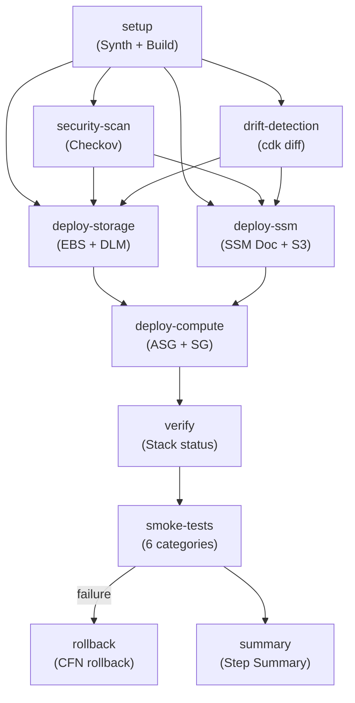

# Monitoring Observability Platform — Deep-Dive Technical Reference

> **Purpose** — This document is a deep technical reference covering every layer of the monitoring
> platform implementation: Linux OS commands, file permissions, networking protocols, Docker networking,
> security group rules, pipeline YAML analysis, deployment scripts, and SDK vs CLI usage patterns.
> It supplements the portfolio-level overview with implementation-grade detail.

---

## Table of Contents

1. [Linux OS Commands & System Administration](#1-linux-os-commands--system-administration)
2. [File Permissions & Ownership](#2-file-permissions--ownership)
3. [Networking Protocols & Port Architecture](#3-networking-protocols--port-architecture)
4. [Docker Networking Deep Dive](#4-docker-networking-deep-dive)
5. [Security Group Rules & Traffic Flow](#5-security-group-rules--traffic-flow)
6. [Pipeline YAML — Step-by-Step Analysis](#6-pipeline-yaml--step-by-step-analysis)
7. [Deployment Scripts — SDK vs CLI Analysis](#7-deployment-scripts--sdk-vs-cli-analysis)
8. [Shell Scripting Patterns & Gotchas](#8-shell-scripting-patterns--gotchas)
9. [IMDSv2 — Instance Metadata Service](#9-imdsv2--instance-metadata-service)
10. [Systemd Service Management](#10-systemd-service-management)
11. [SSM Run Command Document Execution Model](#11-ssm-run-command-document-execution-model)
12. [EBS Volume Lifecycle — Attach, Format, Mount](#12-ebs-volume-lifecycle--attach-format-mount)

---

## 1. Linux OS Commands & System Administration

### 1.1 Package Management (`dnf`)

Amazon Linux 2023 (AL2023) uses `dnf` (Dandified Yum), not `yum`. The UserData builder runs:

```bash
dnf update -y
```

| Flag | Purpose                                                                        |
| ---- | ------------------------------------------------------------------------------ |
| `-y` | Auto-accept all prompts (non-interactive mode, required for automated scripts) |

**Why `dnf` over `yum`?** AL2023 dropped `yum` as the default package manager. `dnf` has better dependency resolution, parallel downloads, and modular repository support. `yum` still exists as a symlink but is deprecated.

**Why update first?** Security patches and bug fixes. Running `dnf update` before installing packages ensures the base AMI's packages are patched before adding new software.

### 1.2 Docker Installation

```bash
# Install Docker engine from AL2023 repositories
dnf install -y docker

# Start the Docker daemon immediately
systemctl start docker

# Enable Docker to start on boot
systemctl enable docker

# Add ec2-user to the docker group (run docker without sudo)
usermod -aG docker ec2-user
```

| Command                       | What It Does                                                        | Why It's Needed                                   |
| ----------------------------- | ------------------------------------------------------------------- | ------------------------------------------------- |
| `dnf install -y docker`       | Installs Docker Engine from AL2023 repos                            | AL2023 doesn't ship with Docker pre-installed     |
| `systemctl start docker`      | Starts the Docker daemon (dockerd) via systemd                      | `docker compose up` requires a running daemon     |
| `systemctl enable docker`     | Creates a symlink in `/etc/systemd/system/multi-user.target.wants/` | Ensures Docker starts automatically after reboot  |
| `usermod -aG docker ec2-user` | Appends (`-a`) the `docker` group (`-G`) to ec2-user                | Without this, only root can run `docker` commands |

**`systemctl start` vs `systemctl enable`:** `start` runs the service NOW. `enable` makes it start on BOOT. You need both — `start` for the current session, `enable` for persistence across reboots/instance replacements.

### 1.3 Docker Compose v2 Plugin Installation

```bash
DOCKER_COMPOSE_VERSION="v2.24.0"
mkdir -p /usr/local/lib/docker/cli-plugins
curl -SL "https://github.com/docker/compose/releases/download/${DOCKER_COMPOSE_VERSION}/docker-compose-linux-x86_64" \
  -o /usr/local/lib/docker/cli-plugins/docker-compose
chmod +x /usr/local/lib/docker/cli-plugins/docker-compose

# Backward compatibility: standalone binary
cp /usr/local/lib/docker/cli-plugins/docker-compose /usr/local/bin/docker-compose
ln -sf /usr/local/bin/docker-compose /usr/bin/docker-compose
```

| Command                                      | Purpose                                                                                                                         |
| -------------------------------------------- | ------------------------------------------------------------------------------------------------------------------------------- |
| `mkdir -p /usr/local/lib/docker/cli-plugins` | Creates the Docker CLI plugin directory. `-p` creates parent dirs without error if they exist                                   |
| `curl -SL ... -o ...`                        | Downloads the Compose binary. `-S` shows errors, `-L` follows redirects (GitHub redirects to CDN)                               |
| `chmod +x`                                   | Makes the downloaded binary executable (see [Section 2](#2-file-permissions--ownership))                                        |
| `cp` + `ln -sf`                              | Provides backward compatibility. `cp` creates standalone binary; `ln -sf` creates symlink (`-s`=symbolic, `-f`=force overwrite) |

**Why both plugin and standalone?** Docker Compose v2 uses `docker compose` (plugin syntax) over `docker-compose` (standalone). Some scripts and tools still reference the old `docker-compose` syntax. Installing both ensures compatibility.

### 1.4 AWS CLI v2 Installation

```bash
if ! command -v aws &> /dev/null; then
    curl "https://awscli.amazonaws.com/awscli-exe-linux-x86_64.zip" -o "/tmp/awscliv2.zip"
    unzip -q /tmp/awscliv2.zip -d /tmp
    /tmp/aws/install
    rm -rf /tmp/aws /tmp/awscliv2.zip
fi
```

| Command            | Purpose                                                                                                     |
| ------------------ | ----------------------------------------------------------------------------------------------------------- |
| `command -v aws`   | Checks if `aws` is in PATH (more portable than `which`)                                                     |
| `&> /dev/null`     | Redirects both stdout AND stderr to `/dev/null` (suppresses all output)                                     |
| `unzip -q`         | Quiet mode — suppresses the per-file extraction output                                                      |
| `/tmp/aws/install` | AWS CLI installer script — installs to `/usr/local/aws-cli/v2/` and creates symlink at `/usr/local/bin/aws` |
| `rm -rf`           | Clean up: `-r` recursive, `-f` force (no prompt). Removes the zip and extracted installer                   |

**Why check first?** AL2023 may already have AWS CLI v2 pre-installed depending on the AMI. The idempotency check avoids reinstalling and saves ~20 seconds.

### 1.5 SSM Agent Shell Compatibility Fix

```bash
if [ ! -e /usr/bin/sh ]; then
    ln -sf /bin/bash /usr/bin/sh
fi
```

**Problem:** SSM Agent's `aws:runShellScript` action executes commands via `/usr/bin/sh`. On some AL2023 builds, only `/bin/sh` exists. SSM fails with `fork/exec /usr/bin/sh: no such file or directory`.

**Solution:** Create a symbolic link from `/usr/bin/sh` → `/bin/bash`.

| Component      | Path                                                                              |
| -------------- | --------------------------------------------------------------------------------- |
| `[ ! -e ... ]` | Test if file exists (`-e` = exists). `!` negates. Only creates symlink if missing |
| `ln -sf`       | `-s` = symbolic link, `-f` = force (overwrites if exists)                         |

---

## 2. File Permissions & Ownership

### 2.1 Linux Permission Model

Linux uses a 3-tier permission model: **Owner**, **Group**, **Others**. Each tier has **Read (4)**, **Write (2)**, **Execute (1)** bits.

```
-rwxr-xr-x  =  755  =  Owner: rwx, Group: r-x, Others: r-x
-rw-r--r--  =  644  =  Owner: rw-, Group: r--, Others: r--
```

### 2.2 Permissions Used in This Project

| Command                            | Where Used            | Octal                       | What It Does                                                  |
| ---------------------------------- | --------------------- | --------------------------- | ------------------------------------------------------------- |
| `chmod +x`                         | Docker Compose binary | Adds execute bit for all    | Makes the binary runnable by anyone                           |
| `chmod +x /tmp/smoke-test.sh`      | Smoke test pipeline   | Adds execute bit            | Required before `bash /tmp/smoke-test.sh`                     |
| `find ... -exec chmod +x {} +`     | SSM document          | Adds execute to `.sh` files | S3 sync strips execute permissions — must restore             |
| `chown -R ec2-user:ec2-user /data` | EBS mount point       | N/A (ownership)             | Docker runs as root by default, but the ec2-user needs access |

### 2.3 Why S3 Strips Execute Permissions

S3 is an object store, not a filesystem. It does not preserve POSIX file permissions. When you `aws s3 sync` files FROM S3, all files get default permissions (typically `644` — no execute bit). Shell scripts that were executable locally lose their execute permission after download.

**The fix in the SSM document:**

```bash
find ${MONITORING_DIR} -name '*.sh' -exec chmod +x {} +
```

| Component                | Purpose                                                                                                                                                      |
| ------------------------ | ------------------------------------------------------------------------------------------------------------------------------------------------------------ |
| `find ${MONITORING_DIR}` | Recursively search the monitoring directory                                                                                                                  |
| `-name '*.sh'`           | Match files ending in `.sh`                                                                                                                                  |
| `-exec chmod +x {} +`    | Execute `chmod +x` on all matched files. `{}` is the placeholder for each file. `+` batches files (more efficient than `\;` which runs one `chmod` per file) |

### 2.4 Docker Volume Mount Permissions

In `docker-compose.yml`, volumes use the `:ro` suffix:

```yaml
volumes:
  - ./prometheus/prometheus.yml:/etc/prometheus/prometheus.yml:ro
  - /proc:/host/proc:ro
  - /sys:/host/sys:ro
```

| Suffix | Meaning              | Why Used                                                                                          |
| ------ | -------------------- | ------------------------------------------------------------------------------------------------- |
| `:ro`  | Read-only mount      | Prevents the container from modifying host configuration files                                    |
| (none) | Read-write (default) | Used for data volumes like `/prometheus`, `/var/lib/grafana` where services write persistent data |

**Security principle:** Configuration files (`prometheus.yml`, `config.yml`) are mounted as read-only. Data directories (`/prometheus`, `/var/lib/grafana`) are read-write. This follows the principle of least privilege — containers can only write where they need to.

### 2.5 EBS Mount Ownership

```bash
chown -R ec2-user:ec2-user /data
```

| Flag                | Purpose                                                        |
| ------------------- | -------------------------------------------------------------- |
| `-R`                | Recursive — changes ownership for all files and subdirectories |
| `ec2-user:ec2-user` | Sets both owner AND group to `ec2-user`                        |

**Why needed?** When `mkfs.xfs` creates a filesystem, root owns everything. Docker Compose runs as root (by default), but if ec2-user needs to troubleshoot or access files via SSH/SSM, they need ownership. Some containers (like Grafana) run as non-root users internally and need the mount point to be writable by their UID.

### 2.6 fstab Entry

```bash
echo "$DEVICE /data xfs defaults,nofail 0 2" >> /etc/fstab
```

| Field       | Value             | Meaning                                                                                                             |
| ----------- | ----------------- | ------------------------------------------------------------------------------------------------------------------- |
| Device      | `$DEVICE`         | The block device (e.g., `/dev/nvme1n1`)                                                                             |
| Mount point | `/data`           | Where the filesystem is mounted                                                                                     |
| Filesystem  | `xfs`             | XFS filesystem type (AWS default for EBS volumes)                                                                   |
| Options     | `defaults,nofail` | `defaults` = rw,suid,dev,exec,auto,nouser,async. `nofail` = if the device is missing at boot, don't halt the system |
| Dump        | `0`               | Don't include in backup dumps                                                                                       |
| fsck order  | `2`               | Check this filesystem after root (`1`) during boot                                                                  |

**Why `nofail`?** If the EBS volume fails to attach (rare), the instance should still boot so you can troubleshoot via SSM. Without `nofail`, a missing device causes the boot process to hang indefinitely.

---

## 3. Networking Protocols & Port Architecture

### 3.1 Protocol Map

```
┌─────────────────────────────────────────────────────────────────┐
│                    EC2 Instance (t3.small)                       │
│                                                                  │
│  ┌──────────────┐  HTTP (TCP 9090)  ┌──────────────────────┐    │
│  │  Prometheus   │◄────────────────│  Scrape Targets       │    │
│  │  :9090        │  pull model      │  (Node Exporter,      │    │
│  └──────────────┘                  │   GitHub Exporter)     │    │
│                                     └──────────────────────┘    │
│  ┌──────────────┐  HTTP (TCP 3000)                              │
│  │  Grafana      │  PromQL/LogQL                                │
│  │  :3000        │  queries                                     │
│  └──────────────┘                                               │
│                                                                  │
│  ┌──────────────┐  HTTP (TCP 3100)  ┌──────────────────────┐    │
│  │  Loki         │◄────────────────│  Promtail (push)      │    │
│  │  :3100        │  POST /loki/     │  ECS Promtail sidecar │    │
│  └──────────────┘  api/v1/push     └──────────────────────┘    │
│                                                                  │
│  ┌──────────────┐  gRPC (TCP 4317) ┌──────────────────────┐    │
│  │  Tempo        │◄────────────────│  Grafana Alloy        │    │
│  │  :3200/:4317  │  OTLP proto     │  (ECS sidecar)        │    │
│  └──────────────┘  :4318           └──────────────────────┘    │
│                     HTTP/protobuf                                │
└─────────────────────────────────────────────────────────────────┘
```

### 3.2 Port Binding Strategy

| Service         | Bind Address | Port | Protocol | Why This Binding                                          |
| --------------- | ------------ | ---- | -------- | --------------------------------------------------------- |
| Prometheus      | `127.0.0.1`  | 9090 | HTTP/TCP | Localhost only — no external access needed                |
| Grafana         | `127.0.0.1`  | 3000 | HTTP/TCP | Localhost only — access via SSM port forwarding           |
| Node Exporter   | `127.0.0.1`  | 9100 | HTTP/TCP | Scraped by Prometheus within the same host                |
| Loki            | `127.0.0.1`  | 3100 | HTTP/TCP | Receives logs from Promtail (same host) + ECS via VPC     |
| Promtail        | `127.0.0.1`  | 9080 | HTTP/TCP | Exposes targets endpoint for debugging                    |
| Tempo HTTP      | `127.0.0.1`  | 3200 | HTTP/TCP | Grafana queries Tempo API internally                      |
| Tempo OTLP gRPC | `0.0.0.0`    | 4317 | gRPC/TCP | **Must accept from VPC** — ECS Alloy sidecars send traces |
| Tempo OTLP HTTP | `0.0.0.0`    | 4318 | HTTP/TCP | Fallback OTLP receiver for HTTP-based trace exporters     |
| GitHub Exporter | `127.0.0.1`  | 9101 | HTTP/TCP | Scraped by Prometheus internally                          |

**Key Decision: `127.0.0.1` vs `0.0.0.0`**

- `127.0.0.1` = loopback interface only. Traffic from outside the host (even within the VPC) is rejected at the network stack level. This is the strongest restriction.
- `0.0.0.0` = all interfaces. Accepts traffic from any source that can reach the host. Required for Tempo because ECS tasks in other instances need to send traces.

### 3.3 Protocols Used

| Protocol     | Layer            | Where Used                                                 | Details                                                                                                           |
| ------------ | ---------------- | ---------------------------------------------------------- | ----------------------------------------------------------------------------------------------------------------- |
| **HTTP/1.1** | L7 (Application) | Prometheus scraping, Grafana API, Loki push, health checks | Text-based request/response. Prometheus uses HTTP GET for scraping (`/metrics` endpoint)                          |
| **gRPC**     | L7 (Application) | Tempo OTLP receiver (:4317)                                | Binary protocol built on HTTP/2. Uses Protocol Buffers for serialization. Lower overhead than JSON for trace data |
| **HTTP/2**   | L7 (Application) | Underlying transport for gRPC                              | Multiplexed streams, header compression, server push. Required by gRPC spec                                       |
| **TCP**      | L4 (Transport)   | All services                                               | Reliable, ordered delivery. All monitoring services use TCP                                                       |
| **DNS**      | L7 (Application) | Docker internal DNS, Cloud Map DNS-SD                      | Docker Compose creates an internal DNS resolver. Prometheus uses `dns_sd_configs` for Cloud Map                   |

### 3.4 Prometheus Scrape Protocol

Prometheus uses a **pull model** — it actively fetches metrics from targets:

```
Prometheus → HTTP GET http://node-exporter:9100/metrics → Target responds with text/plain
```

The response format is Prometheus exposition format:

```
# HELP node_cpu_seconds_total Seconds the CPUs spent in each mode.
# TYPE node_cpu_seconds_total counter
node_cpu_seconds_total{cpu="0",mode="idle"} 12345.67
```

**Why pull over push?** Pull model means Prometheus controls scrape frequency, can detect when targets are down (failed scrape = target unhealthy), and targets don't need to know about Prometheus's existence.

### 3.5 Prometheus Service Discovery

The `prometheus.yml` uses three discovery mechanisms:

#### Static Config (local services)

```yaml
scrape_configs:
  - job_name: "prometheus"
    static_configs:
      - targets: ["localhost:9090"]
```

Known, fixed targets. Used for services on the same host.

#### EC2 Service Discovery

```yaml
- job_name: "ecs-nextjs-node-exporter"
  ec2_sd_configs:
    - region: eu-west-1
      port: 9100
      filters:
        - name: tag:Purpose
          values: ["NextJS"]
```

Prometheus queries the EC2 API (`DescribeInstances`) to find instances by tag. Resolves to the instance's **private IP** (within VPC).

**Why `ec2_sd_configs`?** ECS EC2 instances are behind an ASG — their IPs change on replacement. Static config would break. EC2 SD auto-discovers new instances by tag.

#### DNS Service Discovery (Cloud Map)

```yaml
- job_name: "nextjs-application-metrics"
  metrics_path: "/api/metrics"
  authorization:
    type: Bearer
    credentials_file: /etc/prometheus/secrets/metrics-token
  dns_sd_configs:
    - names:
        - "nextjs-app.nextjs.local"
      type: A
      port: 3000
      refresh_interval: 30s
```

**Why DNS-SD instead of EC2-SD for application metrics?** ECS tasks using `awsvpc` networking mode get their own ENI (Elastic Network Interface). The task's IP is different from the host instance's IP. `ec2_sd_configs` would resolve to the host IP (wrong target). DNS-SD with Cloud Map resolves A records to each task's ENI IP (correct target).

**Bearer token authentication:** The `/api/metrics` endpoint requires a Bearer token to prevent unauthorized scraping. The token is stored in `/etc/prometheus/secrets/metrics-token` on the monitoring instance.

---

## 4. Docker Networking Deep Dive

### 4.1 Bridge Network

```yaml
networks:
  monitoring:
    driver: bridge
```

Docker creates a virtual bridge network (`br-xxxx`) on the host. All containers connected to the `monitoring` network can communicate using container names as hostnames.

```
┌──────────────────────────────────────────────────┐
│                Docker Bridge: monitoring           │
│                                                    │
│  prometheus   ──┐                                  │
│  grafana      ──┤── Virtual Switch (br-xxxx)       │
│  loki         ──┤                                  │
│  tempo        ──┤   IP Range: 172.18.0.0/16        │
│  promtail     ──┤                                  │
│  node-exporter──┤                                  │
│  github-exp   ──┘                                  │
│                                                    │
└──────────────────────────────────────────────────┘
```

**How container DNS works:** Docker runs an embedded DNS server at `127.0.0.11`. When Prometheus scrapes `node-exporter:9100`, Docker resolves `node-exporter` to its container IP (e.g., `172.18.0.3`) via this internal DNS.

### 4.2 Volume Architecture

```yaml
volumes:
  prometheus_data: # Docker-managed named volume → /data/prometheus on EBS
  grafana_data: # Docker-managed named volume → /data/grafana on EBS
  loki_data: # Docker-managed named volume → /data/loki on EBS
  tempo_data: # Docker-managed named volume → /data/tempo on EBS
```

Named volumes are stored at `/var/lib/docker/volumes/` by default. The monitoring stack sets `DOCKER_ROOT` or uses Docker's default, which sits on the root filesystem. The actual persistent data is at `/data` (EBS mount), referenced by the SSM document's `downloadAndStartMonitoringStack` layout.

### 4.3 Host Filesystem Mounts (Node Exporter)

```yaml
node-exporter:
  volumes:
    - /proc:/host/proc:ro
    - /sys:/host/sys:ro
    - /:/rootfs:ro
```

| Host Path | Container Path | Why                                                                                         |
| --------- | -------------- | ------------------------------------------------------------------------------------------- |
| `/proc`   | `/host/proc`   | Linux process information pseudo-filesystem. Node Exporter reads CPU, memory, process stats |
| `/sys`    | `/host/sys`    | Linux device/driver information. Node Exporter reads disk, network interface stats          |
| `/`       | `/rootfs`      | Root filesystem. Node Exporter reads disk usage, filesystem stats                           |

**All mounted as `:ro`** — Node Exporter only reads system metrics, never modifies the host.

**Why remapped paths (`/host/proc` not `/proc`)?** Inside the container, `/proc` is the container's own process namespace. Mounting the host's `/proc` to `/host/proc` avoids overriding the container's own `/proc`. The `--path.procfs=/host/proc` flag tells Node Exporter where to find the HOST's proc filesystem.

### 4.4 Log Collection Mounts (Promtail)

```yaml
promtail:
  volumes:
    - ./promtail/config.yml:/etc/promtail/config.yml:ro
    - /var/log:/var/log:ro
    - /var/lib/docker/containers:/var/lib/docker/containers:ro
```

| Mount                        | Purpose                                                                            |
| ---------------------------- | ---------------------------------------------------------------------------------- |
| `/var/log`                   | System logs (syslog, cloud-init, user-data output)                                 |
| `/var/lib/docker/containers` | Docker container logs (`*-json.log` files). Promtail tails these and sends to Loki |

---

## 5. Security Group Rules & Traffic Flow

### 5.1 Monitoring Security Group (SSM-Only Mode)

The `SecurityGroupConstruct` creates the monitoring instance's security group with `ssmOnlyAccess: true`:

```typescript
new SecurityGroupConstruct(this, "SG", {
  vpc,
  ssmOnlyAccess: true, // No external CIDR ingress
  ports: DEFAULT_MONITORING_PORTS, // 3000, 9090, 9100
  namePrefix: "monitoring-development",
});
```

**Resulting AWS Security Group Rules:**

| Direction   | Source/Destination | Port     | Protocol | Purpose                               |
| ----------- | ------------------ | -------- | -------- | ------------------------------------- |
| **Ingress** | Self (sg-xxxx)     | 3000/TCP | TCP      | Grafana internal communication        |
| **Ingress** | Self (sg-xxxx)     | 9090/TCP | TCP      | Prometheus internal                   |
| **Ingress** | Self (sg-xxxx)     | 9100/TCP | TCP      | Node Exporter internal                |
| **Egress**  | 0.0.0.0/0          | All      | All      | All outbound (for S3, SSM, API calls) |

**Why self-referencing rules?** In SSM-only mode, there are NO CIDR-based ingress rules. No external IP can reach the instance. The self-referencing rules allow containers on the same instance to communicate through the security group (required by Docker's bridge network when ports are published).

**How do developers access Grafana?** Via SSM port forwarding:

```bash
aws ssm start-session --target i-xxx \
  --document-name AWS-StartPortForwardingSession \
  --parameters '{"portNumber":["3000"],"localPortNumber":["3000"]}'
```

This creates an encrypted tunnel from `localhost:3000` on the developer's machine to `127.0.0.1:3000` on the EC2 instance. No security group rule needed — SSM traffic goes through the SSM VPC endpoint (port 443 outbound).

### 5.2 ECS Security Group (Cross-Stack Monitoring)

```typescript
// Monitoring SG → ECS SG: Allow Prometheus to scrape ECS instances
this.securityGroup.addIngressRule(
  props.monitoringSecurityGroup,
  ec2.Port.tcp(9100),
  "Prometheus scrapes Node Exporter",
);
this.securityGroup.addIngressRule(
  props.monitoringSecurityGroup,
  ec2.Port.tcp(3000),
  "Prometheus scrapes Next.js /metrics endpoint",
);
```

This allows the monitoring EC2 instance (in the Monitoring SG) to reach ECS instances (in the ECS SG) on ports 9100 and 3000. Without this rule, Prometheus scrape requests would be dropped by the ECS security group.

### 5.3 Traffic Flow Diagram

```
Developer Machine                    AWS VPC
┌─────────────┐                     ┌─────────────────────┐
│ localhost    │  SSM Tunnel         │  Monitoring Instance │
│  :3000 ─────┼──(port 443)────────►│  127.0.0.1:3000     │
│             │  Encrypted WebSocket │  (Grafana)           │
└─────────────┘                     └─────────────────────┘

ECS Instance                        Monitoring Instance
┌─────────────┐                     ┌─────────────────────┐
│ Node Exporter│  TCP 9100           │  Prometheus          │
│  :9100 ◄────┼──────────────────────┤  Scrapes every 15s  │
│             │  Cross-SG rule       │                      │
└─────────────┘                     └─────────────────────┘

ECS Task (awsvpc)                   Monitoring Instance
┌─────────────┐                     ┌─────────────────────┐
│ Alloy sidecar│  gRPC 4317          │  Tempo               │
│  ─────────┼──────────────────────►│  0.0.0.0:4317        │
│ OTLP traces │  Binary protobuf    │  (OTLP receiver)     │
└─────────────┘                     └─────────────────────┘
```

---

## 6. Pipeline YAML — Step-by-Step Analysis

### 6.1 Pipeline Architecture Overview

File: `.github/workflows/_deploy-monitoring.yml` (411 lines)

This is a **reusable workflow** (`workflow_call`), invoked by trigger workflows like `deploy-monitoring-dev.yml`.

```yaml
on:
  workflow_call:
    inputs:
      environment: # "development", "staging", "production"
      cdk-environment: # "development" (CDK context value)
      require-approval: # "never" for dev, "broadening" for prod
      enable-security-scan: # boolean
    secrets:
      AWS_OIDC_ROLE:
      GRAFANA_ADMIN_PASSWORD:
```

### 6.2 Job Dependency Graph



### 6.3 Setup Job — Line-by-Line Analysis

#### OIDC Authentication

```yaml
- name: Configure AWS Credentials
  uses: aws-actions/configure-aws-credentials@ececac1a45f3b08a01d2dd070d28d111c5fe6722 # v4.1.0
  with:
    role-to-assume: ${{ secrets.AWS_OIDC_ROLE }}
    aws-region: ${{ env.AWS_REGION }}
    audience: sts.amazonaws.com
```

| Parameter        | Value                     | Why                                                                                                                                                    |
| ---------------- | ------------------------- | ------------------------------------------------------------------------------------------------------------------------------------------------------ |
| `role-to-assume` | IAM Role ARN from secrets | OpenID Connect (OIDC) — GitHub Actions exchanges a JWT token with AWS STS for temporary credentials. No static access keys stored in GitHub            |
| `audience`       | `sts.amazonaws.com`       | The OIDC token audience must match the IAM Identity Provider's audience configuration                                                                  |
| Pin to SHA       | `@ececac1a45...`          | Security: pins to exact commit hash instead of `@v4`. Prevents supply chain attacks if the action maintainer pushes a malicious update to the `v4` tag |

**How OIDC works:**

1. GitHub Actions runner requests a JWT from GitHub's OIDC provider
2. `configure-aws-credentials` calls `sts:AssumeRoleWithWebIdentity` with the JWT
3. AWS validates the JWT against the IAM Identity Provider
4. AWS returns temporary credentials (15-minute default)

#### Account ID Validation

```yaml
- name: Validate AWS Account ID
  run: |
    ACCOUNT_ID="${{ vars.AWS_ACCOUNT_ID }}"
    if ! [[ "$ACCOUNT_ID" =~ ^[0-9]{12}$ ]]; then
      echo "ERROR: Invalid AWS account ID format"
      exit 1
    fi
    echo "::add-mask::$ACCOUNT_ID"
    echo "account_id=$ACCOUNT_ID" >> $GITHUB_OUTPUT
```

| Line                                 | What It Does                                                                                        |
| ------------------------------------ | --------------------------------------------------------------------------------------------------- |
| `[[ "$ACCOUNT_ID" =~ ^[0-9]{12}$ ]]` | Bash regex match: exactly 12 digits. Validates format before passing to CDK                         |
| `::add-mask::$ACCOUNT_ID`            | GitHub Actions command: redacts this value from all subsequent log output                           |
| `>> $GITHUB_OUTPUT`                  | Writes to the job's output file. Other jobs access this via `${{ needs.setup.outputs.account_id }}` |

#### CDK Synthesis

```yaml
- name: Synthesize & Determine Stack Names
  env:
    GRAFANA_ADMIN_PASSWORD: ${{ secrets.GRAFANA_ADMIN_PASSWORD }}
  run: npx tsx scripts/deployment/synthesize-ci.ts monitoring ${{ inputs.cdk-environment }}
```

**Why `npx tsx`?** `tsx` is a TypeScript executor that compiles and runs `.ts` files without a build step. `npx` runs it from `node_modules`. This avoids needing `tsc` compilation before running the script.

**Why pass `GRAFANA_ADMIN_PASSWORD` as env var?** The CDK `app.ts` reads `process.env.GRAFANA_ADMIN_PASSWORD` during synthesis and passes it to the SSM stack via context. This way, the secret is available at synth time but never embedded in CloudFormation JSON templates.

### 6.4 Deploy Jobs — Parallel Execution

```yaml
deploy-storage:
  needs: [setup, security-scan, drift-detection]
  if: always() && needs.setup.result == 'success'
    && (needs.security-scan.result == 'success' || needs.security-scan.result == 'skipped')

deploy-ssm:
  needs: [setup, security-scan, drift-detection]
  # Same condition as storage - runs in PARALLEL

deploy-compute:
  needs: [setup, deploy-storage, deploy-ssm]
  if: always() && needs.deploy-storage.result == 'success' && needs.deploy-ssm.result == 'success'
```

**Why `always()` in the `if`?** Without `always()`, GitHub Actions skips jobs if ANY dependency was skipped. Since `security-scan` and `drift-detection` can be skipped (conditional), we need `always()` + explicit result checks.

**Why parallel Storage + SSM?** These stacks share NO CloudFormation dependencies. Storage creates EBS/DLM; SSM creates SSM Document/S3 bucket. No cross-references. Parallel deployment saves ~2 minutes.

**Why sequential Compute?** Compute creates the ASG which references the EBS volume (from Storage) via SSM Parameter and the SSM Association (from SSM stack). It MUST wait for both.

### 6.5 Smoke Test Pipeline — Deep Analysis

File: `.github/workflows/_smoke-tests.yml` (305 lines)

#### Step 1: Discover Scripts Bucket

```bash
BUCKET=$(aws ssm get-parameter \
  --name "/${{ inputs.name-prefix }}/ssm/scripts-bucket-name" \
  --query "Parameter.Value" --output text)
```

**Why SSM Parameter Store?** The S3 bucket name is generated by CDK (includes account ID and region). Hardcoding it would break across environments. The SSM stack writes the bucket name to SSM Parameter Store; the smoke test reads it.

#### Step 2: Find Target Instance

```bash
INSTANCE_ID=$(aws ec2 describe-instances \
  --filters \
    "Name=tag:Project,Values=Monitoring" \
    "Name=instance-state-name,Values=running" \
  --query 'Reservations[0].Instances[0].InstanceId' \
  --output text)
```

**JMESPath query:** `Reservations[0].Instances[0].InstanceId` — navigates the nested API response to extract just the instance ID string.

#### Step 3: Wait for SSM Agent

```bash
while [ $ATTEMPT -le $MAX_ATTEMPTS ]; do
    STATUS=$(aws ssm describe-instance-information \
      --filters "Key=InstanceIds,Values=$INSTANCE_ID" \
      --query 'InstanceInformationList[0].PingStatus' \
      --output text)
    if [ "$STATUS" == "Online" ]; then break; fi
    sleep 15
    ((ATTEMPT++))
done
```

**Why wait?** After an ASG rolling update, the new instance boots but the SSM Agent takes 15-60 seconds to register with the SSM service. Running commands before registration fails with "InvalidInstanceId".

#### Step 4: Stage & Execute via SSM Run Command

```bash
# Stage the script to S3
aws s3 cp scripts/monitoring/smoke-test.sh "s3://${BUCKET}/${S3_KEY}"

# Execute on instance via SSM
COMMAND_ID=$(aws ssm send-command \
  --instance-ids "$INSTANCE_ID" \
  --document-name "AWS-RunShellScript" \
  --parameters '{"commands":["aws s3 cp s3://...smoke-test.sh /tmp/smoke-test.sh","chmod +x /tmp/smoke-test.sh","bash /tmp/smoke-test.sh"]}' \
  --timeout-seconds 600 \
  --query 'Command.CommandId' --output text)
```

**Why S3 staging instead of inline?** SSM `send-command` has a 100KB command payload limit. The smoke test script is 15KB. While it fits, S3 staging is more reliable and avoids shell escaping issues with complex scripts. The script also gets the latest version from the repository (uploaded in the same pipeline run).

**Why custom polling instead of `aws ssm wait`?** The `aws ssm wait command-executed` waiter has a hard limit of ~100 seconds (20 attempts × 5 seconds). Smoke tests can take 2-3 minutes. Custom polling with a 600-second budget avoids premature timeouts.

### 6.6 Rollback Mechanism

```yaml
rollback:
  if: |
    always()
    && needs.deploy-compute.result == 'success'
    && (needs.verify.result == 'failure' || needs.smoke-tests.result == 'failure')
    && inputs.cdk-environment != 'development'

  steps:
    - run: npx tsx scripts/deployment/rollback.ts "${{ needs.setup.outputs.compute-stack }}" --region ${{ env.AWS_REGION }}
```

**Trigger conditions:** Only fires if (1) Compute deployed successfully, (2) verification OR smoke tests failed, (3) NOT development environment.

**Why not rollback Storage/SSM?** Storage contains EBS volumes (data loss risk). SSM contains configuration (safe to leave). Only the Compute stack (instance, ASG) is rolled back to the previous working CloudFormation template.

### 6.7 Summary Job — Environment Variables Pattern

```yaml
summary:
  env:
    DEPLOY_STORAGE_RESULT: ${{ needs.deploy-storage.result }}
    DEPLOY_SSM_RESULT: ${{ needs.deploy-ssm.result }}
    DEPLOY_COMPUTE_RESULT: ${{ needs.deploy-compute.result }}
    SECURITY_SCAN_RESULT: ${{ needs.security-scan.result || 'skipped' }}
    VERIFY_RESULT: ${{ needs.verify.result || 'skipped' }}
    SMOKE_TESTS_RESULT: ${{ needs.smoke-tests.result || 'skipped' }}
    ROLLBACK_RESULT: ${{ needs.rollback.result || 'skipped' }}
```

**Why `|| 'skipped'`?** If a job was skipped (e.g., security scan disabled), `needs.security-scan.result` is empty/undefined. The `||` operator provides a default string so the summary TypeScript can render all stages.

---

## 7. Deployment Scripts — SDK vs CLI Analysis

### 7.1 Architecture Decision: CDK CLI via `child_process`, NOT AWS SDK

The deployment scripts in `scripts/deployment/` use the **CDK CLI** wrapped in TypeScript, NOT the AWS SDK directly:

```typescript
// exec.ts — CDK execution wrapper
import { spawn } from "child_process";

export async function runCdk(args: string[]): Promise<CdkResult> {
  return new Promise((resolve) => {
    const child = spawn("npx", ["cdk", ...args], {
      cwd,
      stdio: options.captureOutput ? "pipe" : "inherit",
      shell: true,
    });
    // ... handle stdout/stderr/exit code
  });
}
```

**Why NOT the AWS SDK?**

| Approach                            | Pros                                                                                   | Cons                                                                                            |
| ----------------------------------- | -------------------------------------------------------------------------------------- | ----------------------------------------------------------------------------------------------- |
| **CDK CLI via spawn** (what we use) | CDK handles CloudFormation diffing, asset publishing, stack ordering, progress display | Harder to parse output programmatically                                                         |
| **AWS SDK directly**                | Full control, type-safe CloudFormation API calls                                       | Must re-implement CDK's asset bundling, S3 staging, changeset creation, polling, rollback logic |

The CDK CLI already handles the complex orchestration of: synthesize → publish assets → create changeset → execute changeset → poll for completion. Reimplementing this with raw `@aws-sdk/client-cloudformation` would be thousands of lines.

### 7.2 Script Inventory

| Script                  | Purpose                      | Method                                   | SDK Used?                           |
| ----------------------- | ---------------------------- | ---------------------------------------- | ----------------------------------- |
| `deploy.ts`             | Deploy stacks                | `spawn('npx', ['cdk', 'deploy', ...])`   | ❌ CDK CLI                          |
| `drift-detection.ts`    | Run `cdk diff`               | `spawn('npx', ['cdk', 'diff', ...])`     | ❌ CDK CLI                          |
| `get-stack-names.ts`    | Output stack names as JSON   | Pure TypeScript (reads from `stacks.ts`) | ❌ None                             |
| `synthesize-ci.ts`      | CDK synth for CI             | `spawn('npx', ['cdk', 'synth', ...])`    | ❌ CDK CLI                          |
| `verify-deployment.ts`  | Verify stack health          | TypeScript                               | ✅ AWS SDK (`CloudFormationClient`) |
| `rollback.ts`           | Rollback CFN stack           | TypeScript                               | ✅ AWS SDK (`CloudFormationClient`) |
| `deployment-summary.ts` | Generate GitHub Step Summary | Pure TypeScript (reads env vars)         | ❌ None                             |

**Two scripts use the AWS SDK directly:**

- `verify-deployment.ts` — calls `DescribeStacks` to check stack status (CREATE_COMPLETE, UPDATE_COMPLETE)
- `rollback.ts` — calls `RollbackStack` or `CancelUpdateStack` to revert failed deployments

### 7.3 The `buildCdkArgs` Pattern

```typescript
export function buildCdkArgs(options: CdkArgsOptions): string[] {
  const args: string[] = [options.command];

  if (options.all) args.push("--all");
  if (options.stackNames?.length) args.push(...options.stackNames);
  if (options.exclusively) args.push("--exclusively");

  // Context arguments
  Object.entries(options.context).forEach(([key, value]) => {
    args.push("-c", `${key}=${value}`);
  });

  if (options.profile) args.push("--profile", options.profile);
  if (options.requireApproval)
    args.push("--require-approval", options.requireApproval);

  return args;
}
```

This builder creates CLI args like:

```bash
npx cdk deploy Monitoring-Compute-development \
  --exclusively \
  -c project=monitoring \
  -c environment=development \
  --profile dev-account \
  --require-approval never
```

**`--exclusively` flag:** Deploy only the named stack, NOT its dependencies. Used when deploying individual stacks in the pipeline (where dependency ordering is handled by the workflow `needs`).

### 7.4 GitHub Actions Integration Patterns

The scripts integrate with GitHub Actions via:

```typescript
// Write to $GITHUB_OUTPUT (set job outputs)
const outputFile = process.env.GITHUB_OUTPUT;
appendFileSync(outputFile, `has_changes=${hasChanges}\n`);

// Write to $GITHUB_STEP_SUMMARY (markdown in the Actions UI)
const summaryFile = process.env.GITHUB_STEP_SUMMARY;
appendFileSync(summaryFile, markdownContent);

// GitHub Actions annotations (appear in the PR diff)
console.log("::notice::Infrastructure changes detected");
console.log("::warning::Some stacks could not be diffed");
console.log(`::error::Deployment failed for ${stackName}`);
```

---

## 8. Shell Scripting Patterns & Gotchas

### 8.1 `set -euo pipefail` — The Strict Mode

```bash
set -euo pipefail
```

| Flag          | Behavior                                                            | Gotcha                                                     |
| ------------- | ------------------------------------------------------------------- | ---------------------------------------------------------- |
| `-e`          | Exit immediately on any command failure (non-zero exit)             | `((0++))` returns exit code 1 (see below)                  |
| `-u`          | Treat unset variables as errors                                     | `${UNDEFINED_VAR}` causes immediate exit                   |
| `-o pipefail` | Pipeline fails if ANY command in the pipe fails (not just the last) | `grep "missing" file \| wc -l` fails if grep finds nothing |

### 8.2 The `((0++))` Trap (Fixed in smoke-test.sh)

```bash
PASSED=0
log_pass() { echo "[PASS] $1"; ((PASSED++)); }  # BUG!
```

**The problem:** In bash, `((expression))` returns exit code 1 if the expression evaluates to 0. When `PASSED` is `0`, `((0++))` starts at value 0 (the pre-increment value is used for the return code), which is **falsy** → exit code 1 → `set -e` kills the script on the FIRST successful check.

**The fix:**

```bash
log_pass() { echo "[PASS] $1"; ((PASSED++)) || true; }
```

`|| true` ensures the overall expression always succeeds, regardless of the arithmetic result.

### 8.3 Here-documents for Multi-line Files

```bash
cat > /etc/systemd/system/monitoring-stack.service << 'SYSTEMD_SERVICE'
[Unit]
Description=Monitoring Stack
Requires=docker.service
After=docker.service

[Service]
Type=oneshot
RemainAfterExit=yes
WorkingDirectory=/opt/monitoring
ExecStart=/usr/bin/docker compose up -d
ExecStop=/usr/bin/docker compose down

[Install]
WantedBy=multi-user.target
SYSTEMD_SERVICE
```

**`<< 'DELIMITER'` vs `<< DELIMITER`:**

- Single quotes (`'SYSTEMD_SERVICE'`): No variable expansion inside the here-doc. `$VARIABLE` is treated as literal text.
- No quotes (`SYSTEMD_SERVICE`): Variables are expanded. `$VARIABLE` becomes its value.

### 8.4 Idempotent Scripts

The UserData and SSM scripts are designed to be **idempotent** — running them multiple times produces the same result:

```bash
# Idempotent: only install if not already present
if ! command -v aws &> /dev/null; then install_aws_cli; fi

# Idempotent: mkdir -p doesn't fail if directory exists
mkdir -p /opt/monitoring

# Idempotent: grep before appending to fstab
if ! grep -q "/data" /etc/fstab; then
    echo "$DEVICE /data xfs defaults,nofail 0 2" >> /etc/fstab
fi

# Idempotent: docker compose up -d starts only stopped/changed containers
docker compose up -d
```

### 8.5 Error Handling Patterns

```bash
# Pattern 1: Non-fatal section (disable set -e temporarily)
set +e
aws ssm send-command ... || echo "WARNING: SSM trigger failed"
set -e

# Pattern 2: Exit on first failure with descriptive message
if [ -z "$INSTANCE_ID" ] || [ -z "$REGION" ]; then
    echo "ERROR: Failed to retrieve instance metadata"
    exit 1
fi

# Pattern 3: Polling with timeout
while [ $ELAPSED -lt $TIMEOUT ]; do
    STATUS=$(aws ssm get-command-invocation ...)
    case "$STATUS" in Success|Failed) break ;; esac
    sleep $POLL; ELAPSED=$((ELAPSED + POLL))
done
```

---

## 9. IMDSv2 — Instance Metadata Service

### 9.1 What is IMDS?

EC2 Instance Metadata Service provides instance information (ID, region, IAM credentials) via a link-local HTTP endpoint at `169.254.169.254`.

### 9.2 IMDSv1 vs IMDSv2

| Feature        | IMDSv1                            | IMDSv2                             |
| -------------- | --------------------------------- | ---------------------------------- |
| Authentication | None                              | Session token required             |
| Request        | `curl http://169.254.169.254/...` | Token + header (see below)         |
| Security       | Vulnerable to SSRF attacks        | Mitigates SSRF via PUT requirement |

### 9.3 IMDSv2 Token Flow

```bash
# Step 1: Get session token (PUT request — cannot be done via SSRF)
IMDS_TOKEN=$(curl -sX PUT "http://169.254.169.254/latest/api/token" \
  -H "X-aws-ec2-metadata-token-ttl-seconds: 300")

# Step 2: Use token to get metadata
INSTANCE_ID=$(curl -s -H "X-aws-ec2-metadata-token: $IMDS_TOKEN" \
  http://169.254.169.254/latest/meta-data/instance-id)

REGION=$(curl -s -H "X-aws-ec2-metadata-token: $IMDS_TOKEN" \
  http://169.254.169.254/latest/meta-data/placement/region)

AZ=$(curl -s -H "X-aws-ec2-metadata-token: $IMDS_TOKEN" \
  http://169.254.169.254/latest/meta-data/placement/availability-zone)
```

**Why IMDSv2?** The CDK Launch Template sets `httpTokens: 'required'`, which disables IMDSv1 entirely. All metadata requests MUST use the token-based v2 flow. This is an AWS security best practice.

**TTL of 300 seconds:** The token expires after 5 minutes. Since all UserData commands run sequentially, 300s is sufficient. The SSM document re-acquires the token if `$IMDS_TOKEN` is unset.

---

## 10. Systemd Service Management

### 10.1 Service Unit File Anatomy

```ini
[Unit]
Description=Monitoring Stack (Prometheus + Grafana + Loki)
Requires=docker.service          # Hard dependency — if Docker stops, this stops
After=docker.service             # Start order — wait for Docker to start first

[Service]
Type=oneshot                     # Runs once and exits (not a long-running daemon)
RemainAfterExit=yes              # systemd considers it "active" even after ExecStart exits
WorkingDirectory=/opt/monitoring # cd here before running ExecStart
ExecStart=/usr/bin/docker compose up -d
ExecStop=/usr/bin/docker compose down

[Install]
WantedBy=multi-user.target       # Start when the system reaches multi-user mode (normal boot)
```

| Directive                    | Purpose                                                                                                                             |
| ---------------------------- | ----------------------------------------------------------------------------------------------------------------------------------- |
| `Type=oneshot`               | `docker compose up -d` returns immediately after starting containers. Unlike `Type=simple`, systemd doesn't expect a persistent PID |
| `RemainAfterExit=yes`        | Without this, systemd would mark the service as "inactive" after `docker compose up -d` exits, even though containers are running   |
| `WantedBy=multi-user.target` | Creates a symlink in `/etc/systemd/system/multi-user.target.wants/`, enabling auto-start                                            |

### 10.2 Systemd Commands Used

```bash
systemctl daemon-reload          # Re-reads all unit files (required after creating/modifying)
systemctl enable monitoring-stack.service  # Enable auto-start on boot
systemctl start docker           # Start Docker NOW
systemctl enable docker          # Enable Docker auto-start on boot
```

---

## 11. SSM Run Command Document Execution Model

### 11.1 How SSM Documents Execute

The `SsmRunCommandDocument` construct generates a JSON document like:

```json
{
  "schemaVersion": "2.2",
  "mainSteps": [
    {
      "action": "aws:runShellScript",
      "name": "DownloadMonitoringStack",
      "inputs": {
        "runCommand": [
          "#!/bin/bash",
          "set -euxo pipefail",
          "mkdir -p /opt/monitoring",
          "aws s3 sync s3://bucket/scripts/ /opt/monitoring/"
        ],
        "workingDirectory": "/tmp",
        "timeoutSeconds": "600"
      }
    }
  ]
}
```

### 11.2 Key Behaviors

| Behavior                        | Detail                                                                                                                                     |
| ------------------------------- | ------------------------------------------------------------------------------------------------------------------------------------------ |
| **workingDirectory validation** | SSM validates the directory EXISTS before running commands. If it doesn't exist, the step fails immediately without executing any commands |
| **Sequential steps**            | Steps run in order. Step 2 starts only after Step 1 succeeds                                                                               |
| **Exit code**                   | Non-zero exit code = step failure = document failure                                                                                       |
| **`set -euxo pipefail`**        | Added by the construct. `-x` enables command tracing (logs every command before execution)                                                 |

### 11.3 SSM Association vs Send-Command

| Feature      | SSM Association                                | Send-Command                            |
| ------------ | ---------------------------------------------- | --------------------------------------- |
| Trigger      | Automatic (on instance registration, schedule) | Manual (API call)                       |
| Re-execution | Automatic on new instances joining ASG         | Must be triggered again                 |
| Tracking     | Association status visible in SSM console      | Command ID tracked per execution        |
| Use case     | Post-boot configuration that should always run | Ad-hoc commands, debugging, smoke tests |

---

## 12. EBS Volume Lifecycle — Attach, Format, Mount

### 12.1 The Complete Sequence

```
Instance Boot → Get IMDS Token → Get Volume ID → Wait for Available → Attach → Wait for Device → Format (if new) → Mount → fstab → chown
```

### 12.2 NVMe Device Mapping

On Nitro-based instances (t3, m5, c5, etc.), EBS volumes appear as NVMe devices:

```
Requested:  /dev/xvdf
Actual:     /dev/nvme1n1
```

The UserData handles this with:

```bash
NVME_DEVICE=$(lsblk -o NAME,SERIAL -d | grep $(echo $VOLUME_ID | tr -d '-') | awk '{print "/dev/"$1}')
```

| Command                                | Purpose                                                              |
| -------------------------------------- | -------------------------------------------------------------------- |
| `lsblk -o NAME,SERIAL -d`              | List block devices with name and serial number. `-d` = no partitions |
| `grep $(echo $VOLUME_ID \| tr -d '-')` | Match by volume ID (with hyphens removed — NVMe serial format)       |
| `awk '{print "/dev/"$1}'`              | Extract the device name and prepend `/dev/`                          |

### 12.3 Filesystem Detection

```bash
FSTYPE=$(blkid -o value -s TYPE $DEVICE 2>/dev/null || echo "")
if [ -z "$FSTYPE" ]; then
    mkfs.xfs $DEVICE
fi
```

- `blkid` reads the volume's superblock to detect existing filesystems
- If empty (new volume), creates XFS filesystem
- **Why XFS?** AWS default for EBS. Better performance for large files, supports online resizing

---

## Quick Reference Card

### Linux Commands Used

| Command                       | Category                      | File                                      |
| ----------------------------- | ----------------------------- | ----------------------------------------- |
| `dnf update -y`               | Package management            | user-data-builder.ts                      |
| `dnf install -y docker`       | Package management            | user-data-builder.ts                      |
| `systemctl start/enable`      | Service management            | user-data-builder.ts                      |
| `usermod -aG docker ec2-user` | User management               | user-data-builder.ts                      |
| `chmod +x`                    | File permissions              | user-data-builder.ts, smoke-test pipeline |
| `chown -R ec2-user:ec2-user`  | File ownership                | user-data-builder.ts                      |
| `mkdir -p`                    | Directory creation            | user-data-builder.ts, ssm-stack.ts        |
| `mount`, `fstab`              | Filesystem mounting           | user-data-builder.ts                      |
| `mkfs.xfs`                    | Filesystem creation           | user-data-builder.ts                      |
| `ln -sf`                      | Symbolic links                | user-data-builder.ts                      |
| `curl -sX PUT`                | HTTP requests (IMDSv2)        | user-data-builder.ts                      |
| `lsblk`, `blkid`              | Block device inspection       | user-data-builder.ts                      |
| `find -exec`                  | File search + bulk operations | ssm-stack.ts                              |
| `lsof -ti :port`              | Port conflict detection       | connect-monitoring.sh                     |
| `kill`, `kill -9`             | Process termination           | connect-monitoring.sh                     |
| `aws s3 sync`                 | S3 file sync                  | ssm-stack.ts, smoke-test pipeline         |
| `aws ec2 attach-volume`       | EBS attachment                | user-data-builder.ts                      |
| `aws ssm send-command`        | Remote command execution      | smoke-test pipeline                       |
| `aws ssm get-parameter`       | Parameter discovery           | smoke-test pipeline                       |
| `docker compose up -d`        | Container orchestration       | user-data-builder.ts                      |

### Networking Quick Reference

| Protocol | Port | Service       | Bind      | Direction                |
| -------- | ---- | ------------- | --------- | ------------------------ |
| HTTP     | 9090 | Prometheus    | 127.0.0.1 | Inbound (scrape targets) |
| HTTP     | 3000 | Grafana       | 127.0.0.1 | Inbound (dashboard)      |
| HTTP     | 9100 | Node Exporter | 127.0.0.1 | Inbound (metrics)        |
| HTTP     | 3100 | Loki          | 127.0.0.1 | Inbound (log push)       |
| HTTP     | 9080 | Promtail      | 127.0.0.1 | Inbound (targets)        |
| HTTP     | 3200 | Tempo         | 127.0.0.1 | Inbound (API)            |
| gRPC     | 4317 | Tempo OTLP    | 0.0.0.0   | Inbound (traces)         |
| HTTP     | 4318 | Tempo OTLP    | 0.0.0.0   | Inbound (traces)         |
| HTTP     | 9101 | GH Exporter   | 127.0.0.1 | Inbound (metrics)        |
| HTTPS    | 443  | SSM/S3/STS    | Outbound  | Outbound (AWS APIs)      |
