# CloudWatch Log Groups Strategy — NextJS Stacks

Comprehensive inventory of every CloudWatch Log Group created by the NextJS infrastructure, organized by stack. Each entry documents the log group's purpose, naming convention, retention policy, encryption, and removal behavior.

---

## Why CloudWatch Log Groups?

Every compute resource in the NextJS platform writes structured logs to CloudWatch. Rather than relying on CloudWatch's auto-created log groups (which default to **never expire** and have **no encryption**), this project **explicitly creates every log group in CDK** to enforce:

| Concern                  | Problem without explicit log groups                                   | CDK solution                                                            |
| ------------------------ | --------------------------------------------------------------------- | ----------------------------------------------------------------------- |
| **Cost control**         | Auto-created log groups retain logs forever → unbounded storage costs | Env-driven retention: 7 days (dev) / 30 days (staging) / 90 days (prod) |
| **Encryption at rest**   | Auto-created log groups have no encryption                            | KMS encryption via shared or per-stack keys                             |
| **Lifecycle management** | Orphaned log groups after stack deletion                              | `removalPolicy` — DESTROY in dev, RETAIN in prod                        |
| **Naming consistency**   | Random names make CloudWatch console unnavigable                      | Hierarchical naming: `/service/project/component-environment`           |
| **IAM scoping**          | Wildcard `logs:*` permissions required                                | Precise resource ARNs using known log group name prefixes               |

---

## Log Group Inventory by Stack

### 1. API Stack (`NextJsApiStack`)

> **Source**: [api-stack.ts](file:///Users/nelsonlamounier/Desktop/revamp-portfolio-iac/cdk-monitoring/lib/stacks/nextjs/networking/api-stack.ts)

| #   | Log Group Name Pattern                         | Created By                                                                                                                                            | Purpose                                                                                                      | Retention  | Encryption          | Removal Policy |
| --- | ---------------------------------------------- | ----------------------------------------------------------------------------------------------------------------------------------------------------- | ------------------------------------------------------------------------------------------------------------ | ---------- | ------------------- | -------------- |
| 1   | _(auto-generated by CloudFormation)_           | [ApiGatewayConstruct](file:///Users/nelsonlamounier/Desktop/revamp-portfolio-iac/cdk-monitoring/lib/common/networking/api/api-gateway.ts)             | **API Gateway access logs** — records every HTTP request to the REST API (method, path, status, latency, IP) | Env-driven | KMS (construct key) | Env-driven     |
| 2   | `/aws/lambda/nextjs-list-articles-{env}`       | [LambdaFunctionConstruct](file:///Users/nelsonlamounier/Desktop/revamp-portfolio-iac/cdk-monitoring/lib/common/compute/constructs/lambda-function.ts) | **List Articles Lambda** — stdout/stderr from article listing handler                                        | 14 days    | KMS (construct key) | DESTROY        |
| 3   | `/aws/lambda/nextjs-get-article-{env}`         | LambdaFunctionConstruct                                                                                                                               | **Get Article Lambda** — stdout/stderr from single article handler                                           | 14 days    | KMS (construct key) | DESTROY        |
| 4   | `/aws/lambda/nextjs-subscribe-{env}`           | LambdaFunctionConstruct                                                                                                                               | **Subscribe Lambda** — email subscription handler logs                                                       | 14 days    | KMS (construct key) | DESTROY        |
| 5   | `/aws/lambda/nextjs-verify-subscription-{env}` | LambdaFunctionConstruct                                                                                                                               | **Verify Subscription Lambda** — email verification handler logs                                             | 14 days    | KMS (construct key) | DESTROY        |

> [!NOTE]
> The API Gateway access log group **no longer uses a hardcoded name** (removed in commit `e28ccfc`). CloudFormation generates a unique name from the logical ID. This prevents `AlreadyExists` collisions when a stack is rolled back with `RemovalPolicy.RETAIN` and then re-created. The Lambda log groups retain hardcoded names because they use `RemovalPolicy.DESTROY` — the log group is deleted with the stack, so no collision can occur.

---

### 2. Compute Stack (`NextJsComputeStack`)

> **Source**: [compute-stack.ts](file:///Users/nelsonlamounier/Desktop/revamp-portfolio-iac/cdk-monitoring/lib/stacks/nextjs/compute/compute-stack.ts)

| #   | Log Group Name Pattern            | Created By                                                                                                                                            | Purpose                                                                                                                      | Retention  | Encryption         | Removal Policy |
| --- | --------------------------------- | ----------------------------------------------------------------------------------------------------------------------------------------------------- | ---------------------------------------------------------------------------------------------------------------------------- | ---------- | ------------------ | -------------- |
| 6   | `/ec2/nextjs-ecs-{env}/instances` | [LaunchTemplateConstruct](file:///Users/nelsonlamounier/Desktop/revamp-portfolio-iac/cdk-monitoring/lib/common/compute/constructs/launch-template.ts) | **EC2 instance logs** — CloudWatch Agent system logs from ECS hosts (syslog, dmesg, ECS agent logs)                          | Env-driven | None               | Env-driven     |
| 7   | `/ecs/nextjs/execute-command`     | [EcsClusterConstruct](file:///Users/nelsonlamounier/Desktop/revamp-portfolio-iac/cdk-monitoring/lib/common/compute/constructs/ecs/ecs-cluster.ts)     | **ECS Exec session logs** — captures all `aws ecs execute-command` sessions for audit trail (who ran what inside containers) | Env-driven | KMS (exec cmd key) | Env-driven     |

> [!IMPORTANT]
> The ECS Exec log group uses a **dedicated KMS key** (separate from application log encryption) because ECS Exec session data may contain sensitive commands. The key is created by `EcsClusterConstruct` and shared with the EC2 instance role for decryption.

---

### 3. Application Stack (`NextJsApplicationStack`)

> **Source**: [application-stack.ts](file:///Users/nelsonlamounier/Desktop/revamp-portfolio-iac/cdk-monitoring/lib/stacks/nextjs/application/application-stack.ts)

| #   | Log Group Name Pattern                     | Created By                                                                                                                                                       | Purpose                                                                                                                                        | Retention  | Encryption        | Removal Policy                |
| --- | ------------------------------------------ | ---------------------------------------------------------------------------------------------------------------------------------------------------------------- | ---------------------------------------------------------------------------------------------------------------------------------------------- | ---------- | ----------------- | ----------------------------- |
| 8   | `/ecs/nextjs/nextjs-app-{env}`             | [EcsTaskDefinitionConstruct](file:///Users/nelsonlamounier/Desktop/revamp-portfolio-iac/cdk-monitoring/lib/common/compute/constructs/ecs/ecs-task-definition.ts) | **Primary Next.js application logs** — all container stdout/stderr including Next.js server output, request logs, SSR errors, ISR revalidation | Env-driven | KMS (app log key) | RETAIN (prod) / DESTROY (dev) |
| 9   | `/ecs/nextjs/promtail-{env}`               | application-stack.ts (inline)                                                                                                                                    | **Promtail sidecar logs** — logs from the Promtail log forwarder itself (connection errors to Loki, scrape status, backoff)                    | Env-driven | None              | RETAIN (prod) / DESTROY (dev) |
| 10  | `/ecs/nextjs/alloy-{env}`                  | application-stack.ts (inline)                                                                                                                                    | **Grafana Alloy sidecar logs** — trace collector startup, OTLP receiver status, Tempo forwarding errors                                        | Env-driven | None              | RETAIN (prod) / DESTROY (dev) |
| 11  | `/ecs/nextjs/node-exporter-{env}`          | application-stack.ts (inline)                                                                                                                                    | **Node Exporter daemon logs** — host metrics collector status (only errors — Node Exporter is nearly silent when healthy)                      | Env-driven | None              | RETAIN (prod) / DESTROY (dev) |
| 12  | `/aws/lambda/nextjs-ecr-auto-deploy-{env}` | LambdaFunctionConstruct                                                                                                                                          | **Auto-deploy Lambda logs** — ECR push → ECS force-redeploy trigger, invocation logs, errors                                                   | Env-driven | KMS (app log key) | DESTROY                       |

> [!NOTE]
> Sidecar log groups (Promtail, Alloy, Node Exporter) are **conditionally created** — they only exist when the corresponding `monitoring.enable*` prop is `true`. In development without monitoring, these log groups are never created.

---

### 4. Node Exporter Task Definition Stack (`NodeExporterTaskDefinitionStack`)

> **Source**: [node-exporter-task-definition-stack.ts](file:///Users/nelsonlamounier/Desktop/revamp-portfolio-iac/cdk-monitoring/lib/stacks/nextjs/compute/node-exporter-task-definition-stack.ts)

| #   | Log Group Name Pattern     | Created By      | Purpose                                                                                                                                                   | Retention  | Encryption | Removal Policy                |
| --- | -------------------------- | --------------- | --------------------------------------------------------------------------------------------------------------------------------------------------------- | ---------- | ---------- | ----------------------------- |
| 13  | `/ecs/node-exporter-{env}` | Inline in stack | **Standalone Node Exporter logs** — separate from the application-stack Node Exporter; this is the dedicated task definition stack for the daemon service | Env-driven | None       | RETAIN (prod) / DESTROY (dev) |

> [!TIP]
> There are **two Node Exporter log groups**: one from the Application Stack (when Node Exporter runs as a sidecar/inline daemon, `#11`) and one from the dedicated `NodeExporterTaskDefinitionStack` (`#13`). They use different name prefixes (`/ecs/nextjs/node-exporter-*` vs `/ecs/node-exporter-*`).

---

### 5. Edge Stack (`NextJsEdgeStack`)

> **Source**: [edge-stack.ts](file:///Users/nelsonlamounier/Desktop/revamp-portfolio-iac/cdk-monitoring/lib/stacks/nextjs/edge/edge-stack.ts)

| #   | Log Group Name Pattern                        | Created By      | Purpose                                                                                                                                          | Retention | Encryption | Removal Policy |
| --- | --------------------------------------------- | --------------- | ------------------------------------------------------------------------------------------------------------------------------------------------ | --------- | ---------- | -------------- |
| 14  | `/aws/lambda/nextjs-dns-alias-provider-{env}` | Inline in stack | **DNS alias custom resource provider** — logs from the `cr.Provider` framework Lambda that creates Route 53 alias records pointing to CloudFront | 14 days   | None       | DESTROY        |

The Edge stack also creates an **ACM DNS validation Lambda** via `LambdaFunctionConstruct`, which creates its own log group:

| #   | Log Group Name Pattern                        | Created By              | Purpose                                                                                                    | Retention | Encryption | Removal Policy |
| --- | --------------------------------------------- | ----------------------- | ---------------------------------------------------------------------------------------------------------- | --------- | ---------- | -------------- |
| 15  | `/aws/lambda/nextjs-acm-dns-validation-{env}` | LambdaFunctionConstruct | **ACM certificate DNS validation** — cross-account Route 53 record creation for SSL certificate validation | 14 days   | None       | DESTROY        |

---

## Stacks with No Log Groups

| Stack                                          | Why                                                                                                                                    |
| ---------------------------------------------- | -------------------------------------------------------------------------------------------------------------------------------------- |
| **Networking Stack** (`NextJsNetworkingStack`) | ALB access logs go to S3 (not CloudWatch). The stack manages ALB, target groups, security groups — none require CloudWatch log groups. |
| **Data Stack** (`NextJsDataStack`)             | DynamoDB and S3 resources. DynamoDB does not produce CloudWatch Logs natively. S3 access logs go to a dedicated S3 bucket.             |

---

## Retention Policy Reference

All retention values are centralized in [defaults.ts](file:///Users/nelsonlamounier/Desktop/revamp-portfolio-iac/cdk-monitoring/lib/config/defaults.ts):

| Environment | Retention   | `LOG_RETENTION` constant          |
| ----------- | ----------- | --------------------------------- |
| Development | **7 days**  | `logs.RetentionDays.ONE_WEEK`     |
| Staging     | **30 days** | `logs.RetentionDays.ONE_MONTH`    |
| Production  | **90 days** | `logs.RetentionDays.THREE_MONTHS` |

Lambda log groups created by `LambdaFunctionConstruct` default to **14 days** unless overridden.

---

## Naming Convention

```
/<service>/<project-prefix>/<component>-<environment>
```

| Prefix             | Service                       | Example                                       |
| ------------------ | ----------------------------- | --------------------------------------------- |
| `/ecs/`            | ECS containers and sidecars   | `/ecs/nextjs/nextjs-app-production`           |
| `/aws/lambda/`     | Lambda functions              | `/aws/lambda/nextjs-list-articles-production` |
| `/aws/apigateway/` | API Gateway access logs       | _(auto-generated after `e28ccfc`)_            |
| `/ec2/`            | EC2 instance CloudWatch Agent | `/ec2/nextjs-ecs-production/instances`        |

> [!IMPORTANT]
> **IAM scoping relies on these prefixes.** The Task Execution Role in `ComputeStack` grants `logs:CreateLogStream` and `logs:PutLogEvents` scoped to `arn:aws:logs:*:*:log-group:/ecs/nextjs/*:*`. Any log group outside this prefix (e.g., Lambda log groups) must have its own IAM grant — this is handled automatically by `LambdaFunctionConstruct`.

---

## Removal Policy Strategy

| Environment | Removal Policy | Rationale                                                         |
| ----------- | -------------- | ----------------------------------------------------------------- |
| Development | `DESTROY`      | Logs are ephemeral; clean deletion avoids orphaned resources      |
| Production  | `RETAIN`       | Preserves logs for post-mortem analysis even after stack deletion |

> [!CAUTION]
> `RETAIN` in production means log groups survive stack deletion. If you delete and re-create a stack, any log group with a **hardcoded name** will cause an `AlreadyExists` error. This is why the API Gateway access log group was changed to use auto-generated names in commit `e28ccfc`. Lambda log groups are safe because they use `DESTROY` policy.

---

## Architecture Diagram

```mermaid
graph TB
    subgraph "API Stack"
        APIGW["API Gateway Access Logs"]
        L1["Lambda: list-articles"]
        L2["Lambda: get-article"]
        L3["Lambda: subscribe"]
        L4["Lambda: verify-subscription"]
    end

    subgraph "Compute Stack"
        EC2["EC2 Instance Logs"]
        EXEC["ECS Exec Session Logs"]
    end

    subgraph "Application Stack"
        APP["Next.js App Container"]
        PROM["Promtail Sidecar"]
        ALLOY["Alloy Sidecar"]
        NE1["Node Exporter (inline)"]
        DEPLOY["Auto-Deploy Lambda"]
    end

    subgraph "Node Exporter Stack"
        NE2["Node Exporter (standalone)"]
    end

    subgraph "Edge Stack (us-east-1)"
        DNS["DNS Alias Provider"]
        ACM["ACM DNS Validation"]
    end

    CW["CloudWatch Logs"]

    APIGW --> CW
    L1 --> CW
    L2 --> CW
    L3 --> CW
    L4 --> CW
    EC2 --> CW
    EXEC --> CW
    APP --> CW
    PROM --> CW
    ALLOY --> CW
    NE1 --> CW
    DEPLOY --> CW
    NE2 --> CW
    DNS --> CW
    ACM --> CW

    style CW fill:#ff9900,stroke:#232f3e,color:#232f3e
```


