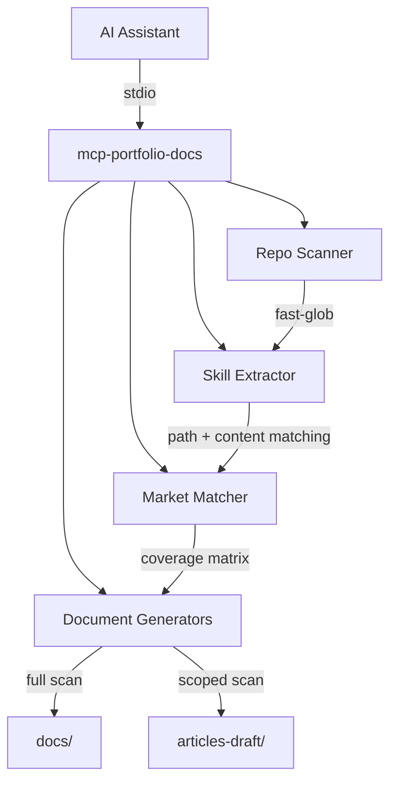

# mcp-portfolio-docs

Evidence-based portfolio documentation generator for DevOps & Cloud Engineering.

An MCP (Model Context Protocol) server that scans this repository, cross-references detected skills against a curated job market taxonomy, and generates markdown documentation — with every claim traceable to actual files.

## Design Principles

| Principle | Description |
|:---|:---|
| **Evidence-Only** | Every skill claim links to concrete file paths. No fabricated metrics, no opinions. |
| **Solo Developer** | All language assumes a single operator. No team escalation, no enterprise handoffs. |
| **Dual-Mode Scanning** | Full repo scan for portfolio overview, scoped scan for targeted feature articles. |
| **Audience-Aware** | Documentation framed for recruiters (skills signal) and junior developers (learning path). |

## Architecture



**Pipeline:** Scan → Extract → Match → Generate

1. **Repo Scanner** — Walks the file tree with `fast-glob`, categorises files (CDK construct, Helm chart, CI workflow, K8s manifest, etc.).
2. **Skill Extractor** — Two-phase detection: path matching (glob patterns) then content confirmation (regex inside files).
3. **Market Matcher** — Cross-references detected skills against the taxonomy to produce a coverage matrix.
4. **Document Generators** — Produces markdown with evidence references, following AG-DOC-01 template for articles.

## Tools (6)

### `analyse-portfolio`

Orchestrates the full pipeline and writes a markdown document to disk.

**Parameters:**
| Name | Type | Required | Description |
|:---|:---|:---|:---|
| `repoPath` | `string` | ✅ | Absolute path to the repository root |
| `scope` | `string` | — | Scope ID for targeted analysis (e.g. `crossplane`, `finops`) |
| `outputDir` | `string` | — | Output directory override |

**Behaviour:**
- **No scope** → Full repo scan → `docs/portfolio-overview.md`
- **With scope** → Scoped scan → `articles-draft/{scope}-implementation.md`

---

### `scan-repo`

Dry-run scan — returns detected skills as JSON without writing files.

**Parameters:**
| Name | Type | Required | Description |
|:---|:---|:---|:---|
| `repoPath` | `string` | ✅ | Absolute path to the repository root |
| `scope` | `string` | — | Scope ID to limit scanning |

**Returns:** JSON with `filesScanned`, `skillsDetected`, skills array (each with evidence), and `coveragePercent`.

---

### `list-skills`

Returns the skills taxonomy, available scopes, ADR topics, and runbook scenarios.

**Parameters:**
| Name | Type | Required | Description |
|:---|:---|:---|:---|
| `category` | `string` | — | Category ID to filter (e.g. `infrastructure-as-code`) |

---

### `generate-adr`

Generates an Architecture Decision Record with evidence files from the repository.

**Parameters:**
| Name | Type | Required | Description |
|:---|:---|:---|:---|
| `repoPath` | `string` | ✅ | Absolute path to the repository root |
| `decision` | `string` | ✅ | ADR topic ID (e.g. `self-managed-k8s-vs-eks`) |
| `outputDir` | `string` | — | Output directory override. Defaults to `docs/adrs/` |

**Available decisions:**
- `self-managed-k8s-vs-eks` — Self-Managed Kubernetes over EKS
- `step-functions-over-lambda-orchestration` — Step Functions over Direct Lambda Orchestration
- `argocd-over-flux` — ArgoCD over Flux for GitOps
- `cdk-over-terraform` — AWS CDK over Terraform
- `traefik-over-nginx-alb` — Traefik over NGINX Ingress / ALB
- `crossplane-for-app-level-iac` — Crossplane for Application-Level IaC

---

### `generate-runbook`

Generates a solo-operator runbook for an incident scenario.

**Parameters:**
| Name | Type | Required | Description |
|:---|:---|:---|:---|
| `repoPath` | `string` | ✅ | Absolute path to the repository root |
| `scenario` | `string` | ✅ | Runbook scenario ID |
| `outputDir` | `string` | — | Output directory override. Defaults to `docs/runbooks/` |

**Available scenarios:**
- `instance-terminated` — EC2 Instance Terminated Unexpectedly
- `pod-crashloop` — Pod CrashLoopBackOff
- `certificate-expiry` — TLS Certificate Approaching Expiry
- `budget-alert` — AWS Budget Threshold Exceeded

---

### `generate-cost-breakdown`

Generates a cost breakdown from CDK resource evidence. Accepts optional pricing data from the `aws-pricing` MCP server via the orchestrating AI assistant.

**Parameters:**
| Name | Type | Required | Description |
|:---|:---|:---|:---|
| `repoPath` | `string` | ✅ | Absolute path to the repository root |
| `monthlyBudget` | `number` | — | Monthly budget in GBP for trade-off analysis |
| `pricingData` | `string` | — | JSON pricing data from the `aws-pricing` MCP server |
| `outputDir` | `string` | — | Output directory override. Defaults to `docs/cost/` |

## Skills Taxonomy

12 categories covering 38 skills mapped to current DevOps/Cloud Engineering job market demand:

| Category | Skills | Example |
|:---|:---|:---|
| Infrastructure as Code | 3 | AWS CDK, CloudFormation, Crossplane XRDs |
| Container Orchestration | 4 | Kubernetes (Self-Managed), Helm, ArgoCD, Docker |
| CI/CD & GitOps | 3 | GitHub Actions, ApplicationSets, Sync-Wave Orchestration |
| Cloud Networking | 4 | VPC, NLB, Traefik, DNS/TLS |
| Observability | 4 | Prometheus, Grafana, CloudWatch, OpenCost |
| Security & Compliance | 4 | IAM Least-Privilege, GuardDuty, CDK-nag, NetworkPolicies |
| Platform Engineering | 3 | Crossplane Providers, Golden-Path, Self-Service |
| Serverless & Compute | 3 | Lambda, Step Functions, EC2 Management |
| Data & Storage | 4 | DynamoDB, S3, SQS, Secrets Manager |
| AI/ML Ops | 2 | Amazon Bedrock, Agentic Content Pipelines |
| Developer Experience | 3 | MCP Servers, TypeScript (Strict), Docs-as-Code |
| Operational Maturity | 3 | FinOps, Automated Testing (Jest), ESLint |

Each skill includes **detection patterns** (glob) and **content patterns** (regex) for evidence-based extraction.

## Scope Profiles

Scoped scans target specific implementation areas:

| Scope ID | Focus |
|:---|:---|
| `crossplane` | Crossplane XRDs, providers, IAM |
| `finops` | OpenCost, budgets, cost management |
| `networking` | VPC, NLB, Traefik, cert-manager |
| `ci-cd` | GitHub Actions, ArgoCD apps |
| `observability` | Prometheus, Grafana, CloudWatch |
| `security` | GuardDuty, CDK-nag, IAM, NetworkPolicies |
| `bedrock` | Bedrock, Step Functions, Lambda |
| `chaos` | Self-healing, PDB, ArgoCD |

## Output Structure

```
docs/
├── portfolio-overview.md     ← full repo scan
├── adrs/
│   ├── self-managed-k8s-vs-eks.md
│   └── cdk-over-terraform.md
├── runbooks/
│   ├── instance-terminated.md
│   └── pod-crashloop.md
├── cost/
│   └── cost-breakdown.md
└── chaos/
    └── chaos-evidence.md

articles-draft/                ← scoped scans (Bedrock pipeline)
├── crossplane-implementation.md
└── networking-implementation.md
```

## Inter-MCP Communication

This server does **not** call other MCP servers directly. The AI assistant orchestrates communication:

```
User → AI Assistant → mcp-portfolio-docs (scan repo)
                    → aws-pricing (get pricing)
                    → mcp-portfolio-docs (generate-cost-breakdown with pricingData)
```

The `generate-cost-breakdown` tool accepts an optional `pricingData` parameter containing JSON pricing data retrieved from the `aws-pricing` MCP server by the AI assistant.

## Development

```bash
# Install dependencies
yarn install

# Build
yarn build

# Run directly (for testing)
yarn dev

# Type check without building
yarn lint
```

## Stack

- **Runtime:** Node.js (ES2022)
- **Language:** TypeScript (strict mode)
- **MCP SDK:** `@modelcontextprotocol/sdk`
- **File Scanning:** `fast-glob`
- **Validation:** `zod`
- **Transport:** stdio
